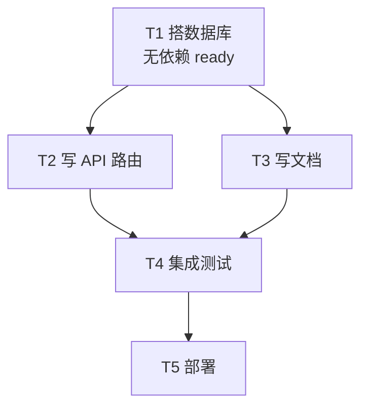

## 核心一句话

> A task graph turns vague goals into ordered, observable work.
> （任务图把模糊目标变成有序、可观察的工作。）

## 问题

Agent 接到一个项目：搭数据库、写 API、加测试。它用 s05 的 TodoWrite 列了
一张清单，然后开始写 API，写到一半发现没数据库表，回头补；加测试时发现
API 接口签名又变了……

盖房子不能先盖屋顶再打地基。**任务之间有先后**，任务依赖应该形成有向无环图
（DAG）。

[任务规划](/ai/intermediate/agent/01-todo-planning/)的 TodoWrite 是当前任务的
执行清单，保存在会话内存中。这里需要的是**任务系统**：每个任务是一个 JSON
文件，任务之间有 `blockedBy` 依赖，跨会话持久化在磁盘上。

## 解决方案

新增 5 个任务工具 + `.tasks/` 目录持久化 + `blockedBy` 依赖检查：



TodoWrite vs Task System：

|          | TodoWrite (s05)      | Task System (s12)           |
| -------- | -------------------- | --------------------------- |
| 定位      | 当前任务的执行清单       | 可恢复的任务系统              |
| 存储      | 进程内 / 会话状态      | `.tasks/{id}.json`          |
| 依赖      | 无                   | `blockedBy` / `blocks` 依赖图 |
| 生命周期  | 当前会话 / 当前任务    | 跨会话保留                   |
| 分工      | 不负责任务认领         | `owner` / claim             |
| 粒度      | Agent 自己的步骤      | 可被认领、追踪、解锁的任务     |

## 工作原理

### Task：数据结构

每个任务是一个 JSON 文件，存于 `.tasks/` 目录：

```python
@dataclass
class Task:
    id: str
    subject: str
    description: str
    status: str          # pending | in_progress | completed
    owner: str | None    # Agent 名（多 Agent 场景）
    blockedBy: list[str] # 依赖的任务 ID 列表
```

ID 用 `timestamp + random hex` 生成，简单但够用。CC 用顺序 ID + highwatermark
文件防止 ID 重用，是更严谨的设计。

### create\_task：创建任务

```python
def create_task(subject: str, description: str = "",
                blockedBy: list[str] | None = None) -> Task:
    task = Task(
        id=f"task_{int(time.time())}_{random_hex(4)}",
        subject=subject, description=description,
        status="pending", owner=None,
        blockedBy=blockedBy or [],
    )
    save_task(task)
    return task
```

创建时自动 `save_task` 到 `.tasks/{id}.json`。`blockedBy` 声明依赖，比如
"写 API" 的 `blockedBy` 是 `["task_schema"]`。

### can\_start：依赖检查

一个任务只能在它的 `blockedBy` **全部 completed** 之后才能开始：

```python
def can_start(task_id: str) -> bool:
    task = load_task(task_id)
    for dep_id in task.blockedBy:
        if not _task_path(dep_id).exists():
            return False  # missing dependency = blocked
        dep = load_task(dep_id)
        if dep.status != "completed":
            return False
    return True
```

不存在的依赖视为 blocked，避免引用错误 ID 时崩溃。

### claim\_task：认领任务

Agent 开始做一个任务时，设置 `owner`，状态从 `pending` → `in_progress`。
`owner` 字段记录谁在做这个任务，多 Agent 场景下防止重复认领：

```python
def claim_task(task_id: str, owner: str = "agent") -> str:
    task = load_task(task_id)
    if task.status != "pending":
        return f"Task {task_id} is {task.status}, cannot claim"
    if not can_start(task_id):
        deps = [d for d in task.blockedBy
                if load_task(d).status != "completed"]
        return f"Blocked by: {deps}"
    task.owner = owner
    task.status = "in_progress"
    save_task(task)
    return f"Claimed {task_id} ({task.subject})"
```

### complete\_task：完成与解锁

任务做完后设为 `completed`，同时扫描所有其他任务，找出**刚刚被解锁**的
下游任务：

```python
def complete_task(task_id: str) -> str:
    task = load_task(task_id)
    task.status = "completed"
    save_task(task)
    # 找出被解锁的下游任务
    unblocked = [t.subject for t in list_tasks()
                 if t.status == "pending" and t.blockedBy
                 and can_start(t.id)]
    msg = f"Completed {task_id} ({task.subject})"
    if unblocked:
        msg += f"\nUnblocked: {', '.join(unblocked)}"
    return msg
```

### 状态机：两个动作，三个状态

```
pending ──claim──→ in_progress ──complete──→ completed
```

- **claim\_task**：`pending` → `in_progress`。设置 owner，开始工作
- **complete\_task**：`in_progress` → `completed`。标记完成，并解锁下游

CC 没有 `in_progress → pending` 的 release 路径。如果 teammate 终止或
shutdown，CC 会把它未完成的任务 unassign（清除 owner）并将 status 重置为
`pending`，方便其他 agent 重新认领。教学版省略了这一恢复路径。

### 合起来跑

```python
# 创建有依赖的任务
schema = create_task("setup database schema")
endpoints = create_task("create API endpoints", blockedBy=[schema.id])
tests = create_task("write tests", blockedBy=[endpoints.id])
docs = create_task("write docs", blockedBy=[schema.id])

# Agent 认领第一个可做的任务
claim_task(schema.id)      # ✓ 无依赖
complete_task(schema.id)   # ✓ 解锁 endpoints, docs

claim_task(endpoints.id)   # ✓ schema 已完成
complete_task(endpoints.id)  # ✓ 解锁 tests
```

每个 `create_task` 写一个 JSON 文件，每个 `claim_task` / `complete_task`
更新文件。跨会话时，`.tasks/` 目录还在，Agent 读文件就能恢复进度。

## 深入 CC 源码

以下基于 CC 源码 `utils/tasks.ts`（862 行）及 TaskCreate / TaskUpdate /
TaskGet / TaskList 四个工具的分析。

### TaskRecord 的完整字段

教学版只讲了 id、subject、status、owner、blockedBy。CC 实际有 9 个字段：

| 字段          | 类型                        | 用途                     |
| ----------- | ------------------------- | ---------------------- |
| id          | string                    | 递增整数 ID               |
| subject     | string                    | 简短标题                  |
| description | string                    | 自由格式描述               |
| activeForm  | string?                   | 进行时态，in\_progress 时在 spinner 显示 |
| owner       | string?                   | 分配的 agent ID          |
| status      | pending/in\_progress/completed | 生命周期             |
| blocks      | string\[\]                | 此任务阻塞的任务 ID（下游）   |
| blockedBy   | string\[\]                | 阻塞此任务的任务 ID（上游）   |
| metadata    | Record?                   | 任意扩展键值对            |

存储位置：`~/.claude/tasks/{taskListId}/{id}.json`，每个任务一个文件。

### 不是 TodoWrite 的升级，是两个独立系统

CC 中 Task System 和 TodoWrite **同时存在**，通过 `isTodoV2Enabled()` 切换
——交互式会话默认启用 Task（V2），非交互式/SDK 默认用 TodoWrite。Task 有
TodoWrite 没有的：文件锁并发保护、依赖强制执行、ownership、fs.watch 响应式
监听、生命周期 hooks。

### 并发认领的锁机制

`claimTask()` 用双重锁防竞争：

**任务文件锁**：`proper-lockfile` 锁住 `{taskId}.json`（最多重试 30 次，
指数退避 5-100ms）。锁内：

1. 重新读取任务（防 TOCTOU）
2. 检查已被他人认领 → `already_claimed`
3. 检查已完成 → `already_resolved`
4. 检查上游未完成 → `blocked`
5. 设置 owner

**列表级锁**（agent busy 检查时）：`.lock` 文件，原子性扫描所有任务并检查
该 agent 是否已有其他 open task。

注意：教学版把 claim 和开始工作合成一步（claim = set owner +
in\_progress）；真实 CC 的 `claimTask` 主要解决 owner 竞争，只设 owner 不改
status，状态更新由 `TaskUpdate` 完成。

### 高水位标防 ID 重用

`.highwatermark` 文件记录曾分配过的最高任务 ID。即使任务被删除，ID 也不会
被重用。

## 试一下

```bash
cd learn-claude-code
python s12_task_system/code.py
```

| Prompt                                                                                                                | 预期行为             |
| --------------------------------------------------------------------------------------------------------------------- | ---------------- |
| `Create tasks: setup database schema, create API endpoints (depends on schema), write tests (depends on endpoints)`   | 生成带依赖的任务文件 |
| `List all tasks and their statuses`                                                                                   | 看板总览           |
| `Claim the first unblocked task and complete it`                                                                      | 认领 + 解锁下游     |
| `List tasks again — which ones are now unblocked?`                                                                    | 验证解锁           |

观察重点：`.tasks/` 目录下是否生成了 JSON 文件？完成任务后，被阻塞的任务
是否解锁？

## 要点备忘

- TodoWrite 是"给自己看的便签"，Task System 是"给大家用的看板"——持久化、
  有依赖、可认领
- 依赖检查的语义：`blockedBy` 里**任何一个**未完成就不能开始；不存在的依赖
  视为 blocked
- `owner` 字段是多 Agent 协作的前提，防止重复认领
- 任务即文件：计划 survives 压缩和重启——上下文会丢，磁盘不会

## 延伸阅读

- [Learn Claude Code s12: Task System](https://learn.shareai.run/zh/s12/)（含锁机制与高水位标源码核查）
- 上游概念：[任务规划 TodoWrite](/ai/intermediate/agent/01-todo-planning/)
- 下一步：慢任务不阻塞主循环，见[后台任务](/ai/advanced/agent/03-background-tasks/)
