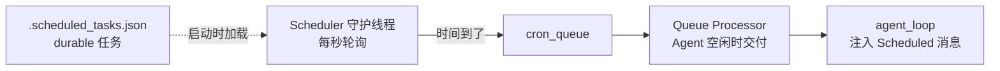

## 核心一句话

> Recurring work should be created by the harness, not remembered by the model.
> （周期性工作应该由 Harness 创建，而不是靠模型记住。）

## 问题

闹钟不需要你盯着它才会响。你设好 7:00，到点它自己响——你在睡觉、在洗澡、
在做饭，它都照响不误。

[后台任务](/ai/advanced/agent/03-background-tasks/)让 Agent 能后台执行慢操作，
但所有操作仍然是你手动触发的。你说一句，Agent 动一下。"每天早上 9 点跑
测试"、"每 30 分钟检查 CI 状态"，这些周期性任务不该需要人每次来推。

## 解决方案

新增独立的 cron 调度线程，每秒检查一次，时间到了把任务塞进 `cron_queue`；
再由 queue processor 在 Agent 空闲时自动交付。

|            | 手动触发 (s13) | 定时触发 (s14)               |
| ---------- | ----------- | -------------------------- |
| 触发者      | 用户输入      | 调度线程                    |
| 触发时机    | 随时        | cron 表达式指定             |
| 需要人参与  | 是          | 否（自动入队，空闲时自动交付） |
| 持久性      | —           | durable 跨重启              |



## 工作原理

### 四层模型

Cron 调度分四层：

1. **Scheduler**：daemon 线程，每秒轮询，判断时间到了没有
2. **Queue**：`cron_queue`，调度线程写入已触发任务
3. **Queue Processor**：发现队列非空且 Agent 空闲，启动一轮 agent\_loop
4. **Consumer**：agent\_loop 从队列消费，注入到 messages

### CronJob：数据结构

```python
@dataclass
class CronJob:
    id: str
    cron: str        # "0 9 * * *"（五段式 cron 表达式）
    prompt: str      # 触发时注入给 Agent 的消息
    recurring: bool  # True=周期性，False=一次性
    durable: bool    # True=写磁盘，跨会话保留
```

Cron 表达式，五段式，Unix 用了 50 年：

```
分钟 小时 日 月 星期
  *   *   *  *  *    每分钟
  0   9   *  *  *    每天早上 9:00
  */5 *   *  *  *    每 5 分钟
  0   9   *  *  1-5  工作日早上 9:00
```

支持 `*`、`*/N`、`N`、`N-M`、`N,M,...`。

### cron\_matches：五段式匹配

标准 cron 语义：分钟、小时、月必须全部匹配；日（DOM）和星期（DOW）同时被
约束时任一匹配即可（OR）：

```python
def cron_matches(cron_expr: str, dt: datetime) -> bool:
    fields = cron_expr.strip().split()
    if len(fields) != 5:
        return False
    minute, hour, dom, month, dow = fields
    dow_val = (dt.weekday() + 1) % 7  # Python Monday=0 → cron Sunday=0

    m = _cron_field_matches(minute, dt.minute)
    h = _cron_field_matches(hour, dt.hour)
    dom_ok = _cron_field_matches(dom, dt.day)
    month_ok = _cron_field_matches(month, dt.month)
    dow_ok = _cron_field_matches(dow, dow_val)

    if not (m and h and month_ok):
        return False
    # DOM and DOW: both constrained → either matching is enough (OR)
    dom_unconstrained = dom == "*"
    dow_unconstrained = dow == "*"
    if dom_unconstrained and dow_unconstrained:
        return True
    if dom_unconstrained:
        return dow_ok
    if dow_unconstrained:
        return dom_ok
    return dom_ok or dow_ok
```

### 独立调度线程：每秒轮询

调度器跑在独立的 daemon 线程里，不依赖 agent\_loop 是否在执行。单个 job
异常不会杀掉整个线程：

```python
def cron_scheduler_loop():
    while True:
        time.sleep(1)
        now = datetime.now()
        minute_marker = now.strftime("%Y-%m-%d %H:%M")
        with cron_lock:
            for job in list(scheduled_jobs.values()):
                try:
                    if cron_matches(job.cron, now):
                        if _last_fired.get(job.id) != minute_marker:
                            cron_queue.append(job)
                            _last_fired[job.id] = minute_marker
                            if not job.recurring:
                                scheduled_jobs.pop(job.id, None)
                            if job.durable:
                                save_durable_jobs()
                except Exception as e:
                    print(f"[cron error] {job.id}: {e}")
```

关键设计：

- **独立于 agent\_loop**：即使 agent\_loop 没在跑，调度器也在后台检查时间
- **date-aware minute\_marker**：用 `"YYYY-MM-DD HH:MM"` 防止同一分钟重复
  触发，同时不会在第二天跳过
- **单 job try/except**：一个坏 job 不会拖垮整个调度线程
- **一次性任务**：触发后自动从 scheduled\_jobs 里删除

### Queue Processor + agent\_loop：交付端

queue processor 不检查时间，只负责在队列有任务且 Agent 空闲时拉起一轮执行：

```python
def queue_processor_loop():
    while True:
        time.sleep(0.2)
        if not has_cron_queue():
            continue
        if not agent_lock.acquire(blocking=False):
            continue
        try:
            if has_cron_queue():
                run_agent_turn_locked()
        finally:
            agent_lock.release()
```

agent\_loop 也不负责检查时间，它只从 `cron_queue` 里拿已触发的任务，注入到
messages 里：

```python
fired = consume_cron_queue()
for job in fired:
    messages.append({"role": "user",
                     "content": f"[Scheduled] {job.prompt}"})
```

生产者（调度线程）、交付者（queue processor）和消费者（agent\_loop）通过
`cron_queue`、`cron_lock`、`agent_lock` 解耦。

### Durable vs Session-only

- **Durable**：任务定义写进 `.scheduled_tasks.json`。Agent 重启后加载文件，
  恢复任务
- **Session-only**：只在内存里。Agent 关闭就没了

**重要前提**：cron 调度器必须在 Agent 进程内跑。进程关闭，调度也停。
Durable 只意味着任务定义跨重启保留，下次 Agent 启动时调度器才会发现"该
触发了"并触发。如果需要"即使应用关闭也能定时跑"，请用系统 crontab 或
systemd timer。

### 合起来跑

```
1. 启动时：
   load_durable_jobs() → 从 .scheduled_tasks.json 恢复持久化任务
   Thread(cron_scheduler_loop, daemon=True).start()   → 调度线程开始轮询
   Thread(queue_processor_loop, daemon=True).start()  → 队列处理器等待交付

2. 注册任务：
   schedule_cron(cron="*/2 * * * *", prompt="run date", durable=True)
   → CronJob 写入 scheduled_jobs + .scheduled_tasks.json

3. 每 2 分钟：
   调度线程检查 → cron_matches 返回 True → cron_queue.append(job)
   → queue processor 发现 Agent 空闲 → agent_loop consume_cron_queue
   → 注入 "[Scheduled] run date"
   → LLM 收到消息，执行 date 命令

4. 关闭进程：
   调度线程跟着停（daemon=True）
   .scheduled_tasks.json 还在磁盘上
   下次启动 → load_durable_jobs → 任务恢复
```

## 深入 CC 源码

以下基于 CC 源码 `CronCreateTool.ts`、`cronScheduler.ts`、`cronTasks.ts`、
`useScheduledTasks.ts` 的完整分析。

### 三个 Cron 工具与存储

CC 暴露 `CronCreate`、`CronDelete`、`CronList` 三个工具给模型，由编译时
门控 `feature('AGENT_TRIGGERS')` 和运行时 GrowthBook 标志控制。Durable 任务
写 `.claude/scheduled_tasks.json`；session-only 任务存于内存数组。还有一个
`.scheduled_tasks.lock` 文件防止同项目的多个 session 重复触发。

### 抖动：防惊群效应

- 重复性任务：触发延迟最多可达期间的 10%（上限 15 分钟），基于任务 ID 的
  确定性哈希
- 一次性任务：当触发时间落在 `:00` 或 `:30` 时，最多提前 90 秒触发
- 抖动配置可通过 GrowthBook 实时调整，60 秒刷新一次

### 自动过期与作业数上限

重复性任务 7 天后自动过期（可配置，上限 30 天）。过期前最后一次触发，触发后
自动删除。`MAX_JOBS = 50`，超限时返回错误："Too many scheduled jobs
(max 50). Cancel one first."

### 触发注入

触发后通过 `enqueuePendingNotification()` 以 `priority: 'later'` 入队命令
队列。标记 `workload: WORKLOAD_CRON`——API 在容量紧张时以更低的 QoS 为
cron 发起的请求服务。

## 试一下

```bash
cd learn-claude-code
python s14_cron_scheduler/code.py
```

| Prompt                                                            | 预期行为           |
| ----------------------------------------------------------------- | -------------- |
| `Schedule a task to print the current date every 2 minutes`       | 周期触发         |
| `List all cron jobs`                                              | 查看注册表       |
| `Create a one-shot reminder in 1 minute to check the build status` | 一次性任务       |
| `Cancel the recurring job and verify with list_crons`             | 取消与验证       |

观察重点：调度线程是否在独立运行？不输入新 prompt 时，是否也出现
`[queue processor]` 并自动执行？durable job 是否写入了
`.scheduled_tasks.json`？

## 要点备忘

- 调度与执行解耦：Scheduler 管时间，Queue Processor 管交付，agent\_loop 只管
  消费——三层通过队列和锁协作
- "周期性工作由 Harness 创建，而不是靠模型记住"：模型没有时间感知，也不该有
- durable 的准确含义是**任务定义**跨重启，不是"进程关了还能跑"
- 单 job 异常被 try/except 隔离，坏任务不拖垮调度器

## 延伸阅读

- [Learn Claude Code s14: Cron Scheduler](https://learn.shareai.run/zh/s14/)（含抖动与过期机制源码核查）
- 上游概念：[后台任务](/ai/advanced/agent/03-background-tasks/)
- 下一步：一个 Agent 不够用了，见[Agent 团队](/ai/advanced/agent/05-agent-teams/)
