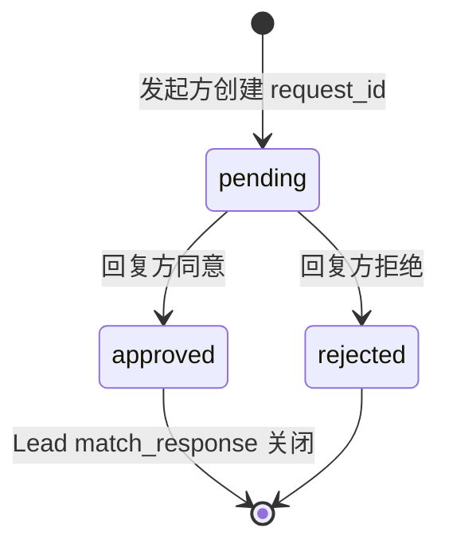

## 核心一句话

> Multi-agent systems need explicit message contracts, not vibes.
> （多 Agent 系统需要显式的消息契约，而不是"凭感觉"。）

## 问题

[Agent 团队](/ai/advanced/agent/05-agent-teams/)的队友能干活了，但协调是松散的：
Lead 发消息，队友回复，没有结构化的协议。两个场景暴露了问题：

**关机**：Lead 想让 Alice 关机。直接杀线程，Alice 写了一半的文件留在磁盘上。
需要握手：Lead 发请求，Alice 确认收尾后关机。

**计划审批**：Bob 想重构认证模块，属于高风险操作。应该先让 Lead 看 Bob 的
计划，审批通过后再动手。

这两个场景结构完全一样：一方发请求，另一方给回复，请求和回复通过**同一个
ID 关联**。有状态机追踪：pending → approved / rejected。

## 解决方案

新增三样：**ProtocolState**（请求状态追踪）、**dispatch\_message**（按消息
类型路由到处理器）、**match\_response**（通过 request\_id 关联回复与请求，
含类型校验）。

两种协议，一套机制：

| 协议                             | 方向        | 用途           |
| ------------------------------ | --------- | ------------ |
| shutdown\_request / response    | Lead → 队友 | 体面关机握手     |
| plan\_approval\_request / response | 队友 → Lead | 计划审批协议示例 |



## 工作原理

### ProtocolState：请求状态

每个协议请求创建一条状态记录，记录谁发的、发给谁、当前状态、附带内容：

```python
@dataclass
class ProtocolState:
    request_id: str      # 唯一 ID，如 "req_004281"
    type: str            # "shutdown" | "plan_approval"
    sender: str          # 发起方
    target: str          # 接收方
    status: str          # pending | approved | rejected
    payload: str         # 计划文本或关机原因
    created_at: float    # 时间戳

pending_requests: dict[str, ProtocolState] = {}
```

发请求时创建记录，收回复时通过 `request_id` 找到对应记录，更新状态。

### 四步协议流程

以关机为例，完整链路：

```
① Lead 发请求
   req_id = new_request_id()  # "req_004281"
   pending_requests[req_id] = ProtocolState(type="shutdown", status="pending", ...)
   BUS.send("lead", "alice", "shutdown_request",
            metadata={"request_id": req_id})

② 队友收到 → dispatch
   inbox = BUS.read_inbox("alice")
   msg_type = msg["type"]  # "shutdown_request"
   → 路由到 handle_shutdown_request()

③ 队友回复
   BUS.send("alice", "lead", "shutdown_response",
            metadata={"request_id": req_id, "approve": True})

④ Lead 收响应 → match
   match_response("shutdown_response", req_id, approve=True)
   pending_requests[req_id].status = "approved"
```

`request_id` 是贯穿全链路的**关联键**，请求带着它出去，回复带着它回来。

### dispatch\_message：按类型路由

队友的 inbox 不只收普通消息，还收协议消息。`handle_inbox_message` 按消息
类型分发：

```python
def handle_inbox_message(name, msg, messages):
    msg_type = msg.get("type", "message")
    req_id = msg.get("metadata", {}).get("request_id", "")

    if msg_type == "shutdown_request":
        BUS.send(name, "lead", "Shutting down.", "shutdown_response",
                 {"request_id": req_id, "approve": True})
        return True   # 停止循环

    if msg_type == "plan_approval_response":
        approve = msg["metadata"].get("approve", False)
        messages.append({"role": "user",
                         "content": "[Plan approved]" if approve
                                    else "[Plan rejected]"})
        return False   # 继续循环
```

新增协议类型只需加新的 `if` 分支。

### match\_response：类型校验

`match_response` 不只按 `request_id` 找状态，还会校验响应类型是否匹配请求
类型：

```python
def match_response(response_type, request_id, approve):
    state = pending_requests.get(request_id)
    if not state:
        return
    if state.type == "shutdown" and response_type != "shutdown_response":
        return  # type mismatch, skip
    if state.type == "plan_approval" and response_type != "plan_approval_response":
        return
    if state.status != "pending":
        return  # already resolved, skip duplicate
    state.status = "approved" if approve else "rejected"
```

一个 shutdown\_response 不会意外 approve 一个 plan\_approval 请求。

### 统一 inbox 消费：consume\_lead\_inbox

`check_inbox` 工具和主循环末尾都调用同一个 `consume_lead_inbox()` 函数，
先路由协议消息再返回剩余内容，避免消息被读走但协议状态没更新：

```python
def consume_lead_inbox(route_protocol=True) -> list[dict]:
    msgs = BUS.read_inbox("lead")
    if route_protocol:
        for msg in msgs:
            meta = msg.get("metadata", {})
            req_id = meta.get("request_id", "")
            msg_type = msg.get("type", "")
            if req_id and msg_type.endswith("_response"):
                match_response(msg_type, req_id, meta.get("approve", False))
    return msgs
```

### 队友 idle loop：等待而不是退出

s15 的队友跑完 10 轮就退出。s16 的队友在 LLM 返回非 tool\_use 后进入
idle 等待：轮询 inbox，收到 shutdown\_request 就响应退出，收到新消息就
继续工作。

```
LLM 返回非 tool_use
  → idle: 每秒轮询 inbox
  → 收到 shutdown_request → 回复 shutdown_response → 退出
  → 收到新消息 → 注入 messages → 继续 LLM turn
```

## 深入 CC 源码

CC 的团队协议实现（`teammateMailbox.ts`，1184 行）和教学版在核心结构上一致：
request\_id + approve/reject 的请求-响应模式。差异在于：

**关机协议**：CC 的 shutdown 是**三向通信**。Lead 发 `shutdown_request`，
队友回复 `shutdown_approved`（或 `shutdown_rejected` 附原因），系统发送
`teammate_terminated` 通知所有相关方。关机确认后系统自动清理 pane
（tmux/iTerm2）、unassign 任务、从 team config 移除成员。教学版用
`shutdown_response` 统一命名，真实源码拆成 approved/rejected 两种独立消息。

**计划审批**：plan approval request 由 `ExitPlanModeV2Tool` 在
plan-mode-required 队友退出 plan mode 时产生。`useInboxPoller` 当前会自动
回写 approval，并把请求交给 Lead 作为上下文。`SendMessageTool` 仍保留显式
approve/reject response 能力，审批时可同时设置 `permissionMode`（如"批准但以
plan mode 运行"），响应中可包含 `feedback` 字符串供队友修正后重新提交。

**消息格式**：CC 的协议消息是结构化的 JSON（有 Zod schema 验证），教学版用
简单的 type + metadata 字典。

**执行门控**：CC 的队友有完整的 permission gating。未获批准的高风险操作会被
拦截，不是可选的。教学版只演示了消息流程，没有实现执行拦截。

**通用性**：教学版的一个 FSM（pending → approved | rejected）对应两种协议，
这个简化完全正确——CC 的所有协议消息共用同一个 request id 关联机制。

## 试一下

```bash
cd learn-claude-code
python s16_team_protocols/code.py
```

| Prompt                                                                                    | 预期行为           |
| ----------------------------------------------------------------------------------------- | -------------- |
| `Spawn alice as a backend dev. Ask her to create a file. Then request her shutdown.`       | 完整关机握手     |
| `Spawn bob with a refactoring task. Have him submit a plan first. Then review and approve it.` | 计划审批流转 |

观察重点：关机握手是否完整（请求 → 确认 → 关机）？`pending_requests` 的
状态是否正确转换？`request_id` 是否在请求和响应之间保持一致？队友 idle 后
是否能收到 shutdown\_request？

## 要点备忘

- 协议 = 共享的卡片形状：请求类型 + request\_id + 期望的回答——关键是关联，
  不是仪式
- request\_id 贯穿全链路：请求带着它出去，回复带着它回来，状态机可追溯
- match\_response 做两层校验：类型匹配（shutdown 的回复不能批准 plan）+
  幂等（已 resolved 的请求跳过重复回复）
- 统一 inbox 消费入口：先路由协议、再返回剩余——避免消息被读走但状态没更新

## 延伸阅读

- [Learn Claude Code s16: Team Protocols](https://learn.shareai.run/zh/s16/)（含三向关机通信源码核查）
- 上游概念：[Agent 团队](/ai/advanced/agent/05-agent-teams/)
- 下一步：队友自己找活干，见[自主智能体](/ai/advanced/agent/07-autonomous-agents/)
