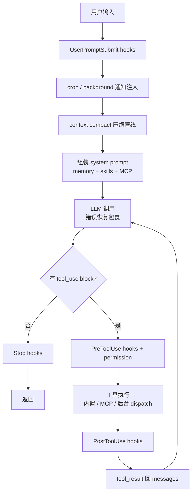

## 核心一句话

> The final harness is still one loop, now surrounded by the systems that
> make it production-shaped.（最终 Harness 仍是一个循环，只是周围长满了
> 让它"生产可用"的系统。）

## 问题

前 19 章每章只加一个机制。这样适合学习，但真实 Agent 不会只带一个机制运行。

一个能长期工作的 coding agent 需要同时拥有：工具分发和权限边界、hooks 扩展
点、todo 计划和任务图、技能/记忆/系统 prompt 组装、压缩和错误恢复、后台任务
和 cron 调度、团队/协议/自治认领、worktree 隔离、MCP 外部工具接入。

难点不是把功能堆起来，而是**看清楚它们都挂在循环的哪个位置**。s20 是终点章：
把所有组件归位。

## 解决方案

s20 不是再发明一个新机制，而是把前面的教学组件合成一个完整 harness：

```
用户输入
  → UserPromptSubmit hooks
  → cron/background 通知注入
  → context compact
  → memory + skills + MCP 状态组装 system prompt
  → LLM
  → has tool_use block?
       否 → Stop hooks → 返回
       是 → PreToolUse hooks + permission
            → TOOL_HANDLERS / MCP handlers / background dispatch
            → PostToolUse hooks
            → tool_result / task_notification 回 messages
            → 下一轮
```

循环本身仍然是同一个结构：调用模型，检查响应里是否出现 `tool_use` block，
执行工具，把结果追加回 `messages`。变化的是**循环周围的 harness 变完整了**。



## 工作原理

### 组件在循环中的位置

| 位置               | 组件                          | 作用                        |
| ---------------- | --------------------------- | ------------------------- |
| 用户输入前后        | `UserPromptSubmit` hooks    | 记录、注入、审计用户输入       |
| LLM 前            | cron queue                  | 把定时触发的 prompt 注入 messages |
| LLM 前            | background notifications    | 后台任务完成后以 `<task_notification>` 注入 |
| LLM 前            | compaction pipeline         | 先压大输出，再裁历史，再压旧 tool\_result |
| LLM 前            | memory / skills / MCP state | 组装 system prompt         |
| LLM 调用          | error recovery              | 429/529 重试、max\_tokens 升级、prompt too long 触发 reactive compact |
| 工具执行前         | `PreToolUse` hooks + permission | 拦截危险命令、写越界、破坏性 MCP 工具 |
| 工具分发           | `assemble_tool_pool`        | 组装内置工具和 MCP 动态工具    |
| 工具执行时         | background dispatch         | 慢 bash 操作放 daemon thread，主循环先返回占位结果 |
| 工具执行后         | `PostToolUse` hooks         | 大输出告警、日志等后处理       |
| 返回循环           | tool\_result                | 每个 `tool_use` 对应一个 `tool_result` |
| 本轮没有 tool\_use | `Stop` hooks                | 统计、清理、审计             |

### 工具与分发

内置工具池 27 个工具：bash、read\_file、write\_file、edit\_file、glob、
todo\_write、task、load\_skill、compact、create\_task、list\_tasks、
get\_task、claim\_task、complete\_task、schedule\_cron、list\_crons、
cancel\_cron、spawn\_teammate、send\_message、check\_inbox、
request\_shutdown、request\_plan、review\_plan、create\_worktree、
remove\_worktree、keep\_worktree、connect\_mcp。

`assemble_tool_pool()` 每轮组装：

```python
BUILTIN_TOOLS + connected MCP tools
BUILTIN_HANDLERS + mcp__server__tool handlers
```

所以 `connect_mcp("docs")` 后，下一轮工具池里会出现 `mcp__docs__search`。

### 权限和 hooks

权限不写死在工具执行行里，而是作为 `PreToolUse` hook：

```python
blocked = trigger_hooks("PreToolUse", block)
if blocked:
    results.append(tool_result(block.id, blocked))
    continue
```

这样 permission、log、审计都可以挂在同一个 hook 点上。执行后再触发
`PostToolUse`。

### 计划与任务：两层并存

- `todo_write`：当前会话内的轻量计划，保存在内存中——帮助单个 Agent 不漂移
- task graph：跨会话、可依赖、可认领的任务文件，写入 `.tasks/task_*.json`
  ——支撑团队协作

### 子 agent 与团队：两种 delegation

- `task`：一次性 subagent。独立 `messages[]`，中间过程丢弃，只返回最终摘要
  ——解决**上下文隔离**
- `spawn_teammate`：持久队友线程。通过 MessageBus 收发消息，能 idle 轮询
  任务板并自动认领——解决**长期并行协作**

### 记忆、技能和 prompt

`assemble_system_prompt(context)` 每轮组装：身份和工具说明、workspace、
skills catalog、`.memory/MEMORY.md`、已连接 MCP server。技能只在 system
prompt 里放**目录**，完整内容通过 `load_skill(name)` 按需加载。

### 压缩和恢复

LLM 前先跑压缩管线：

```
tool_result_budget → snip_compact → micro_compact → compact_history
```

调用模型时再包一层恢复：

- 429：指数退避重试
- 529：指数退避，连续失败可切 fallback model
- `max_tokens`：先提高 max\_tokens，再要求 continuation
- prompt too long：reactive compact 后重试

### 后台和 cron

慢 bash 操作不阻塞主循环：

```
should_run_background → start_background_task → placeholder tool_result
后台完成 → task_notification → 下一轮注入 messages
```

cron 调度器独立 daemon thread 每秒检查一次。CLI 会监听 `cron_queue`，命中后
主动把 `[Scheduled] ...` 注入并运行一轮 Agent。

### worktree 与 MCP

worktree 负责隔离目录：`create_worktree(name, task_id)` 创建独立分支和目录，
task 的 `worktree` 字段绑定目录，队友 claim 到带 worktree 的 task 后，
bash/read/write 自动在对应目录下执行。

MCP 负责外部能力：`connect_mcp(name)` 连接 server，
`assemble_tool_pool()` 把 MCP 工具组装进工具池，工具名统一为
`mcp__server__tool`。

## 结束亦是开始

从 s01 到 s20，代码表面越来越复杂，但核心始终没变：

```python
while True:
    response = LLM(messages, tools)
    if not has_tool_use(response.content):
        return
    results = execute_tools(response.content)
    messages.append(tool_results)
```

Claude Code 的复杂性不是"另一个 agent 大脑"，而是一个**成熟 harness 的
复杂性**。模型负责判断和行动选择；harness 负责把环境、工具、权限、记忆、
团队和外部能力组织好。

这就是全书的终点：**机制很多，循环一个**。

## 试一下

```bash
cd learn-claude-code
python s20_comprehensive/code.py
```

| Prompt                                                                                                        | 观察重点                          |
| ------------------------------------------------------------------------------------------------------------- | ----------------------------- |
| `Create a todo list for inspecting this repo, then list Python files`                                         | 先计划再执行                    |
| `Connect to the docs MCP server and search for agent loop`                                                    | connect 后下一轮出现 MCP 工具   |
| `Create two tasks, create worktrees for them, then spawn alice and bob. Ask them to submit plans before claiming tasks.` | 计划审批 → 认领 → worktree 切换 |
| `remind me of the meeting in 3 minutes.`                                                                      | 到点自动提醒                   |
| `Run npm install in the background and continue reading README.md`                                            | 慢操作返回占位结果              |

## 要点备忘

- 所有机制都挂在循环的**确定位置**：LLM 前注入上下文，工具前拦截权限，工具后
  处理结果，停止时收尾——位置感比功能列表更重要
- 权限、日志、审计共用 PreToolUse 一个挂点：hook 是统一的扩展面
- 两层计划（todo / task graph）、两种 delegation（subagent / teammate）各司
  其职，不是冗余
- 生产级 = 核心循环不变 + 周围系统完备：先理解 30 行内核，再看 1729 行的
  query.ts 就只是保护机制

## 延伸阅读

- [Learn Claude Code s20: Comprehensive Agent](https://learn.shareai.run/zh/s20/)
- 全系列演进路线见[多 Agent 协作总览](/ai/advanced/agent/01-multi-agent/)
- 各机制详解：[子智能体](/ai/intermediate/agent/09-subagent/)、[任务系统](/ai/advanced/agent/02-task-system/)、[后台任务](/ai/advanced/agent/03-background-tasks/)、[定时调度](/ai/advanced/agent/04-cron-scheduler/)、[Agent 团队](/ai/advanced/agent/05-agent-teams/)、[团队协议](/ai/advanced/agent/06-team-protocols/)、[自主智能体](/ai/advanced/agent/07-autonomous-agents/)、[Worktree 隔离](/ai/advanced/agent/08-worktree-isolation/)、[MCP 协议](/ai/intermediate/agent/08-mcp/)
