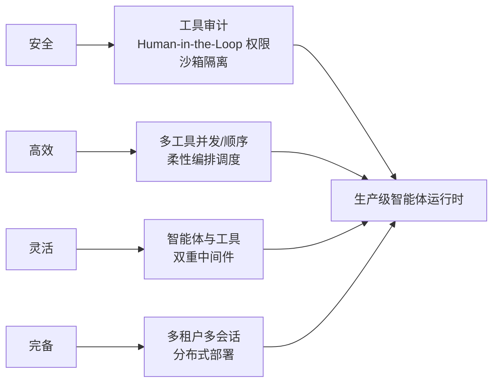

## 为什么需要框架

[Agent Loop](/ai/basic/agent/01-agent-loop/) 本身很小：一个 while 循环 + 工具分发。
但把循环变成**生产系统**，缺的从来不是推理，而是工程外围：

| 裸写循环的缺口 | 框架补什么 |
|---|---|
| 单用户单会话，进程一挂全丢 | 多租户、多会话管理、状态持久化 |
| 工具串行调用，慢工具拖死整体 | 依据工具特性并发/顺序柔性调度 |
| 工具在宿主机裸跑，AI 误操作即事故 | 沙箱隔离 + 权限审计 |
| 每个工具手写注册 | MCP / Skill / 原生函数统一拼装 |
| 部署 = 手动起进程 | 一键后端服务 + 分布式集群 |

## AgentScope 2.0：把生产要求做成一等公民

AgentScope（阿里开源）2.0 的自我定位是"安全、高效、灵活、完备的生产级智能体
框架"，与 1.0 存在破坏性变更。四大支柱正好对应上面的缺口：



### 构建积木

- **ReAct 智能体**：自主推理 + 多工具协同，内置人机协同审核与高并发调度——
  相当于框架替你实现了 [综合 Harness](/ai/advanced/agent/09-comprehensive-agent/)
  里那圈"机制归位"的外围。
- **多维工具包**：原生 Python 函数、[MCP](/ai/intermediate/agent/08-mcp/)、
  外部 Skill 无缝拼装——工具不再硬编码注册。
- **上下文管理**：剪裁、卸载与智能体主动检索，深度融合 Mem0/ReMe 等第三方
  记忆实现（对照站内[记忆系统](/ai/intermediate/agent/04-memory/)）。
- **Workspace 沙箱**：本地隔离沙箱、Docker、E2B、Kubernetes 中安全执行外部
  代码，支持用户/智能体/会话三级隔离。
- **Agent 即服务**：一键部署生产级后端，自带可视化前端与 SDK，多租户多会话
  并发与分布式集群调度。

一句话：**AgentScope 把"会话、租户、沙箱、部署"从业务代码里抽走**，你只写
智能体与工具的逻辑。

## 编排范式：Router 与 Supervisor

LangGraph 系（LangChain 生态）把多智能体协作收敛成几种范式，与站内
[多 Agent 协作](/ai/advanced/agent/01-multi-agent/) 的机制视角互补：

| 范式 | 路由决策 | 适用 |
|---|---|---|
| **Router** | 专用路由步骤（一次分类调用或规则）把输入分给若干垂直 Agent，可并行扇出后合成 | 输入类别清晰、要确定性/轻量分类 |
| **Supervisor / Subagents** | 主 Agent 在对话中动态决定调用哪个子智能体，维持上下文 | 灵活、对话感知的多步编排 |
| **Handoffs** | Agent 之间直接移交控制权 | 多轮对话、清晰交接语义 |

Router 的关键形态（LangChain 文档）：

- **Stateless**：每次请求独立路由，无跨轮记忆——纯预处理步骤；
- **Stateful**：要么把 Router 包装成一个工具交给会话型 Agent 调用（推荐，
  记忆由外层 Agent 管），要么用持久化自管历史（复杂，多 Agent 语气不连贯
  时体验差）。

```python
# 并行扇出：一次分类到多个垂直 Agent，各自处理后合成
def route_query(state):
    classifications = classify_query(state["query"])
    return [Send(c["agent"], {"query": c["query"]}) for c in classifications]
```

选型口诀：**输入类别稳定用 Router，演进上下文用 Supervisor，清晰交接用
Handoffs**。

## 框架版图与选型

| 路线 | 代表 | 特点 | 适合 |
|---|---|---|---|
| 生产级全家桶 | AgentScope 2.0 | 多租户/会话/沙箱/部署原生 | 企业级多用户 Agent 服务 |
| 图编排 | LangGraph | 显式状态图，范式文档全 | 需要精细控制编排的研发团队 |
| 产品化自托管 | OpenClaw | 个人助理网关，通道接入开箱即用 | 个人/小团队的私有 AI 助理（见[下一篇](/ai/advanced/agent/11-openclaw/)） |
| 自研 Harness | Claude Code 式 | 循环 + 机制外围自己长 | 深度定制、学习原理 |

产品/入口速览：**Agent TARS**（开源 GUI Agent，浏览器操作型）、**Qoder**
（插件化 AI 编码工具）、**Moonshot kimi 开放平台**（国产模型 API，工具调用
适合做 Agent 大脑）——作为构建 Agent 的现成积木，按需取用。

## 要点备忘

- 框架解决的不是"会不会推理"，是**多租户、并发调度、沙箱、部署**这些
  生产外围——评估框架先看这四样。
- AgentScope 2.0 与 1.0 破坏性变更，老项目迁移前读 changelog。
- Router 是预处理步骤（无状态优先），Supervisor 才是对话感知的编排者；
  把 Router 包成工具给会话 Agent，是最省心的状态化方式。

## 延伸阅读

- [AgentScope 2.0 官方文档](https://docs.agentscope.io/versions/2.0.5dev/zh)（框架定位与构建积木）
- [LangChain Multi-Agent: Router](https://docs.langchain.com/oss/python/langchain/multi-agent/router)（路由范式与状态化方案）
- [Top 15 AI Agent Frameworks in 2026](https://pickaxe.co/post/top-ai-agent-frameworks)（框架版图横向对比）
