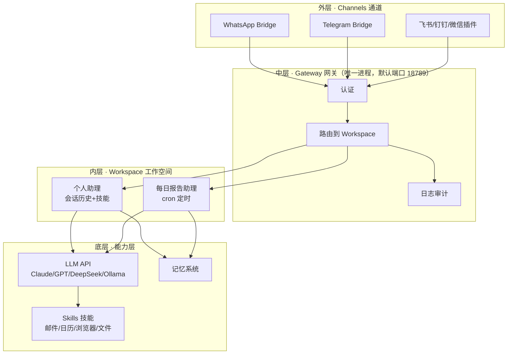
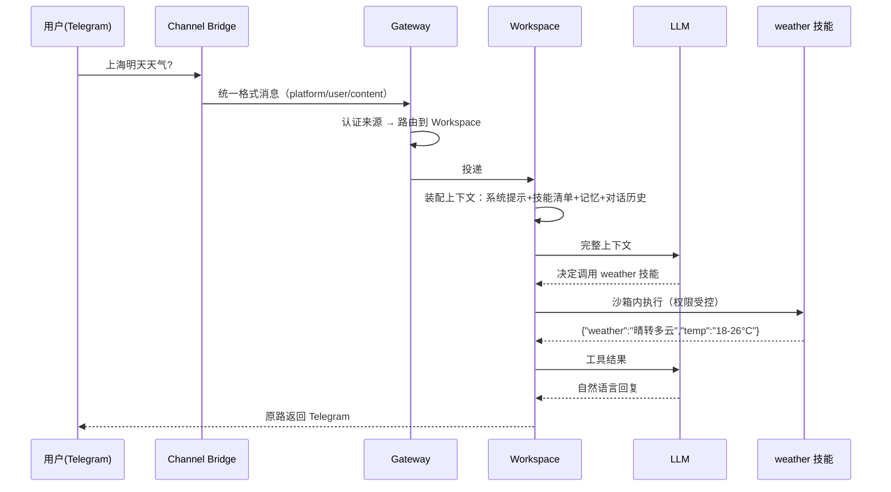

## OpenClaw 是什么

OpenClaw（前身 Clawdbot）是一个**完全开源、自己部署在自己机器上的个人 AI
助理**。它不只是聊天机器人——你通过 WhatsApp/Telegram/飞书/微信发一句
"帮我把今天的邮件整理成总结"，它就能真的去读邮件、写总结、发回给你。

核心思想一句话：**把大模型（大脑）+ 本地工具（手脚）+ 聊天软件（嘴巴耳朵）
连接起来**，让 AI 成为 24 小时在线的电脑管家。数据全在自己机器上，不上传
云端。

## 三层架构



| 概念 | 类比 | 职责 |
|---|---|---|
| **Gateway** | 大楼前台 | 唯一进程入口：认证、路由到工作空间、记录全部交互日志 |
| **Workspace** | 私人办公室 | 实际处理任务：管理对话历史、技能、LLM 配置；可多空间隔离不同事务 |
| **Channels** | 通信设备 | 各消息平台的适配器：接收消息 → 转统一内部格式 → 回发 |
| **Skills** | 工具箱 | 执行特定功能的模块，社区几百个，还能源生成 |
| **LLM** | 顾问大脑 | 外部大模型（自带 API Key），Gateway 只负责"叫它来干活" |

## 一条消息的生命周期

以"在 Telegram 说：上海明天天气？"为例：



关键设计：**LLM 不直连任何平台**——所有消息进出都过 Gateway，认证、路由、
审计有且只有一个收口；技能在受控环境执行，AI 改不了不该改的文件。

## Workspace：多空间隔离

每个 Workspace 是独立的配置单元（模型、技能、语言、温度各自独立）：

```yaml
# workspace-personal.yaml
name: "个人助理"
llm:
  provider: "anthropic"
  model: "claude-sonnet-4"
skills:
  - weather
  - calendar
  - email
  - web-search
settings:
  language: "zh-CN"
```

多空间的典型用法：个人助理 / 每日报告（cron 定时）/ 工作编码助手各一个，
**对话历史与技能互不污染**——这正是站内 [Worktree 隔离](/ai/advanced/agent/08-worktree-isolation/)
与[任务系统](/ai/advanced/agent/02-task-system/)强调的隔离思想在产品层的落地。

## 技能与权限

技能是能力模块，每个技能声明所需权限，执行前受权限系统约束：

| 权限 | 说明 |
|---|---|
| `network` | 网络访问（查天气、搜索） |
| `filesystem` | 读写文件 |
| `email` / `calendar` | 邮箱与日程 |
| `system` | 执行系统命令（最敏感） |

对照站内[权限系统](/ai/basic/agent/03-permission/)：同一套"执行前加门"
的原则——默认最小权限，敏感操作走 Human-in-the-Loop 确认。

## 定时任务

```yaml
cron_jobs:
  - name: "早间报告"
    schedule: "0 8 * * *"
    action:
      type: "send_message"
      channel: "telegram"
      template: |
        请生成今日报告：查天气 + 列日程 + 友好呈现
```

每天 8 点自动触发，产出推送到 Telegram——[定时调度 Cron](/ai/advanced/agent/04-cron-scheduler/)
的"调度与执行解耦"在产品里的直接体现。

## 数据存储分层

| 数据 | 存放 | 保留 |
|---|---|---|
| 当前会话状态 | 内存 | 会话结束 |
| 对话历史 | 本地数据库 | 可配置（如 30 天） |
| 用户配置 | 配置文件 | 永久 |
| 技能数据 | 技能自管 | 随技能 |
| 系统日志 | 日志文件 | 可配置 |

## 要点备忘

- OpenClaw 的架构本质：**通道接入层 + 单一网关收口 + 工作空间隔离 + 技能
  权限**——四层各司其职，LLM 只是可插拔的"大脑"。
- Gateway 是唯一进程（默认 18789 端口）：认证、路由、日志三件事都在它，
  消息永远不直连模型。
- 数据全本地：会话历史、配置、日志都在自己机器，隐私自持。

## 延伸阅读

- [OpenClaw 工作原理（菜鸟教程）](https://www.runoob.com/ai-agent/openclaw-how-it-works.html)（架构图解与消息流转）
- [OpenClaw 官方文档](https://docs.openclaw.ai/zh-CN)（部署与配置）
- [OpenClaw 常见问题（阿里云帮助中心）](https://help.aliyun.com/zh/simple-application-server/use-cases/openclaw-faq)
