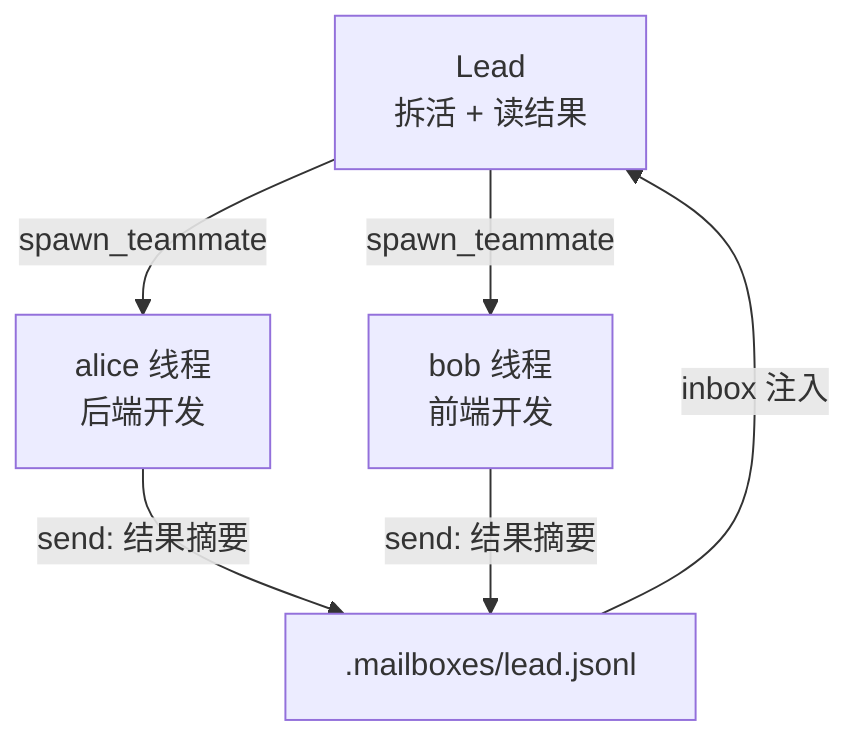

## 核心一句话

> Persistent teammates let work continue in parallel without stuffing every
> thought into one context.（常驻队友让工作并行推进，不用把每个想法都塞进
> 一个上下文。）

## 问题

"重构整个后端"涉及认证模块、数据库层、API 路由、测试。一个 Agent 在修
API 路由时，认证模块的细节已经不在上下文里了。上下文窗口就那么大，单个
Agent 的注意力覆盖不了所有模块。

[子智能体](/ai/intermediate/agent/subagent/)是**临时工**，叫来干一件事就
走了。但有些任务需要能通信、能协作的**队友**。

## 解决方案

新增三样：**MessageBus**（文件收件箱）、**spawn\_teammate\_thread**（启动
队友线程）、**inbox 注入**（Lead 接收队友消息并注入 history）。

|              | s06 子 Agent      | s15 队友                        |
| ------------ | ----------------- | ------------------------------ |
| 生命周期      | 一次性，用完销毁    | 多轮（教学版限 10 轮，真实 CC 用 idle loop） |
| 通信         | 只回传结论         | 异步收件箱，随时通信             |
| 上下文       | 完全隔离           | 通过消息共享信息                |
| 数量         | 一个主 Agent + 偶尔子 Agent | 一个 Lead + 多个队友    |



## 工作原理

### MessageBus：文件收件箱

每个 Agent（包括 Lead 和队友）有一个 `.jsonl` 邮箱。发消息 = 往对方的
文件里 append 一行 JSON。读消息 = 读文件 + 删除（消费式）：

```python
class MessageBus:
    def send(self, from_agent: str, to_agent: str,
             content: str, msg_type: str = "message"):
        msg = {"from": from_agent, "to": to_agent,
               "content": content, "type": msg_type,
               "ts": time.time()}
        inbox = MAILBOX_DIR / f"{to_agent}.jsonl"
        with open(inbox, "a") as f:
            f.write(json.dumps(msg) + "\n")

    def read_inbox(self, agent: str) -> list[dict]:
        inbox = MAILBOX_DIR / f"{agent}.jsonl"
        if not inbox.exists():
            return []
        msgs = [json.loads(line) for line in inbox.read_text().splitlines()]
        inbox.unlink()  # 消费式：读完删除
        return msgs
```

为什么用文件而不是内存队列？文件直观、跨线程可观察。真实 CC 也用文件收件箱
（`~/.claude/teams/{team}/inboxes/`），但加了 `proper-lockfile` 防并发写
冲突。教学版的 `read_inbox` 有 read + unlink 竞态，多线程同时读可能丢消息，
对教学场景可以接受。

### spawn\_teammate\_thread：启动队友

Lead 调用 `spawn_teammate` 工具启动一个队友。队友跑在自己的 daemon 线程里，
有自己的 system prompt、自己的 messages、自己的简化工具集：

```python
def spawn_teammate_thread(name: str, role: str, prompt: str) -> str:
    system = f"You are '{name}', a {role}. Use tools to complete tasks."

    def run():
        messages = [{"role": "user", "content": prompt}]
        sub_tools = [bash, read_file, write_file, send_message]
        for _ in range(10):  # 最多 10 轮
            inbox = BUS.read_inbox(name)
            if inbox:
                messages.append({"role": "user",
                                 "content": f"<inbox>{json.dumps(inbox)}</inbox>"})
            response = client.messages.create(
                model=MODEL, system=system, messages=messages[-20:],
                tools=sub_tools, max_tokens=8000)
            # ... 执行工具、处理结果
        # 完成后发 summary 给 Lead
        BUS.send(name, "lead", summary, "result")

    threading.Thread(target=run, daemon=True).start()
```

关键设计：

- **队友有简化工具集**：bash、read、write、send\_message。真实 CC 的队友
  也有 TaskCreate、TaskUpdate 等工具，任务系统是团队共享的
- **教学版限 10 轮**：防止队友无限循环。真实 CC 用 idle loop：跑完一轮后
  发 `idle_notification`，等 inbox 消息，收到后继续，直到 shutdown\_request
  才退出
- **完成后自动汇报**：`BUS.send(name, "lead", summary)` 把最终结果发到
  Lead 的收件箱

### Lead 的 inbox 注入

Lead 在每轮主循环结束后检查收件箱。队友发来的消息注入到 history 里，让
LLM 能看到并做出反应：

```python
# 主循环结束后
inbox = BUS.read_inbox("lead")
if inbox:
    inbox_text = "\n".join(
        f"From {m['from']}: {m['content'][:200]}" for m in inbox)
    history.append({"role": "user",
                    "content": f"[Inbox]\n{inbox_text}"})
```

CC 更精细：Lead 的 `useInboxPoller` 每 1 秒检查一次，有消息就提交为新的
turn，不需要等用户输入。

### 权限冒泡

教学版省略了权限冒泡。真实 CC 的流程：

1. 队友遇到需要审批的操作 → 发 `permission_request` 到 Lead 收件箱
2. Lead 的 `useInboxPoller` 检测到请求 → 路由到审批队列
3. 用户审批后 → Lead 发 `permission_response` 回队友
4. 队友的 `useSwarmPermissionPoller`（每 500ms 轮询）收到回复 → 继续或拒绝

### 合起来跑

```
1. Lead: "搭建后端：一个人搞不定，组队吧"
2. Lead → spawn_teammate("alice", "backend dev", "创建数据库 schema")
3. Lead → spawn_teammate("bob", "frontend dev", "写 API 客户端")
4. alice 线程启动 → 自己的 LLM 调用 → bash "python manage.py migrate"
5. bob 线程启动 → 自己的 LLM 调用 → write_file("client.ts", ...)
6. alice 完成 → BUS.send("alice", "lead", "Schema done: users, orders tables")
7. bob 完成 → BUS.send("bob", "lead", "Client written with types")
8. Lead 下次循环 → inbox 注入 history → LLM 看到 alice 和 bob 的结果
```

两个队友并行工作。

## 深入 CC 源码

以下基于 CC 源码 `spawnMultiAgent.ts`、`useInboxPoller.ts`（969 行）、
`useSwarmPermissionPoller.ts`、`teammateMailbox.ts` 的完整分析。

### 没有中央消息总线，是文件系统

教学版用 `MessageBus` 类收发消息。CC 的做法更直接：每个 Agent 直接写其他
Agent 的收件箱文件（`~/.claude/teams/{teamName}/inboxes/{agentName}.json`），
写入时用 `proper-lockfile` 文件锁保证并发安全（最多重试 10 次）。

### 15 种消息类型

CC 的团队通信有 15 种结构化消息：普通文本、`idle_notification`、
`permission_request/response`、`plan_approval_request/response`、
`shutdown_request/approved/rejected`、`task_assignment`、
`team_permission_update`、`mode_set_request`、`sandbox_permission_*`、
`teammate_terminated`。文本消息被包装在 `<teammate-message>` XML 标签中
交付给模型。

### 队友生命周期

CC 的队友由 `spawnTeammate()` 创建：

1. **Spawn**：创建 tmux 窗格（或进程内），分配颜色，写入 team config
2. **Work**：`useInboxPoller` 每 1 秒检查收件箱 → 有消息就提交为新的 turn
3. **Idle**：Stop hook 触发 → 发 `idle_notification` 给 Lead
4. **Shutdown**：Lead 发 `shutdown_request` → 队友回复 `shutdown_approved`
   → Lead 清理

Team config 是团队注册表（`~/.claude/teams/{teamName}/config.json`），记录
成员、agentType、颜色、活跃状态。队友之间不能嵌套——CC 明确禁止
"teammates spawning other teammates"。

## 试一下

```bash
cd learn-claude-code
python s15_agent_teams/code.py
```

| Prompt                                                                                              | 预期行为           |
| --------------------------------------------------------------------------------------------------- | -------------- |
| `Spawn alice as a backend developer. Ask her to create a file called schema.sql with a users table.` | 启动队友干活       |
| `Check your inbox for alice's result.`                                                              | Lead 读收件箱    |
| `Spawn bob as a tester. Ask him to check if schema.sql exists and list its contents.`               | 多队友并行       |

观察重点：Lead 如何启动队友？`.mailboxes/` 目录下的 JSONL 文件长什么样？
队友完成后 Lead 的 inbox 有没有注入到 history？

## 要点备忘

- 团队 = 收件箱的集合：协调不需要共享内存，异步消息就够了
- 子 Agent 解决"临时隔离"，常驻队友解决"长期并行"——两种 delegation 各有
  适用场景
- 消息即文件：可观察、可恢复，配文件锁就是并发安全的消息总线
- 权限冒泡让"队友干危险活"仍然经过用户审批——多 Agent 不等于失控

## 延伸阅读

- [Learn Claude Code s15: Agent Teams](https://learn.shareai.run/zh/s15/)（含 15 种消息类型源码核查）
- 对比：[子智能体 Subagent](/ai/intermediate/agent/subagent/)
- 下一步：队友之间要有约定，见[团队协议](/ai/advanced/agent/team-protocols/)
