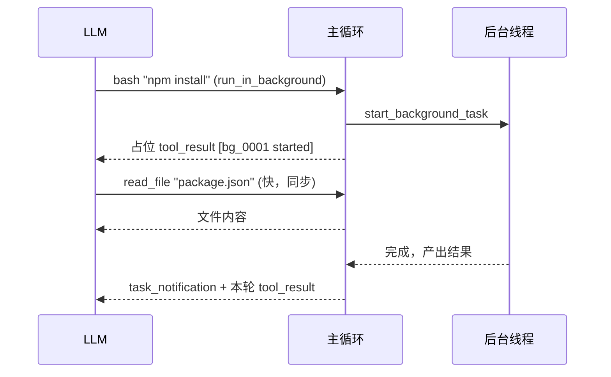

## 核心一句话

> The agent can keep reasoning while slow work completes elsewhere.
> （Agent 在慢活于别处完成的同时，可以继续推理。）

## 问题

你用过洗衣机吗？把衣服扔进去，按下启动，然后去干别的——做饭、回消息、看
论文。30 分钟后洗衣机"滴滴滴"提醒你：好了。你不会站在洗衣机前面干等
30 分钟。

Agent 的 bash 工具也一样。`pip install torch` 要 10 分钟，`npm run build`
要 3 分钟。这些命令一跑，Agent 就在等 bash 工具返回，没法利用这段时间处理
别的任务。

读文件是毫秒级，不等。`git status` 一秒内返回，不等。但 `npm install`？
分钟级。Agent 等 10 分钟什么都不做，而 LLM 按 token 计费，**空转就是浪费**。

## 解决方案

唯一的变动：慢操作扔到后台线程，Agent 继续跑循环，后台完成后把通知注入到
对话里。

|              | 同步 (s12)   | 后台 (s13)                      |
| ------------ | ----------- | ------------------------------ |
| 慢操作        | Agent 干等   | 后台线程执行                    |
| Agent 空闲   | 是          | 否，继续处理                    |
| 结果         | 立即返回     | 下轮注入通知                    |
| 判断标准      | —           | `run_in_background` 参数（模型显式请求），启发式兜底 |



## 工作原理

### should\_run\_background：显式请求优先，启发式兜底

模型通过 bash 工具的 `run_in_background` 参数显式请求后台执行。如果模型
没指定，教学版用关键词启发式兜底：

```python
def is_slow_operation(tool_name: str, tool_input: dict) -> bool:
    """Fallback heuristic: commands likely to take > 30s."""
    if tool_name != "bash":
        return False
    cmd = tool_input.get("command", "").lower()
    slow_keywords = ["install", "build", "test", "deploy", "compile",
                     "docker build", "pip install", "npm install",
                     "cargo build", "pytest", "make"]
    return any(kw in cmd for kw in slow_keywords)

def should_run_background(tool_name: str, tool_input: dict) -> bool:
    """Model explicit request takes priority; fallback to heuristic."""
    if tool_input.get("run_in_background"):
        return True
    return is_slow_operation(tool_name, tool_input)
```

CC 的 bash 工具 schema 里有 `run_in_background: boolean` 参数。**模型自己
决定**哪些命令丢后台，不靠关键词猜。教学版保留启发式作为兜底，但主路径是
模型显式请求。

### start\_background\_task：后台执行与生命周期

把工具调用包装成 worker 函数，扔到 daemon 线程里执行。每个后台任务有唯一
ID，状态存在 `background_tasks` 字典里：

```python
_bg_counter = 0
background_tasks: dict[str, dict] = {}   # bg_id → {tool_use_id, command, status}
background_results: dict[str, str] = {}  # bg_id → output
background_lock = threading.Lock()

def start_background_task(block) -> str:
    """Run tool in a daemon thread. Returns background task ID."""
    global _bg_counter
    _bg_counter += 1
    bg_id = f"bg_{_bg_counter:04d}"

    def worker():
        result = execute_tool(block)
        with background_lock:
            background_tasks[bg_id]["status"] = "completed"
            background_results[bg_id] = result

    with background_lock:
        background_tasks[bg_id] = {
            "tool_use_id": block.id,
            "command": block.input.get("command", ""),
            "status": "running",
        }
    thread = threading.Thread(target=worker, daemon=True)
    thread.start()
    return bg_id
```

`daemon=True` 确保 Agent 进程退出时线程跟着退出。

### collect\_background\_results：通知收集

后台任务完成后，收集结果并格式化为 `<task_notification>` 通知：

```python
def collect_background_results() -> list[str]:
    """Collect completed results as task_notification messages."""
    with background_lock:
        ready_ids = [bid for bid, task in background_tasks.items()
                     if task["status"] == "completed"]
        notifications = []
        for bg_id in ready_ids:
            task = background_tasks.pop(bg_id)
            output = background_results.pop(bg_id, "")
            notifications.append(
                f"<task_notification>\n"
                f"  <task_id>{bg_id}</task_id>\n"
                f"  <status>completed</status>\n"
                f"  <command>{task['command']}</command>\n"
                f"  <summary>{output[:200]}</summary>\n"
                f"</task_notification>")
        return notifications
```

**通知不复用原始 `tool_use_id`**。原始 tool call 已经用占位 `tool_result`
回复了，后台完成是独立事件，用 `task_notification` 格式注入。这符合
Messages API 的工具配对语义：一个 `tool_use` 只对应一个 `tool_result`。

### 循环中的集成

agent\_loop 里，工具执行分两条路，通知和结果合并为一条 user 消息：

```python
results = []
for block in response.content:
    if block.type != "tool_use":
        continue
    if should_run_background(block.name, block.input):
        bg_id = start_background_task(block)
        results.append({"type": "tool_result",
                        "tool_use_id": block.id,
                        "content": f"[Background task {bg_id} started] "
                                   f"Result will be available when complete."})
    else:
        output = execute_tool(block)
        results.append({"type": "tool_result",
                        "tool_use_id": block.id, "content": output})

# 通知和工具结果合入同一条 user 消息
user_content = []
for notif in collect_background_results():
    user_content.append({"type": "text", "text": notif})
user_content.extend(results)
messages.append({"role": "user", "content": user_content})
```

慢操作先回一个带 `bg_id` 的占位 tool\_result，LLM 知道这个命令还在跑，
可以先做别的事。后台完成后，通知作为独立 text block 和当前轮的 tool\_result
一起组成 user 消息。

### 合起来跑

```
Turn 1:
  LLM → bash "npm install" (run_in_background=true)
      → start_background_task → bg_0001
      → tool_result: "[Background task bg_0001 started]..."
  LLM: "OK, I'll check later. Let me also read the config."

Turn 2:
  LLM → read_file "package.json" (fast, sync)
      → tool_result: file content
      → collect: bg_0001 done! inject <task_notification>
  LLM sees: config file + install notification in one message
```

Agent 没干等——npm install 跑后台的时候，它去读了配置文件。

## 深入 CC 源码

以下基于 CC 源码 `query.ts`、`LocalShellTask.tsx`、`messageQueueManager.ts`、
`utils/task/framework.ts` 的完整分析。

### 线程模型：没有真正的线程

CC 运行在 Node.js/Bun **单线程事件循环**中。"后台"只是"不 await"。
`ShellCommand.background(taskId)` 把 stdout/stderr 重定向到文件，让进程独立
运行。

### 七种后台任务类型

CC 定义了 7 种后台任务：`local_bash`、`local_agent`、`remote_agent`、
`in_process_teammate`、`local_workflow`、`monitor_mcp`、`dream`。每种有自己
的注册、生命周期和通知机制。

### 通知注入：命令队列

后台任务完成后通过 `enqueueTaskNotification` 入队到共享命令队列。通知格式
是结构化的 XML：

```
<task_notification>
  <status>completed</status>
  <summary>Background command "npm test" completed (exit code 0)</summary>
</task_notification>
```

优先级分 `next` > `later`。后台任务默认 `later`（不阻塞用户输入）。

### 停滞看门狗

后台 bash 任务有一个看门狗，定期检查输出是否停滞——45 秒无增长后检测交互式
提示（`(y/n)` 等），防止后台任务卡在无人响应的交互式对话框。

### 并发限制

前台工具调用：`CLAUDE_CODE_MAX_TOOL_USE_CONCURRENCY`（默认 10 个并发安全
工具）。后台 bash 任务：没有硬性限制，它们是独立的子进程。

## 试一下

```bash
cd learn-claude-code
python s13_background_tasks/code.py
```

| Prompt                                                                                                | 预期行为             |
| ----------------------------------------------------------------------------------------------------- | ---------------- |
| `Run pip list in the background and find all Python files in this directory`                          | 后台 + 前台并行      |
| `Run npm install (use run_in_background) and while waiting, read package.json`                        | 占位结果 + 通知注入 |
| `Create a task to setup the project, then run pip list in the background`                             | 与任务系统组合      |

观察重点：慢操作有没有被送到后台？`bg_id` 是否返回？后台通知有没有以
`<task_notification>` 格式注入？

## 要点备忘

- 判断后台化的主路径是**模型显式请求**（`run_in_background` 参数），启发式
  只是兜底——模型比关键词更懂哪条命令慢
- 一个 `tool_use` 只对应一个 `tool_result`：占位结果立即回，后台完成走独立
  的 `task_notification` 通道
- 通知与当前轮 tool\_result 合并成一条 user 消息，模型一次看到全部新信息
- `daemon=True`：主进程退出，后台线程跟着退，不留孤儿进程

## 延伸阅读

- [Learn Claude Code s13: Background Tasks](https://learn.shareai.run/zh/s13/)（含七种后台任务类型与看门狗源码核查）
- 上游概念：[任务系统 Task System](/ai/advanced/agent/task-system/)
- 下一步：按时间表自动触发，见[定时调度 Cron](/ai/advanced/agent/cron-scheduler/)
