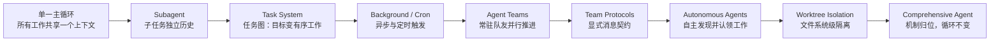

## 为什么需要多个 Agent

单个主循环的瓶颈在**上下文**：所有子任务的细节都挤在一个 messages 里，
既浪费窗口又互相干扰。Learn Claude Code 后半部分的演进线索是：让每个子任务
有干净的消息历史，同时保留主线程的全局视野。

> "Subagents give each subtask a clean message history while preserving the
> main thread." —— s06
>
> "Persistent teammates let work continue in parallel without stuffing every
> thought into one context." —— s15

## 演进路线

每个阶段解决一个确定的问题，逐步把"一个循环"长成"一个平台"：

| 机制                                                    | 解决的问题         | 核心一句话                      |
| ----------------------------------------------------- | ------------- | -------------------------- |
| [子智能体](/ai/intermediate/agent/subagent/)              | 上下文污染         | 大任务拆小，每个子任务干净的消息历史         |
| [任务系统](/ai/advanced/agent/task-system/)               | 计划不持久         | 文件持久化的任务图，可依赖、可认领、跨会话恢复    |
| [后台任务](/ai/advanced/agent/background-tasks/)          | 慢操作阻塞         | 慢操作丢后台线程，主循环继续推理           |
| [定时调度](/ai/advanced/agent/cron-scheduler/)            | 周期性靠人推        | 按时间表生产工作，调度与执行解耦           |
| [Agent 团队](/ai/advanced/agent/agent-teams/)           | 单 Agent 注意力不够 | 文件收件箱 + 常驻队友线程，并行推进        |
| [团队协议](/ai/advanced/agent/team-protocols/)            | 协作失控          | 显式消息契约：request\_id 关联请求与响应 |
| [自主智能体](/ai/advanced/agent/autonomous-agents/)        | 调度瓶颈          | 队友自己看板、自己认领，不等 Lead 派单     |
| [Worktree 隔离](/ai/advanced/agent/worktree-isolation/) | 文件冲突          | 并行 Agent 需要隔离的文件系统，如同隔离的对话 |
| [综合 Harness](/ai/advanced/agent/comprehensive-agent/) | 机制归位          | 机制很多，循环一个                  |

## 协作架构与失败模式

《深入理解 AI Agent》第 10 章从设计原理角度展开多 Agent 协作：协作框架、
上下文的共享与隔离、失败模式，以及涌现的"Agent 社会"。核心论点：**群体智能
高于个体**，但前提是协作结构设计得当——否则多个 Agent 只会更贵、更乱。

## 要点备忘

- 多 Agent 的第一动机是**上下文管理**（隔离与并行），其次才是"更多算力"

- Subagent 返回摘要而非过程，主线程视野不被稀释

- 团队协作的三个地基：任务图（可观察）、消息契约（可预期）、文件隔离
  （不冲突）

- 自主认领工作前，先把任务系统和协议做扎实——顺序不能反

- 最终形态（s20）仍是**一个循环**，只是周围长满了让它"生产可用"的系统

## 延伸阅读

- [Learn Claude Code 课程首页](https://learn.shareai.run/zh/)（s01-s20 全 20 章渐进式课程）

- [深入理解 AI Agent · 第 10 章 多 Agent 协作](https://bojieli.github.io/ai-agent-book/book/chapter10/)

