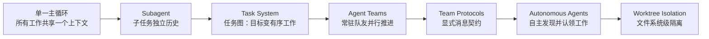
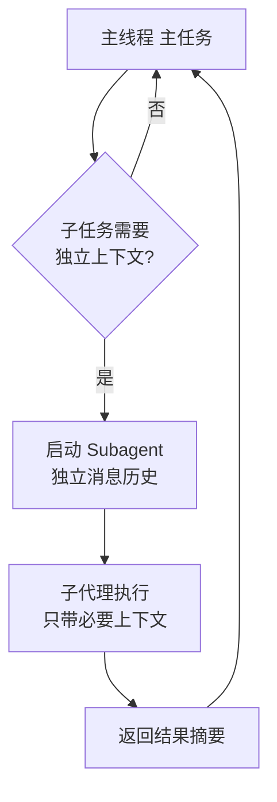

## 为什么需要多个 Agent

单个主循环的瓶颈在**上下文**：所有子任务的细节都挤在一个 messages 里，
既浪费窗口又互相干扰。Learn Claude Code 后半部分的演进线索是：让每个子任务
有干净的消息历史，同时保留主线程的全局视野。

> "Subagents give each subtask a clean message history while preserving the
> main thread." —— s06
>
> "Persistent teammates let work continue in parallel without stuffing every
> thought into one context." —— s15

## 演进路线

## Subagent：干净的消息历史

主线程把子任务委托给子代理：子代理**只携带必要上下文**启动，独立执行，
返回**结果摘要**而不是完整过程。

价值：探索性工作（读大量文件、试错）的中间细节不污染主线程；主线程的上下文
预算留给真正重要的信息。

## Task System：把目标变成有序工作

s12 的任务图（task graph）把模糊目标拆成**有序、可观察**的工作单元——每项任务
有状态（待办/进行中/完成）、有依赖关系、可被分配。这是团队协作的地基：
没有可观察的任务清单，多个 Agent 就无法分工。

## Agent Teams 与协议

| 机制 | 解决的问题 | 核心一句话 |
|---|---|---|
| Agent Teams（s15） | 并行推进 | 常驻队友各守一摊，工作不挤一个上下文 |
| Team Protocols（s16） | 协作失控 | 多 Agent 系统需要**显式消息契约**，不是"凭感觉"（not vibes） |
| Autonomous Agents（s17） | 调度瓶颈 | 队友能**自己发现并认领**工作，不等人派单 |
| Worktree Isolation（s18） | 文件冲突 | 并行 Agent 需要隔离的文件系统，如同隔离的对话 |

Worktree 隔离在实践中通常用 Git worktree 实现：每个并行 Agent 在独立工作树里
改代码，互不踩踏，完成后合流。

## 协作架构与失败模式

《深入理解 AI Agent》第 10 章从设计原理角度展开多 Agent 协作：协作框架、
上下文的共享与隔离、失败模式，以及涌现的"Agent 社会"。核心论点：**群体智能
高于个体**，但前提是协作结构设计得当——否则多个 Agent 只会更贵、更乱。

## 要点备忘

- 多 Agent 的第一动机是**上下文管理**（隔离与并行），其次才是"更多算力"
- Subagent 返回摘要而非过程，主线程视野不被稀释
- 团队协作的三个地基：任务图（可观察）、消息契约（可预期）、文件隔离（不冲突）
- 自主认领工作前，先把任务系统和协议做扎实——顺序不能反
- 最终形态（s20）仍是**一个循环**，只是周围长满了让它"生产可用"的系统

## 延伸阅读

- [Learn Claude Code s06: Subagent](https://learn.shareai.run/zh/s06/)
- [Learn Claude Code s12-s18](https://learn.shareai.run/zh/)（任务系统、团队、协议、自主代理、工作树隔离）
- [深入理解 AI Agent · 第 10 章 多 Agent 协作](https://bojieli.github.io/ai-agent-book/book/chapter10/)
