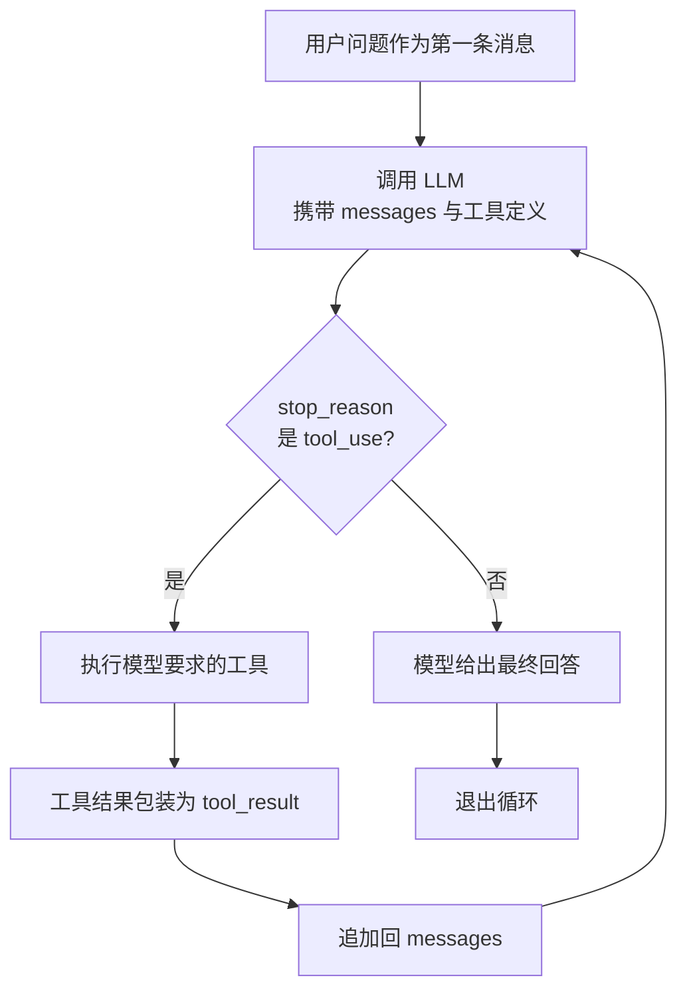

## 核心公式

《深入理解 AI Agent》全书围绕一个公式展开：

> **Agent = LLM + 上下文 + 工具**

模型负责**决策**（要不要调工具、调哪个），Harness 负责**执行**（调了就跑、
结果喂回去）。Harness 不是智能本身，而是让模型能持续行动的运行框架。

## 问题：模型会输出命令，但不会自己跑

你让大模型"读取目录下的文件并执行 xxx.py"，它能输出一条 bash 命令，但输出完
就停了——不会自己执行，也看不到结果，更不会基于结果继续推理。

你可以手动跑一遍，把输出粘贴回对话框，让它接着干；下一条命令出来，再跑、再贴。
每一个来回，你都在做中间层。**把这个过程自动化，就是 Agent Loop。**

## 循环流程

整个过程只有两个信号：

| 信号                          | 含义           | 循环动作            |
| --------------------------- | ------------ | --------------- |
| `stop_reason == "tool_use"` | 模型举手说"我要用工具" | 执行 → 结果喂回去 → 继续 |
| `stop_reason != "tool_use"` | 模型说"我做完了"    | 退出循环            |



## 最小实现（约 30 行）

```python
def agent_loop(messages):
    while True:
        response = client.messages.create(
            model=MODEL, system=SYSTEM, messages=messages,
            tools=TOOLS, max_tokens=8000,
        )
        messages.append({"role": "assistant", "content": response.content})

        if response.stop_reason != "tool_use":
            return

        results = []
        for block in response.content:
            if block.type == "tool_use":
                output = run_bash(block.input["command"])
                results.append({
                    "type": "tool_result",
                    "tool_use_id": block.id,
                    "content": output,
                })
        messages.append({"role": "user", "content": results})
```

分步来看：

1. 把用户的问题作为第一条消息
2. 将消息和工具定义一起发给 LLM
3. 追加模型回答；检查它是否调了工具，没调 → 结束
4. 执行模型要求的工具，收集结果
5. 把工具结果作为新消息追加，回到第 2 步

## 教学版 vs 生产版（Claude Code 源码对照）

Learn Claude Code s01 对照了 Claude Code 源码 `src/query.ts`（1729 行）。核心差异
只有两个：

- **CC 不看** **`stop_reason`** **字段**，而是检查内容里有没有 `tool_use` 块——流式响应中
  `stop_reason` 可能还没更新但内容里已经有 `tool_use` 了。CC 用 `needsFollowUp`
  标志：只要检测到 `tool_use` 块就设为 `true`

- **CC 有更多退出路径和恢复策略**，覆盖 blocking limit、prompt too long、model
  error、abort、hook stop、max turns、token budget continuation、reactive compact
  retry 等场景

生产版 State 对象有 10 个字段（教学版只用 messages）：

| #  | 字段                             | 用途                 | 对应章节 |
| -- | ------------------------------ | ------------------ | ---- |
| 1  | `messages`                     | 当前迭代的消息数组          | s01  |
| 2  | `toolUseContext`               | 工具、信号、权限上下文        | s02  |
| 3  | `autoCompactTracking`          | 压缩状态追踪             | s08  |
| 4  | `maxOutputTokensRecoveryCount` | token 恢复尝试次数（上限 3） | s11  |
| 5  | `hasAttemptedReactiveCompact`  | 本轮是否已尝试响应式压缩       | s08  |
| 6  | `maxOutputTokensOverride`      | 8K→64K 的升级覆盖       | s11  |
| 7  | `pendingToolUseSummary`        | 后台 Haiku 生成的工具摘要   | s08  |
| 8  | `stopHookActive`               | 停止钩子是否产生阻塞错误       | s04  |
| 9  | `turnCount`                    | 轮次计数（maxTurns 检查）  | s01  |
| 10 | `transition`                   | 上一次继续原因            | s11  |

此外 CC 的 `StreamingToolExecutor` 让工具在模型还在生成时就开始并行执行（根据
工具是否并发安全决定并发或独占）。

## 要点备忘

- **30 行的** **`while True`** **就是 1729 行 query.ts 的核心**，所有复杂字段和退出路径
  都是保护机制；先理解核心循环，后面的一切自然展开

- 每次调用都是无状态的：模型不"记住"上一轮，Harness 必须每次送回完整历史

- 模型只发出调用请求，真正执行工具的是 Harness——这是理解 Agent 架构的关键

- 教学版只有 1 条退出路径（模型不调工具就结束），生产版有多条恢复与退出路径

## 延伸阅读

- [Learn Claude Code s01: The Agent Loop](https://learn.shareai.run/zh/s01/)（含 CC 源码核查细节）

- [深入理解 AI Agent · 第 1 章 Agent 基础知识](https://bojieli.github.io/ai-agent-book/book/chapter1/)

