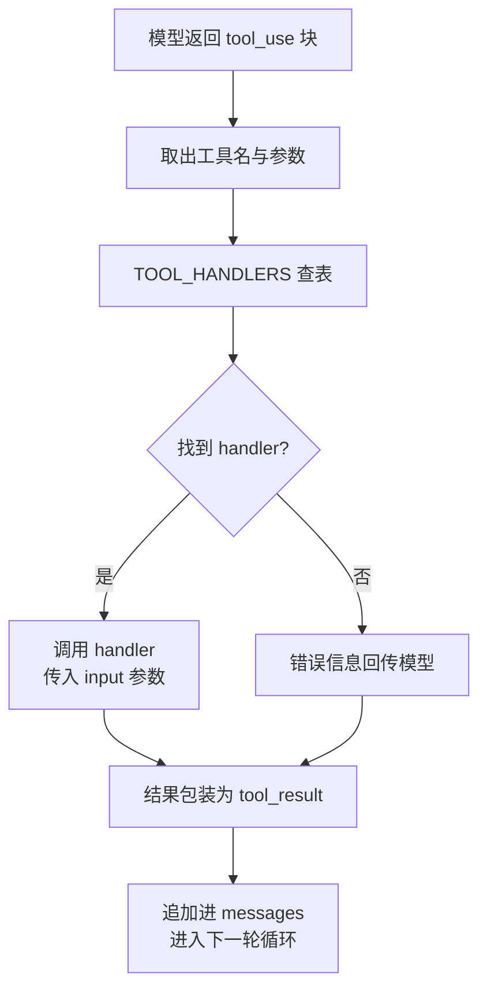
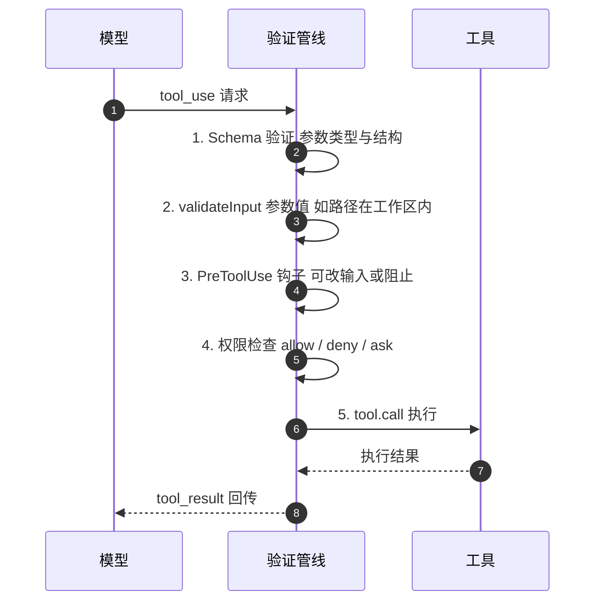

## 为什么需要专用工具

只有 bash 一个工具时：读文件要 `cat`，写文件要 `echo "..." > file.py`，改文件要
`sed`。模型想的是"读这个文件"，却要拼出 `cat path/to/file`——多了一层翻译，
浪费 token，还容易拼错。

给 Agent 专用工具后，模型直接表达意图：`read_file(path="...")`。

## 工具定义：告诉模型"我能做什么"

每个工具是一条 JSON Schema 描述，随请求的 `tools` 字段传给模型（不是消息）：

```python
TOOLS = [
    {"name": "bash", "description": "Run a shell command.", ...},
    {"name": "read_file", "description": "Read file contents.", ...},
    {"name": "write_file", "description": "Write content to file.", ...},
    {"name": "edit_file", "description": "Replace text in file once.", ...},
    {"name": "glob", "description": "Find files by pattern.", ...},
]
```

模型看到的是"工具名 + 用途说明 + 参数结构"；它据此决定调哪个、传什么参数。

## 分发流程："加一个工具，只加一个 handler"

s01 的循环完全保留，唯一的变动在工具执行那一行：`run_bash()` 替换为
`TOOL_HANDLERS[block.name]()` 查表分发。



给 Agent 加一个工具只需两件事：

1. **定义工具**：在 `TOOLS` 数组里加一条描述
2. **注册处理函数**：在 `TOOL_HANDLERS` 字典里加一行映射

```python
TOOL_HANDLERS = {
    "bash": run_bash,
    "read_file": run_read,
    "write_file": run_write,
    "edit_file": run_edit,
    "glob": run_glob,
}

# 循环里只改了一行——从硬编码 run_bash 变成查表：
for block in response.content:
    if block.type == "tool_use":
        handler = TOOL_HANDLERS[block.name]   # 查表
        output = handler(**block.input)       # 调用
        results.append(...)
```

**循环不变，能力可插拔**——这是 Agent 工具系统的核心设计。

## 多工具调用

模型经常一次返回多个 tool_use："读一下 a.py 和 b.py，然后列出所有 .py 文件"。
教学版按 `response.content` 原始顺序逐个执行。

Claude Code 的做法更精细——`partitionToolCalls()` 按连续块分批：

```
[read A, read B, glob *.py, bash "rm x", read C]
 → batch1（并发）: [read A, read B, glob *.py]
 → batch2（串行）: [bash "rm x"]
 → batch3（并发）: [read C]
```

并发安全的连续块编入同一个 batch，batch 内真正并发执行（有并发上限）；遇到
非并发安全的就开新 batch；batch 之间严格顺序。

注意 CC 的并发判断**不是简单的"只读 vs 写"**，而是按具体输入判断：

| 工具 | isReadOnly | isConcurrencySafe |
|---|---|---|
| FileRead | true | true |
| Glob | true | true |
| Bash `ls` | true | **true**（关键差异：只读命令可并发） |
| Bash `rm` | false | false |
| TaskCreate | false | **true**（改状态但写不同文件，可并发） |

## CC 的验证管线

生产级 Agent 的每个工具调用经过 5 步验证（`toolExecution.ts`）：



每个工具还有 `maxResultSizeChars` 上限：结果超过阈值就落盘，模型看到的是
预览 + 文件路径。FileRead 特殊——设为 `Infinity`，否则读文件的结果被落盘后，
再读那个落盘文件又会触发落盘，形成无限循环。

## 相对 s01 的变更

| 组件 | 之前（s01） | 之后（s02） |
|---|---|---|
| 工具数量 | 1（bash） | 5（+read、write、edit、glob） |
| 工具执行 | 硬编码 `run_bash()` | TOOL_HANDLERS 查表分发 |
| 路径安全 | 无 | safe_path 校验（仅文件工具） |
| 循环 | `while True` + `stop_reason` | 与 s01 完全一致 |

## 要点备忘

- 工具定义与实现分离：定义告诉模型能做什么，handler 决定实际怎么做
- 分发查表让"加工具"变成增量改动，不动核心循环
- bash 不受 safe_path 保护，`rm -rf /` 还是能跑——所以 s03 要加权限门
- 模型一次可能返回多个 tool_use，执行顺序策略（顺序/分批并发）由 Harness 决定

## 延伸阅读

- [Learn Claude Code s02: Tool Use](https://learn.shareai.run/zh/s02/)（含 CC 分区算法与验证管线源码细节）
- [深入理解 AI Agent · 第 4 章 工具](https://bojieli.github.io/ai-agent-book/book/chapter4/)
