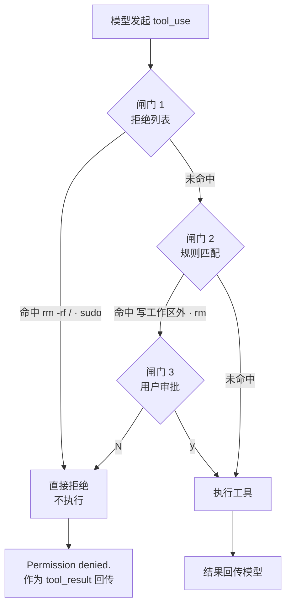

## 核心一句话

> Dangerous actions need a harness decision point before the shell runs.
> （危险动作需要在 shell 执行前有一个 Harness 决策点。）

**安全不能靠信任模型，要靠代码**——在工具执行之前做判断。模型提议工具，
运行时把每个请求路由到 allow / ask / deny。

## 问题

s02 的 Agent 有 5 个工具。file tools 受 `safe_path` 保护，但 bash 不受限制。
让它"清理一下项目"，可能执行 `rm -rf /`。

## 三道闸门

s02 的循环完全保留，唯一的变动在工具执行前插入 `check_permission()`。
顺序固定：硬拒绝优先，软询问次之，都没命中就放行。



| 闸门      | 作用                         | 命中后       |
| ------- | -------------------------- | --------- |
| 1. 拒绝列表 | 永远禁止的操作（`rm -rf /`、`sudo`） | 直接拒绝，不执行  |
| 2. 规则匹配 | 取决于上下文的操作（写工作区外、`rm` 文件）   | 交给闸门 3    |
| 3. 用户审批 | 闸门 2 命中后，暂停等用户确认           | 用户决定允许或拒绝 |

三道都没命中 → 直接执行。大部分日常只读操作走这条路。

## 三个请求，三种路由

| 请求                                 | 判定      | 路由                     |
| ---------------------------------- | ------- | ---------------------- |
| `read_file("README.md")`           | 只读工作区文件 | **allow**：不写不删，无需审批    |
| `bash("rm -rf ./tmp/build-cache")` | 本地破坏性命令 | **ask**：可能有用，但需要人点头    |
| `bash("sudo rm -rf /")`            | 禁止的根删除  | **deny**：永远到不了 handler |

## 工作原理

**闸门 1**：一张硬拒绝表，先查，命中就返回阻止信息。（教学示意：简单字符串
匹配不是可靠安全机制，命令变体和 shell 展开可能绕过。）

```python
DENY_LIST = [
    "rm -rf /", "sudo", "shutdown", "reboot",
    "mkfs", "dd if=", "> /dev/sda",
]

def check_deny_list(command: str) -> str | None:
    for pattern in DENY_LIST:
        if pattern in command:
            return f"Blocked: '{pattern}' is on the deny list"
    return None
```

**闸门 2**：规则匹配——描述"什么时候需要问用户"。每条规则指定工具和检查条件：

```python
PERMISSION_RULES = [
    {
        "tools": ["write_file", "edit_file"],
        "check": lambda args: not (WORKDIR / args.get("path", ""))
                              .resolve().is_relative_to(WORKDIR),
        "message": "Writing outside workspace",
    },
    {
        "tools": ["bash"],
        "check": lambda args: any(kw in args.get("command", "")
                                  for kw in ["rm ", "> /etc/", "chmod 777"]),
        "message": "Potentially destructive command",
    },
]
```

**闸门 3**：规则命中后，暂停等用户输入：

```python
def ask_user(tool_name, args, reason) -> str:
    print(f"\n⚠ {reason}")
    choice = input(" Allow? [y/N] ").strip().lower()
    return "allow" if choice in ("y", "yes") else "deny"
```

**三道闸门串在一起**，插在工具执行之前：

```python
def check_permission(block) -> bool:
    # 闸门 1: 硬拒绝
    if block.name == "bash":
        reason = check_deny_list(block.input.get("command", ""))
        if reason:
            print(f"\n⛔ {reason}")
            return False

    # 闸门 2 + 3: 规则匹配 → 用户审批
    reason = check_rules(block.name, block.input)
    if reason:
        decision = ask_user(block.name, block.input, reason)
        if decision == "deny":
            return False

    return True
```

在 agent\_loop 中——s02 的循环只加了一行：

```python
for block in response.content:
    if block.type == "tool_use":
        if not check_permission(block):          # ← 新增
            results.append({... "content": "Permission denied."})
            continue
        output = TOOL_HANDLERS[block.name](**block.input)  # s02 原有
        results.append(...)
```

## 会话走查：一次"清理项目"的完整经过

让 Agent"清理一下项目"，观察三轮工具请求各自的路由：

| 轮次 | 模型请求                               | 闸门路径                       | 用户看到                          |
| -- | ---------------------------------- | -------------------------- | ----------------------------- |
| 1  | `glob("*.py")`                     | 三道都没命中 → **allow**         | 直接执行，无感知                      |
| 2  | `bash("rm -rf ./tmp/build-cache")` | 闸门 2 命中 `rm `    → **ask** | ⚠ 提示 + `Allow? [y/N]`，输入 y 放行 |
| 3  | `bash("sudo rm -rf /")`            | 闸门 1 命中 → **deny**         | ⛔ Blocked，直接拦截                |

被 deny 后模型收到的是一条 tool\_result（`"Permission denied."`）——它知道被拒了，
通常会换个思路（比如只删项目内的缓存目录），循环继续。

## 反面案例：字符串匹配会被绕过

教学版的 DENY\_LIST 是子串匹配，这些变体全部漏网：

| 变体                                            | 为什么绕过了                     |
| --------------------------------------------- | -------------------------- |
| `cd / && rm -rf *`                            | 命令里没有 `"rm -rf /"` 这个子串    |
| `X=/; rm -rf $X`                              | 变量拼接，静态字符串匹配看不到 `$X` 的值    |
| `su -c "rm -rf /"`                            | 不含 `"sudo"` 子串（su 不是 sudo） |
| `bash -c "$(echo cm0gLXJmIC8= \| base64 -d)"` | base64 编码执行，任何关键词都不出现      |

这就是为什么 CC 不用字符串匹配，而用多阶段验证：Zod schema 校验 → 工具级
`validateInput()` → PreToolUse hooks → 多层规则合并。**教学版演示的是"决策点
必须在执行前"这个位置问题，不是具体怎么匹配**。

## 教学版 vs Claude Code

**PermissionResult 不是 3 种，是 4 种**（`types/permissions.ts`）：

| behavior      | 含义             | 教学版对应   |
| ------------- | -------------- | ------- |
| `allow`       | 直接允许           | 闸门 3 通过 |
| `deny`        | 直接拒绝           | 闸门 1 命中 |
| `ask`         | 弹出对话框问用户       | 闸门 2 命中 |
| `passthrough` | 工具不表态，交给通用管线决定 | 无       |

**拒绝列表不是一个文件，是 8 个来源**，高优先级覆盖低优先级：

| 来源                | 配置位置                               |
| ----------------- | ---------------------------------- |
| `userSettings`    | `~/.claude/settings.json`          |
| `projectSettings` | `.claude/settings.json`            |
| `localSettings`   | `settings.local.json`              |
| `flagSettings`    | Feature flags                      |
| `policySettings`  | 企业管理策略                             |
| `cliArg`          | `--allowedTools` / `--deniedTools` |
| `command`         | 内联命令                               |
| `session`         | 会话内临时授权                            |

**三个值得注意的细节**：

- **验证是多阶段的**：Zod schema → validateInput() → PreToolUse hooks →
  多层规则检查 → bypassPermissions / allow rules / passthrough→ask

  CC 的 `hasPermissionsToUseToolInner()` 完整决策序列（从上到下短路）：

  1. 整个工具被 deny rule 禁用 → `deny`
  2. 整个工具被 ask rule 标记 → `ask`
  3. `tool.checkPermissions()` 工具自己的判断
  4. 工具自己返回 deny → `deny`
  5. `requiresUserInteraction()` → `ask`
  6. 内容相关的 ask 规则 → `ask`（**不可绕过**）
  7. 安全检查违规 → `ask`（**不可绕过**）
  8. bypassPermissions 模式 → `allow`
  9. 整个工具被 allow rule 放行 → `allow`
  10. passthrough → 转为 `ask`

  注意第 6、7 步：即便开了 bypassPermissions，安全检查违规照样 ask——顺序
  保证了"不可绕过"的语义。

- **YoloClassifier（自动审批）**：auto 模式下把工具调用 + 对话上下文发给一个
  分类器 LLM 判断是否安全——先 acceptEdits 模拟，再白名单，最后才调分类器；
  分类器连续拒绝太多就回退人工审批

- **权限冒泡**：子 Agent 的 `permissionMode` 设为 `'bubble'`，权限弹窗冒泡到
  父 Agent 的终端，而不是在子 Agent 里静默拒绝

`isDestructive()` 在 CC 里**纯粹是 UI 展示用的**（显示 `[destructive]` 标签），
不参与权限决策。

## 试一下

```bash
cd learn-claude-code
python s03_permission/code.py
```

| Prompt                                                   | 预期行为                 |
| -------------------------------------------------------- | -------------------- |
| `Create a file called test.txt in the current directory` | 直接通过（工作区内写）          |
| `What files are in the current directory?`               | 只读，全部通过              |
| `Delete all temporary files in /tmp`                     | bash + rm，触发闸门 2 弹审批 |
| `Try to write a file to /etc/something`                  | 写工作区外，触发闸门 2 弹审批     |

观察重点：哪些操作直接通过？哪些需要确认？哪些被直接拒绝？

## 要点备忘

- 权限是一个**路由器**：安全调用直接跑，有风险的问人，禁止模式直接停

- 决策点必须在**工具执行之前**，事后拦截没有意义

- 教学版的字符串匹配会被命令变体绕过——生产级要用多阶段验证 + 多来源规则合并

- Hook 返回 allow 也不能绕过 settings.json 的 deny/ask 规则（CC 最重要的安全
  不变式，见[钩子机制](/ai/basic/agent/04-hooks/)一篇）

## 延伸阅读

- [Learn Claude Code s03: Permission](https://learn.shareai.run/zh/s03/)（含 CC 权限管线源码核查）

- [深入理解 AI Agent · 第 4 章 工具](https://bojieli.github.io/ai-agent-book/book/chapter4/)

<br />
