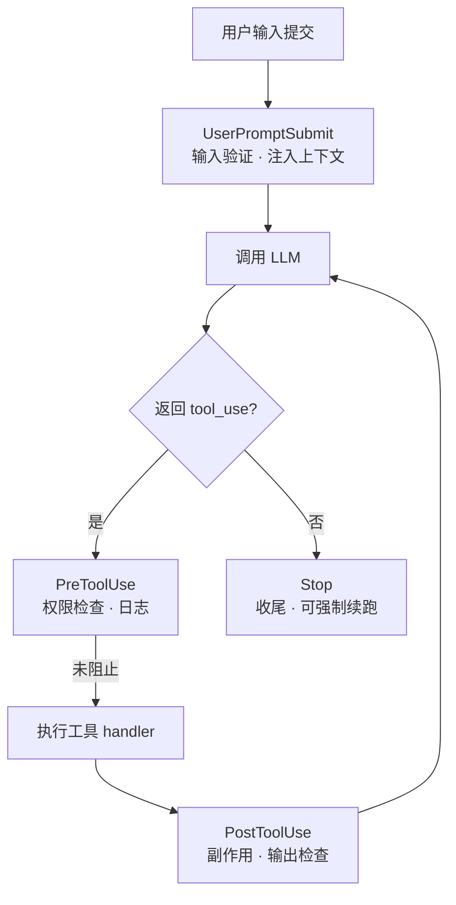

## 核心一句话

> Cross-cutting behavior belongs around the loop, not tangled inside it.
> （横切行为属于循环周围，不该纠缠在循环内部。）

循环应该是一个稳定的核心，扩展应该挂在外面。

## 问题

s03 的 Agent 有权限检查了。但每次加一个新检查，比如"记录每次 bash 调用"、
"操作后自动 git add"，都要修改 `agent_loop` 函数：

```python
def agent_loop(messages):
    while True:
        # ... LLM call ...
        for block in response.content:
            log_to_file(block)      # 加一行
            check_permission(block)  # 加一行
            notify_slack(block)      # 又加一行
            output = execute(block)
            auto_git_add(block)     # 再加一行
            # ... 很快循环就认不出来了
```

你想扩展的是 Agent 的**行为**，但你改的却是**循环本身**。

## 四个事件，覆盖一个完整的 Agent Cycle

s03 的循环和权限逻辑完全保留。唯一的变动是把 `check_permission()` 从循环体内
移到 hook 上，循环不再直接调用任何检查函数，改为 `trigger_hooks("PreToolUse", block)`，
由注册表决定跑什么。

| 事件               | 触发时机             | 典型用途                   |
| ---------------- | ---------------- | ---------------------- |
| UserPromptSubmit | 用户输入提交后、进入 LLM 前 | 输入验证、注入上下文             |
| PreToolUse       | 工具执行前            | 权限检查、日志记录              |
| PostToolUse      | 工具执行后            | 副作用（自动 git add 等）、输出检查 |
| Stop             | 循环即将退出时          | 收尾清理（CC 还支持强制续跑）       |



## 工作原理

**hook 注册表**：一个字典，事件名映射到回调列表：

```python
HOOKS = {
    "UserPromptSubmit": [],
    "PreToolUse": [],
    "PostToolUse": [],
    "Stop": [],
}

def register_hook(event: str, callback):
    HOOKS[event].append(callback)

def trigger_hooks(event: str, *args):
    for callback in HOOKS[event]:
        result = callback(*args)
        if result is not None:   # 返回值 ≠ None → hook 说"停"
            return result
    return None
```

PreToolUse 的非 None 返回值会阻止本次工具执行；Stop 的非 None 返回值会
**强制续跑**（把消息注入 messages 继续）。

**权限检查变成一个普通的 hook**（s03 的逻辑原样搬进来）：

```python
# PreToolUse: 权限检查（s03 的逻辑，从循环移到 hook）
def permission_hook(block):
    if block.name == "bash":
        for pattern in DENY_LIST:
            if pattern in block.input.get("command", ""):
                return "Permission denied by deny list"
    if block.name in ("write_file", "edit_file"):
        path = block.input.get("path", "")
        if not (WORKDIR / path).resolve().is_relative_to(WORKDIR):
            choice = input(" Allow? [y/N] ").strip().lower()
            if choice not in ("y", "yes"):
                return "Permission denied by user"
    return None
```

**另外四个回调**，覆盖 agent cycle 剩下的关键节点：

```python
# UserPromptSubmit: 注入工作目录信息
def context_inject_hook(query: str) -> str | None:
    print(f"[HOOK] UserPromptSubmit: working in {WORKDIR}")
    return None   # None = 不修改，放行

# PreToolUse: 日志
def log_hook(block):
    print(f"[HOOK] {block.name}(...)")

# PostToolUse: 大输出提醒
def large_output_hook(block, output):
    if len(str(output)) > 100000:
        print(f"[HOOK] ⚠ Large output from {block.name}")

# Stop: 收尾统计
def summary_hook(messages: list) -> str | None:
    tool_count = sum(1 for m in messages
                     for b in (m.get("content")
                               if isinstance(m.get("content"), list) else [])
                     if isinstance(b, dict) and b.get("type") == "tool_result")
    print(f"[HOOK] Stop: session used {tool_count} tool calls")
    return None   # None = 允许退出，返回字符串 = 强制续跑

register_hook("UserPromptSubmit", context_inject_hook)
register_hook("PreToolUse", permission_hook)
register_hook("PreToolUse", log_hook)
register_hook("PostToolUse", large_output_hook)
register_hook("Stop", summary_hook)
```

**UserPromptSubmit 的接入点**在主循环——用户输入后、进 LLM 前：

```python
query = input("s04 >> ")
trigger_hooks("UserPromptSubmit", query)   # ← 进入 LLM 之前
history.append({"role": "user", "content": query})
agent_loop(history)
```

**Stop 的强制续跑**——hook 返回消息时注入 messages 并继续循环：

```python
if response.stop_reason != "tool_use":
    force = trigger_hooks("Stop", messages)   # ← 退出之前
    if force:
        messages.append({"role": "user", "content": force})
        continue
    return
```

**循环里只改了一处**——从直接调用改为触发钩子：

```python
for block in response.content:
    if block.type != "tool_use":
        continue

    # s03: if not check_permission(block): ...
    # s04: hook 替代硬编码
    blocked = trigger_hooks("PreToolUse", block)
    if blocked:
        results.append({"type": "tool_result", "tool_use_id": block.id,
                        "content": str(blocked)})
        continue

    handler = TOOL_HANDLERS.get(block.name)
    output = handler(**block.input) if handler else f"Unknown: {block.name}"

    trigger_hooks("PostToolUse", block, output)

    results.append({"type": "tool_result", "tool_use_id": block.id,
                    "content": output})
```

加行为 = 注册一个回调，循环一行不动。

## 案例：加一个"写完自动 git add"的行为

s03 时代要改 `agent_loop` 本体；现在只写一个回调并注册：

```python
def auto_git_add_hook(block, output):
    if block.name in ("write_file", "edit_file"):
        subprocess.run(["git", "add", block.input.get("path", "")],
                       capture_output=True)

register_hook("PostToolUse", auto_git_add_hook)
```

效果：每次写/改文件后自动加入暂存区。循环零改动——对比开头的"膨胀循环"
反例，五个行为（权限、日志、大输出提醒、统计、git add）全部挂在循环外面。

## 教学版 vs Claude Code

**Hook 事件不止 4 个，是 27 个**（`coreTypes.ts`）：

| 类别      | 事件                                                                  |
| ------- | ------------------------------------------------------------------- |
| 工具相关    | PreToolUse, PostToolUse, PostToolUseFailure                         |
| 会话相关    | SessionStart, SessionEnd, Stop, StopFailure, Setup                  |
| 用户交互    | UserPromptSubmit, Notification, PermissionRequest, PermissionDenied |
| 子 Agent | SubagentStart, SubagentStop                                         |
| 压缩相关    | PreCompact, PostCompact                                             |
| 团队相关    | TeammateIdle, TaskCreated, TaskCompleted                            |
| 其他      | Elicitation, ConfigChange, WorktreeCreate, FileChanged 等            |

**HookResult 常用字段**（完整 14 个字段）：

| 字段                    | 用途                                    |
| --------------------- | ------------------------------------- |
| `blockingError`       | 阻塞错误 → 注入对话让模型自纠                      |
| `permissionBehavior`  | allow / deny / ask / passthrough 权限决策 |
| `updatedInput`        | 修改工具输入                                |
| `additionalContext`   | 附加上下文                                 |
| `preventContinuation` | 阻止后续执行                                |

**三个关键机制**：

- **安全不变式**：hook 返回 `allow` 时，仍然要检查 settings.json 的 deny/ask
  规则——即使用户的 hook 脚本说"允许"，被禁用的工具照样被阻止。教学版没有
  这个层次，生产环境会形成安全漏洞

- **stopHookActive 防死循环**：stop hook 产生 blockingError 时循环带
  `stopHookActive: true` 重入下一轮，后续迭代看到标志就不再触发。防止
  "模型自纠 → stop hook 报错 → 模型再自纠"的永不停机 bug

- **hook\_stopped\_continuation**：PostToolUse 返回 `preventContinuation: true`
  时产生附件，query.ts 检测到后优雅退出——不是崩溃，是完成

## 试一下

```bash
cd learn-claude-code
python s04_hooks/code.py
```

| Prompt                               | 预期行为                   |
| ------------------------------------ | ---------------------- |
| `Read the file README.md`            | 直接通过，观察 `[HOOK]` 日志    |
| `Create a file called test.txt`      | 通过后观察 PostToolUse 是否触发 |
| `Delete all temporary files in /tmp` | bash + rm 触发权限 hook    |

观察重点：每次工具执行前是否出现 `[HOOK]` 日志？权限被拒时是 hook 拦截的
还是循环里硬编码的？

## 要点备忘

- **Beginner rule**：加行为 = 注册回调，不是编辑核心的 model→tool→result 循环

- 循环只认识**事件名**，回调行为全在注册表——关注点分离

- 权限检查是 hook 的一种应用，不是特权机制

- hook 的 allow 不能越过 deny 规则，这是权限系统最重要的安全设计（见
  [权限系统](/ai/basic/agent/03-permission/)）

## 延伸阅读

- [Learn Claude Code s04: Hooks](https://learn.shareai.run/zh/s04/)（含 27 个事件与 HookResult 完整源码分析）

- [MCP 官方文档 · Hooks](https://modelcontextprotocol.io/)（跨客户端的 hook 事件约定）

