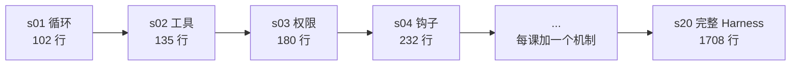

import CategoryNotesIsland from '../../../../../components/learn/CategoryNotesIsland.astro';

本层覆盖 Learn Claude Code 的"工具与执行"层：**循环让模型能行动，工具让行动
有落点，权限让行动可控，钩子让行为可扩展**。后续的规划、压缩、多 Agent 协作
都建立在这四个机制之上。
点击右侧圆点可标记学习状态（未学 → 学习中 → 已掌握）。

<CategoryNotesIsland categoryId="ai/basic/agent" />

## 从 30 行循环到生产级 Harness

Learn Claude Code 的 20 课揭示了一个核心事实：**最小的可用 Agent 就是一个
while 循环**——调用模型、执行工具、回传结果。生产级系统（如 Claude Code）
的 1729 行 query.ts 核心仍是这 30 行，其余都是叠加在其上的保护机制。

本方向笔记的素材出处与完整学习路径见[学习资源导航](/guide/resources/)。
