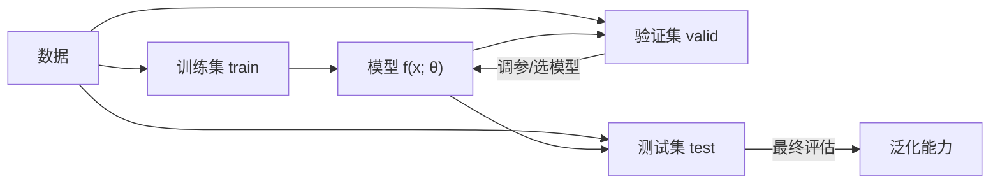

## 机器学习的本质

机器学习 = 让程序**从数据中学习规律**，而不是靠人逐条写死规则。传统编程是
「数据 + 规则 → 答案」；机器学习的范式是「数据 + 答案 → 规则」——模型就是
自动归纳出来的那条规则。

数学上看，模型 `f` 接受输入 `x`，产出预测 `y = f(x; θ)`，其中 `θ` 是模型参数。
训练就是不断调整 `θ`，让预测值逼近真实值（最小化损失函数）。

## 三种学习范式

| 范式 | 训练数据形态 | 典型任务 | 目标 |
|---|---|---|---|
| 监督学习 | 带标签 `(x, y)` | 分类、回归 | 学会 x→y 的映射 |
| 无监督学习 | 只有 `x`，无标签 | 聚类、降维、异常检测 | 发现数据内在结构 |
| 强化学习 | 环境反馈的奖励信号 | 游戏、机器人控制 | 学策略最大化长期回报 |

- **监督学习**是工业界绝对主力：垃圾邮件识别（分类）、房价预测（回归）。
- **无监督学习**用来"无师自通"：把用户聚成几类（聚类）、把高维数据压到二维可视化（降维）。
- **强化学习**是 Agent 的思想源头：智能体在环境里试错，靠奖励/惩罚更新策略——
  这也是 LLM 训练后期 RLHF（人类反馈强化学习）的直接前身。

## 过拟合与欠拟合

这是机器学习最核心的一对矛盾，决定一个模型能不能"举一反三"：

| 状态 | 表现 | 成因 | 对策 |
|---|---|---|---|
| 欠拟合 | 训练集都学不好 | 模型太简单/训练不够 | 加复杂度、加数据 |
| 过拟合 | 训练集满分，测试集崩 | 模型死记硬背噪声 | 正则化、加数据、早停 |

**验证集/测试集的意义**：判断过拟合的标准就是"训练表现 vs 未见数据表现"的
差距。差距小且都好 → 理想；训练好测试差 → 过拟合。这就是为什么数据要切
train/valid/test 三份，绝不能拿测试集调参。

## 常用概念速查

- **损失函数（Loss）**：衡量预测与真实的差距。回归用 MSE/MAE，分类用交叉熵。
- **梯度下降**：沿损失函数的负梯度方向逐步更新参数，让损失变小。
- **特征（Feature）**：喂给模型的输入维度；传统 ML 靠人工设计特征。
- **参数 vs 超参数**：参数是模型自己学的（如权重）；超参数是人先定的（如学习率）。

## 小结

- ML 本质是"用数据归纳规则"，监督/无监督/强化是三种基本范式。
- 过拟合 vs 欠拟合是贯穿全程的核心矛盾，验证集是判断它的标尺。
- 梯度下降 + 损失函数是几乎所有模型训练的通用骨架。

## 延伸阅读

- [Learn Claude Code 的 AI 基础前置章节](https://learn.shareai.run/zh/)（AI 方向整体脉络）
- [Google 机器学习速成课程](https://developers.google.com/machine-learning/crash-course)