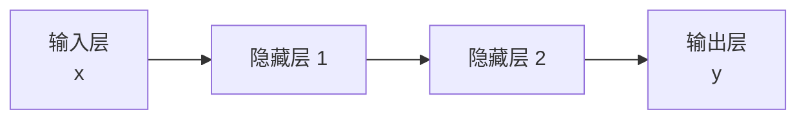
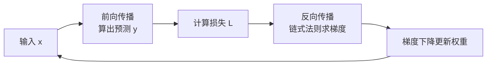

## 为什么需要深度学习

传统机器学习卡在**特征工程**：模型学得好不好，取决于人能不能手工设计出好特征。
深度学习把这一步也交给模型——**多层神经网络自动逐层提取特征**，底层学到简单
模式（边缘、纹理），高层拼出抽象概念（物体、语义）。

## 神经元与神经网络

一个神经元做三件事：加权求和 → 加偏置 → 过激活函数。

```text
y = σ( w₁x₁ + w₂x₂ + ... + b )
```

把大量神经元按层堆叠，就是神经网络：



- **激活函数**（σ）引入非线性：没有它，多层网络数学上等于单层，学不了复杂映射。
  常用 ReLU、Sigmoid、GELU（Transformer 系用 GELU）。
- **深度** = 层数多，能表达更复杂的函数，但也更难训练。

## 前向传播与反向传播

- **前向传播**：输入从输入层流到输出层算出预测值，并计算损失。
- **反向传播（Backprop）**：从输出层往回，用链式法则算出每个参数对损失的
  梯度，再沿梯度更新参数。



**反向传播让深度网络可训练**，是整个深度学习的引擎。现代框架（PyTorch、
TensorFlow）自动完成这一步，你只需定义前向计算。

## 三大经典架构

| 架构 | 擅长 | 典型场景 | 局限 |
|---|---|---|---|
| CNN 卷积网络 | 局部特征（空间） | 图像识别 | 不适合长序列 |
| RNN/LSTM 循环网络 | 序列（时间） | 文本、语音 | 难并行、长程依赖 |
| Transformer | 全局注意力（并行） | 文本、多模态 | 计算开销随长度平方增长 |

Transformer 的**自注意力（Self-Attention）**机制一举解决了 RNN 难并行和长程
遗忘的问题：每个位置直接关注序列里所有其他位置，可以并行计算。这是 LLM 的
底座，下一层「大模型 LLM」就从这里继续。

## 小结

- 深度学习 = 多层神经网络自动学特征，反向传播是训练引擎。
- 前向算预测、反向算梯度，两下交替就是一轮训练。
- CNN/RNN/Transformer 是三大骨架，Transformer 的自注意力催生了 LLM。

## 延伸阅读

- [Google 机器学习速成课程 · 神经网络](https://developers.google.com/machine-learning/crash-course/neural-networks)
- [深入理解 AI Agent · 大模型基础章节](https://bojieli.github.io/ai-agent-book/)