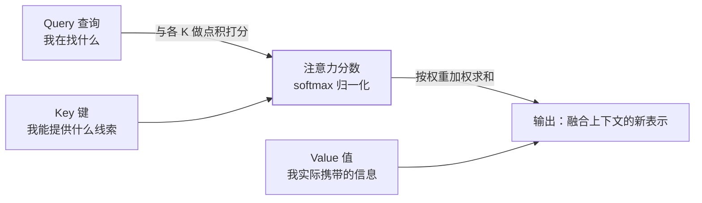

深度学习篇的架构对比表里，Transformer 只有一句"全局注意力、可并行"。
它凭什么统一了 NLP 并成为所有 LLM 的底座？答案全在**自注意力机制**里——
这是 AI 面试从算法岗到应用岗共同的必考题。

## 从 RNN 的两个痛点说起

上篇对比过：RNN 按时间步逐个处理序列，**前一步不算完，后一步不能开始**——
天然无法并行，GPU 算力浪费；且序列一长，早期的信息被逐步稀释（长程遗忘）。

Transformer（2017，论文标题就是《Attention Is All You Need》）的解法
釜底抽薪：**抛弃逐步递归，让每个位置直接"看"序列里的所有其他位置**——
这就是自注意力（Self-Attention）。所有位置同时计算，并行度拉满；任意两
位置距离都是 1，长程依赖不再衰减。

## 自注意力的直觉：每个词环顾四周再决定自己

"苹果发布了新手机"和"苹果很好吃"里的"苹果"含义不同——**词义由上下文
决定**。自注意力就是把这个直觉机械化：每个 token 计算自己与序列中所有
token 的关联度（注意力权重），再按权重把全场信息加权汇总，得到融合了
上下文的新表示。

## Q / K / V：一次检索式的信息汇总

实现上，每个 token 的表示被投影成三个向量：

用检索类比（与本站倒排索引篇异曲同工）：**Query 是查询词，Key 是文档索引，
Value 是文档内容**——拿 Query 和每个 Key 算相似度得分，softmax 归一化成
权重，再对 Value 加权求和。

- **除以 √d**（缩放点积）：维度 d 越大点积方差越大，softmax 会饱和成
  one-hot（梯度消失）——除以 √d 稳住分布，面试标准答案。
- **多头注意力**：把上述过程并行做 h 次（每组独立的 Q/K/V 投影）——
  有的头盯语法、有的头盯指代、有的头盯语义，最后拼合。一组注意力只有
  一种"关注模式"，多头才够用。

## 位置编码：并行化的代价

自注意力把序列当**集合**处理（并行计算的代价），词序信息丢了——"我打你"
和"你打我"会得到相同表示。解法：把位置信息显式注入，原始论文用正弦/余弦
位置编码，现在主流是可学习的或旋转位置编码（RoPE）。这是 Transformer
结构里除注意力外必须知道的第二个组件。

## 从 Transformer 到 LLM

原始结构是 Encoder-Decoder 两段（翻译场景：编码源句、解码生成）。后续分化：

- **Encoder-only**（BERT）：双向注意力，擅长理解类任务；
- **Decoder-only**（GPT 系）：只保留解码器，**因果注意力**（每个位置只看
  前文）+ 逐 token 生成——这就是 LLM 的架构形态（见大模型 LLM 篇），
  也是推理参数篇里"逐 token 概率分布"的物理来源。

## 高频追问速答

- **自注意力复杂度？** O(n²·d)：每个位置对每个位置打分。这解释了两件事：
  ①上下文窗口为什么是稀缺资源、按 token 计费（见推理参数篇）；②长文本
  为什么要做各种稀疏/线性注意力优化。
- **KV Cache 是什么？** 生成第 n 个 token 时，前 n-1 个 token 的 Key/Value
  不用重算，缓存复用——LLM 推理省显存省时间的核心优化。
- **为什么 LLM 都用 Decoder-only？** 训练目标（预测下一个词）与生成任务
  天然一致、结构简单易规模化、KV Cache 友好——工程与效果的合流选择。

## 小结

- 痛点→解法：RNN 难并行/长程遗忘 → 自注意力让每个位置直接看全场，并行且
  距离恒为 1。
- Q/K/V 是检索式汇总（查询/索引/内容），√d 缩放稳住 softmax，多头提供
  多种关注模式，位置编码补回词序。
- 后续分化：Encoder-only 理解、Decoder-only 生成——LLM 全家都是后者。
