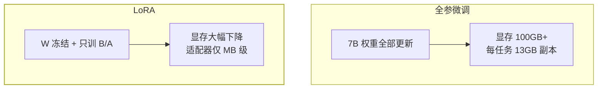

落地选型篇说"微调是最后才上的重武器"，还说了一句"LoRA"——本篇拆开它：
**为什么冻结大模型、只训一个很小的增量矩阵，就能改变模型行为**。
LoRA（Low-Rank Adaptation）是当前 AI 应用团队做领域微调的事实标准，
面试出现率随 AI 应用岗一起快速上升。

## 全参微调的痛点：贵在"全"

对 7B 模型做全参微调意味着：

- **显存**：模型权重 + 梯度 + 优化器状态（Adam 要存动量和二阶矩），
  7B 模型 FP16 训练要 100GB+ 显存——单卡不可能；
- **存储**：每个任务一份完整模型副本（13GB+），十个任务十份；
- **服务**：切换任务 = 换整个模型，加载慢、显存占满。

痛点全部源于"**要更新全部权重**"这一步。LoRA 的解法就是不动原权重。

## 核心思想：权重的"变化量"是低秩的

微调改变了模型行为，但行为变化只需要一个**低秩的增量**。LoRA 假设
全参微调学到的 ΔW（权重变化量）可以用两个小矩阵的乘积近似：

```
W' = W + ΔW ≈ W + B × A
          （d×d）   （d×r）×（r×d）   r ≪ d，如 r=8
```

- 原权重 W **完全冻结**（不更新、不存梯度、不进优化器）；
- 只训练 B 和 A 两个小矩阵：以 d=4096、r=8 计，参数从 1600 万降到
  6.5 万——**缩小约 250 倍**；
- 推理时可把 BA 合并回 W（线性运算），**零额外推理延迟**。



## 多适配器：一个底座养多个任务

LoRA 的工程红利：**底座共享，任务只是 MB 级适配器**——

- 十个领域任务 = 十对 B/A 文件（每个几 MB~百 MB）；
- 服务端按请求挂载对应适配器（或动态合并/切换），无需多份底座；
- 这正是落地选型篇"微调做稳定行为范式"在经济上变得可行的原因。

**QLoRA** 再进一步：底座量化到 4bit 冻结加载，LoRA 部分保持高精度训练
——消费级显卡也能微调大模型，进一步降门槛。

## 高频追问速答

- **秩 r 怎么选？** 常用 8~64：任务越"新"（与预训练分布差异越大）r 越大；
  先小后大做实验，r 翻倍看评测分数（应用评估篇的回归评测派上用场）。
- **LoRA 能给模型注入新知识吗？** 不能指望它——低秩增量擅长调整**行为
  范式**（输出格式、语气、任务套路），知识注入仍走 RAG（选型篇的结论
  在原理层的印证：知识要的是"记住"，不是低秩修正）。
- **为什么推理时合并 BA 不影响精度？** W+BA 在数学上就是同一个线性层，
  合并只是把加法提前算好——部署也可选不合并（多任务热切换）。

## 小结

- LoRA = 冻结底座 + 低秩增量（B×A）：参数量降百倍，显存与存储从灾难
  变日常，推理零延迟（可合并）。
- 工程红利是多适配器：底座共享，任务即文件。
- 边界要清楚：LoRA 调行为，RAG 管知识——两者组合才是完整的领域适配。
