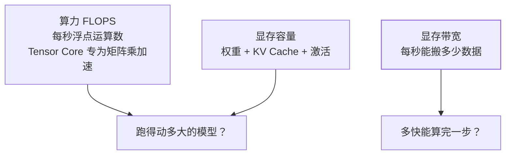

vLLM 篇说"LLM 推理瓶颈是显存带宽"、量化篇算"显存账"、LoRA 篇省"显存"
——它们共同的底层问题是：**GPU 到底在干什么、瓶颈到底是什么**。本篇
把算力基础补齐，前面所有 AI 篇的"为什么"都有了着落。

## 为什么是 GPU：矩阵乘的并行性

Transformer 的计算本质是**海量矩阵乘法**。CPU 少核强单核（适合分支
逻辑），GPU **万核弱单核**（适合同时算一万个乘加）——把一个大矩阵乘
拆给一万个小核同时算，GPU 就是为此设计的"矩阵乘法机器"。

## 三个必须分清的概念

- **算力（FLOPS）**：Tensor Core 是专为矩阵乘设计的单元（一次算一小块
  矩阵）——训练看算力；
- **显存容量**：权重 + KV Cache + 激活值都要放——**放不下就跑不了**
  （量化篇省的就是它）；
- **显存带宽**：LLM 推理逐 token 生成时，**每生成一个 token 都要把全部
  权重过一遍显存**——带宽不够，算力再高也白搭（推理是 memory-bound，
  这就是 vLLM 拼命优化 KV Cache、量化省带宽的原因）。

## 混合精度：FP32 精度与 FP16 速度的折中

权重用 FP32 存"主副本"保证精度，**计算与存储用 FP16/BF16**（半精度）：
显存减半、Tensor Core 对半精度算力翻倍。BF16 的指数位与 FP32 相同
（数值范围大不易溢出），是当前训练默认。量化篇的 INT8/INT4 是更激进
的延续。

## 训练与推理：负载完全不同

| | 训练 | 推理 |
| --- | --- | --- |
| 计算量 | 前向 + **反向** + 优化器 | 只前向 |
| 显存 | 权重+梯度+优化器状态（约 3~4 倍权重） | 权重 + KV Cache（LoRA/量化省这里） |
| 瓶颈 | 算力为主 | **显存带宽为主** |

这也解释了：LoRA 为什么能大幅省显存（不动主权重，梯度与优化器状态
只针对小矩阵）；vLLM 为什么拼 KV Cache 管理（推理显存的大头）。

## 高频追问速答

- **为什么多卡训练？** 两个原因：单卡显存放不下（需要切分模型）+ 单卡
  太慢（数据并行多卡各算一批）——分布式训练篇的正题。
- **推理加速三板斧对应什么瓶颈？** 量化/KV Cache 管理（省容量与带宽）、
  batching（提高算力利用率）、投机解码（用小模型草稿大模型验证）——
  全部围绕"显存搬运"打。
- **买卡看什么？** 显存容量（跑不跑得动）> 显存带宽（快不快）> 算力
  （批量吞吐）——推理场景这个排序通常成立。

## 小结

- Transformer = 海量矩阵乘 → GPU 万核并行是天然载体。
- 三概念：算力（训练瓶颈）、显存容量（放不放得下）、显存带宽
  （推理瓶颈）——三个 AI 篇的"为什么"分别落在这三个上。
- 混合精度与量化是显存账的两级减法；训练与推理负载完全不同，
  优化手段也不同。
