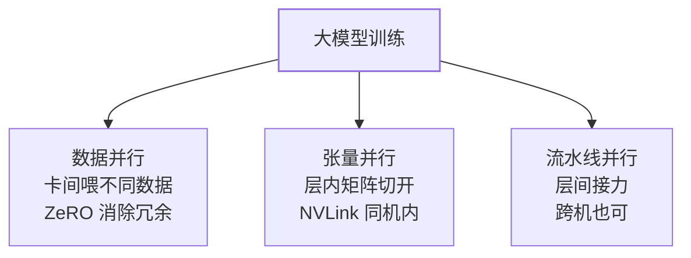

GPU 篇留下一个追问："为什么需要多卡训练？"两个原因：**单卡放不下**
（显存墙）与**单卡太慢**（时间墙）。多卡并行的全部技术，就是在回答
"把什么切开、放到不同卡上"——按**数据**切是数据并行，按**层内矩阵**
切是张量并行，按**层间**切是流水线并行。

## 数据并行（DP）：最容易，先想它

每张卡放**完整模型**，喂**不同的数据**，各自算梯度后聚合（AllReduce：
所有卡互相交换梯度求平均）再统一更新。

- 优点：实现最简单，通信只发生在每步末尾；
- 缺点：**每张卡都要放下完整模型**——7B 模型 FP16 训练要 100GB+，
  单卡就放不下，DP 直接出局；
- 这就是 **ZeRO** 出场的原因：把优化器状态/梯度/参数**分片**到各卡
  （ZeRO-1 分优化器状态、2 加分梯度、3 连参数也分）——DP 的显存冗余
  被逐级消除。

## 张量并行（TP）：单层矩阵切开

把**一层内部的矩阵乘**切开到多卡（Megatron：权重列切/行切），每步
前向都要跨卡通信（AllReduce/AllGather）——通信极频繁，一般只在
**高速互联（NVLink）**的同机多卡间做。

## 流水线并行（PP）：按层切开

把模型的**不同层**放到不同卡，像工厂流水线：卡 1 算前几层，传给
卡 2 算中间层……缺点是**流水线气泡**（前向反向的接力有空档），
需要微批（把 batch 切小份连续喂）填充。

## 组合：3D 并行

大模型训练 = **数据并行 × 张量并行 × 流水线并行**的组合：

- 经验布局：**TP 在 NVLink 同机内**（通信最频繁）、PP 跨机（通信少）、
  DP 在最外层（通信每步一次）；
- 推理也多卡吗？是——模型放不下单卡时用 TP（vLLM 支持 tensor
  parallel size）；推理只前向，一般不需要 PP/ZeRO。

## 高频追问速答

- **AllReduce 是什么？** 所有卡各自有一个数（梯度），互相交换后每张
  卡都得到总和（平均）——集合通信原语，NCCL 实现，Ring AllReduce
  让通信量与卡数无关。
- **ZeRO 三级各分什么？** 1 分优化器状态、2 加分梯度、3 加分模型
  参数——级别越高越省显存、通信越多。
- **训练和推理的并行策略一样吗？** 不一样：训练要反向传播（TP/PP
  复杂度高），推理只前向（TP 为主即可，vLLM 单机 TP 就够多数场景）。

## 小结

- 多卡的根因：显存墙 + 时间墙；切分维度三种：数据（DP+ZeRO 消冗余）、
  层内（TP，同机 NVLink）、层间（PP，流水线气泡靠微批填）。
- 3D 并行是布局问题：TP 同机、PP 跨机、DP 外层——按通信频率排位置。
- 推理的多卡简单得多：TP 为主，vLLM 一个参数的事。
