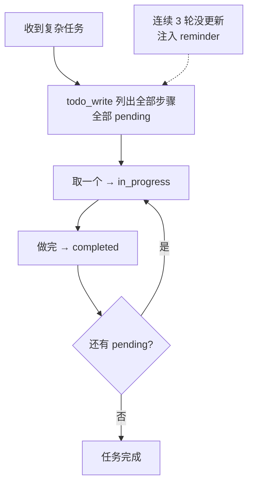

## 核心一句话

> Explicit plans keep long-running work visible and correctable.
> （显式计划让长时间运行的工作可见、可纠正。）

## 问题

给 Agent 一个复杂任务："把所有 Python 文件改成 snake\_case 命名，然后跑测试，
修好失败。"

Agent 开始干活，改了 3 个文件，跑了个测试，发现 2 个失败，开始修。修着修着，
它忘了最初是"改成 snake\_case"——测试失败把注意力全吸走了。

对话越长越严重：工具结果不断填满上下文，系统提示的影响力被稀释。一个 10 步
重构，做完 1-3 步就开始即兴发挥，因为 4-10 步已经被挤出注意力了。

## 解决方案

新增 `todo_write` 工具 + reminder 机制。`todo_write` 本身**不做任何实际工作**，
不能读文件、不能跑命令，只是让 Agent 在动手之前先理清思路。



## 工作原理

**todo\_write 工具定义**——和其他 5 个工具一起注册进 dispatch map：

```python
TOOLS = [
    # ... bash / read_file / write_file / edit_file / glob ...
    # s05: 新增一条
    {"name": "todo_write",
     "description": "Create and manage a task list ...",
     "input_schema": {
         "type": "object",
         "properties": {
             "todos": {
                 "type": "array",
                 "items": {
                     "type": "object",
                     "properties": {
                         "content": {"type": "string"},
                         "status": {"type": "string",
                                    "enum": ["pending", "in_progress", "completed"]},
                     },
                 },
             },
         },
     }},
]

TOOL_HANDLERS["todo_write"] = run_todo_write
```

**handler 实现**——保存在当前进程内存，同时在终端显示进度：

```python
CURRENT_TODOS: list[dict] = []

def run_todo_write(todos: list) -> str:
    global CURRENT_TODOS
    CURRENT_TODOS = todos

    lines = ["\n## Current Tasks"]
    for t in CURRENT_TODOS:
        icon = {"pending": " ", "in_progress": "▸", "completed": "✓"}[t["status"]]
        lines.append(f"  [{icon}] {t['content']}")
    print("\n".join(lines))
    return f"Updated {len(CURRENT_TODOS)} tasks"
```

**Nag reminder**：模型连续 3 轮没调 `todo_write` 时，自动注入一条提醒：

```python
if rounds_since_todo >= 3 and messages:
    messages.append({
        "role": "user",
        "content": "<reminder>Update your todos.</reminder>",
    })
    rounds_since_todo = 0
```

**关键洞察**：todo\_write 不给 Agent 增加任何**执行能力**，它增加的是
**规划能力**。dispatch 机制不变，新工具仍然走 `TOOL_HANDLERS[block.name]` 分发。

## 走查案例：一次三步重构的完整经过

任务："重构 hello.py：加类型注解、docstring、main guard"

Agent 收到后**第一个工具调用就是 todo\_write**：

```json
[{"content": "Add type hints",   "status": "pending"},
 {"content": "Add docstrings",   "status": "pending"},
 {"content": "Add main guard",   "status": "pending"}]
```

之后逐个推进，每完成一步再调一次 todo\_write 更新状态：

| 时点            | todo 列表状态              | 上下文里多了一条            |
| ------------- | ---------------------- | ------------------- |
| 开始            | □ □ □ 全 pending        | 计划本体                |
| 第 1 步         | ▸ □ □ 第一项 in\_progress | "我正在做第 1 步"         |
| 第 2 步         | ✓ ▸ □                  | "第 1 步已完成"          |
| 中途跑测试发现 2 个失败 | ✓ ▸ □                  | 计划还在视野内，修完回来继续第 2 步 |
| 完成            | ✓ ✓ ✓                  | 全部完成                |

如果没有计划：测试失败的 tool\_result 一进来，"最初是来加类型注解的"这条信息
就被稀释了——10 步任务做完 3 步开始即兴发挥，就是这个机制缺失的表现。

## 教学版 vs Claude Code：两套任务系统并存

CC 中有两套系统（`tasks.ts`），由 `isTodoV2Enabled()` 切换——交互式会话 V2 默认
启用，非交互式会话（SDK）V1 默认启用：

| 维度 | TodoWrite（V1）    | Task System（V2 = s12）                     |
| -- | ---------------- | ----------------------------------------- |
| 存储 | 内存 AppState，退出清空 | 文件持久化 `tasks/{taskListId}/{taskId}.json`  |
| 结构 | 平铺列表             | `blockedBy` 依赖图                           |
| 并发 | 无锁               | `proper-lockfile` 并发安全                    |
| 工具 | 一个 TodoWrite     | 四个独立工具（Create/Get/Update/List）            |
| 集成 | 无                | TaskCreated / TaskCompleted hooks 供外部系统集成 |

教学版的 nag reminder（3 轮未更新就提醒）是教学机制，CC 源码中没有固定的
"3 轮"逻辑——更接近的是当 3 个以上 todo 全部完成但没有 verification 项时，
追加 verification nudge。

## 试一下

```bash
cd learn-claude-code
python s05_todo_write/code.py
```

| Prompt                                                                                                              | 预期行为         |
| ------------------------------------------------------------------------------------------------------------------- | ------------ |
| `Refactor s05_todo_write/example/hello.py: add type hints, docstrings, and a main guard`                            | 先列 3 步再执行    |
| `Create a Python package under s05_todo_write/example/demo_pkg with __init__.py, utils.py, and tests/test_utils.py` | 多文件任务先拆步骤    |
| `Review Python files under s05_todo_write/example and fix any style issues`                                         | 观察 TODO 状态流转 |

观察重点：第一次工具调用是不是 `todo_write`？TODO 列了几步？执行过程中状态
有没有从 `pending` 变成 `in_progress` / `completed`？

## 要点备忘

- **注意力稀释是长任务的敌人**：计划以可见列表的形式对抗上下文挤压

- 计划工具是"给自己用的便签"——通过 tool\_result 进入对话，模型每轮都能看到

- reminder 机制把"别忘了更新计划"变成 Harness 的责任，而不是模型的自觉

- V2 的依赖图 + 持久化 + 并发锁，是通往[多 Agent 协作](/ai/advanced/agent/01-multi-agent/)的地基

## 延伸阅读

- [Learn Claude Code s05: TodoWrite](https://learn.shareai.run/zh/s05/)（含 V1/V2 切换逻辑源码核查）

- [Learn Claude Code s12: Task System](https://learn.shareai.run/zh/s12/)

