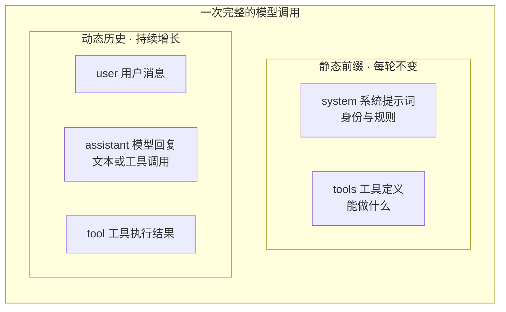
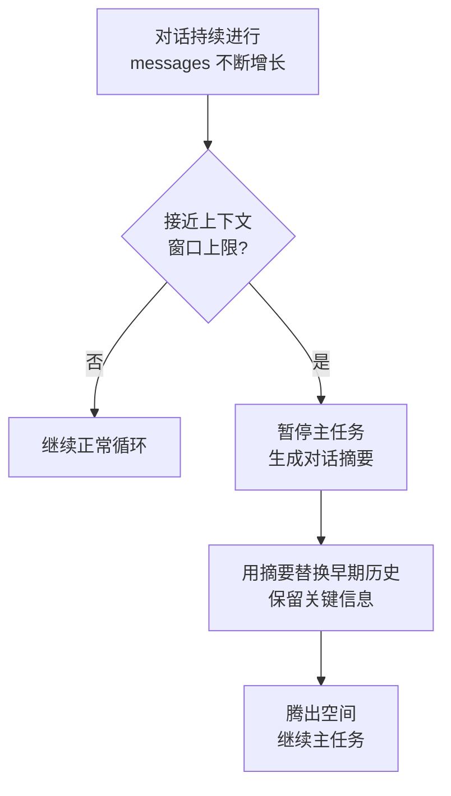

## 上下文是 Agent 的"眼睛"

Agent 只能基于它看到的信息做决策。所谓上下文，就是每次调用模型时它**实际看到的
全部信息**——不仅包含对话历史，还包含系统指令、工具描述等。

《深入理解 AI Agent》第二章给了一个精准的比喻：一位天才工程师加入你的团队，
理论功底深厚，但对产品架构、业务逻辑、团队规范一无所知，关键决策还散落在
不同成员的脑子里——再聪明也难以发挥价值。这正是 AI Agent 面临的困境。

以 Coding Agent 为例，有效工作的最低信息需求是三类：

| 信息类别 | 内容 | 缺失后果 |
|---|---|---|
| 实时代码上下文 | 目录结构、模块职责、核心数据结构、代码规范 | 语法正确但风格格格不入，甚至引入架构冲突 |
| 流程规范 | Git 分支策略、提交规范、CI/CD 要求 | 直接往主分支提交未经测试的代码 |
| 环境信息 | 环境配置、测试数据库、部署方式、密钥管理 | 本地能跑通的修复到测试环境就崩 |

**一个中等能力的模型配上精心组织的上下文，往往能胜过顶级模型在信息匮乏下的
盲目摸索。**

## API 视角：上下文的构成

大模型 API 的核心是一个消息列表（messages），每条消息有角色标识：

| 角色 | 来源 | 作用 |
|---|---|---|
| `system` | 开发者编写 | 身份、行为规则、约束条件；模型视为最高优先级指令 |
| `user` | 终端用户 | 需要响应的请求 |
| `assistant` | 模型生成 | 之前的回复，含文本与工具调用请求；原样放回让模型"记住"自己说过什么 |
| `tool` | Agent 框架 | 工具执行结果，通过 `tool_call_id` 与调用请求关联 |

工具定义（tools）不是消息，而是请求的独立字段。



## 消息如何增长：跟踪一个真实请求

以"温哥华现在几点、天气如何"为例，模型不知道"现在"，需要调工具：

**第 1 次调用前**（2 条消息）：

```
messages = [
  { role: "system",    content: "You are a helpful assistant..." },
  { role: "user",      content: "What's the current time and weather in Vancouver?" },
]
```

**第 1 次调用后**（模型返回两个工具调用请求，+3 条）：

```
messages = [
  { role: "system",    content: "..." },
  { role: "user",      content: "What's the current time..." },
  { role: "assistant", tool_calls: [get_current_time, get_weather] },  # 模型生成
  { role: "tool",      tool_call_id: "call_abc", content: "{time...}" },   # 框架执行
  { role: "tool",      tool_call_id: "call_def", content: "{weather...}" },
]
```

**第 2 次调用后**（模型给出最终回复，+1 条）：

```
messages = [
  ...（同上 5 条）
  { role: "assistant", content: "It's currently 5:18 AM on Saturday..." },  # 最终回复
]
```

三个关键细节：

- **每次调用都是无状态的**：模型不会"记住"上一次对话，框架必须每次送回完整历史
- **assistant 消息原样放回**：让模型看到自己之前做了什么决策
- **tool 消息靠 `tool_call_id` 关联**：模型据此知道哪个结果对应哪个调用

**Agent 框架的核心工作就是管理这个 messages 列表**——所有上下文工程技术，
本质上都是在优化这个列表的内容和结构。

## 上下文压缩（Auto Compact）

对话越长，messages 越大：输入 token 成本上升、逼近窗口上限、关键信息被稀释。
s08 的解法是压缩——用摘要替换早期历史，保持对话可用：



Claude Code 的实现细节（见 agent-loop 一篇的 State 字段表）：

- `autoCompactTracking` 追踪压缩状态，`hasAttemptedReactiveCompact` 防止本轮
  重复触发响应式压缩
- 压缩期间后台用 Haiku 生成工具使用摘要（`pendingToolUseSummary`），不阻塞主任务
- 有些事实不应被摘要吞掉（用户偏好、关键决策）——s09 的记忆系统负责让它们跨
  会话存活

## 要点备忘

- 上下文工程首先是**组织问题**：团队关键知识若散落在私聊和脑子里，再好的 Agent
  也无计可施；对远程友好的文档化团队天然对 AI 友好
- 静态前缀（system + tools）与动态历史分离；KV Cache 让不变前缀的重算成本极低
- 上下文不是塞得越多越好：无关片段是噪声，会稀释关键信息（"Lost in the
  Middle"：关键信息放在长上下文中间位置更容易被忽略）
- 上下文窗口的上限问题靠压缩解决，跨会话的持久问题靠记忆系统解决

## 延伸阅读

- [深入理解 AI Agent · 第 2 章 上下文工程](https://bojieli.github.io/ai-agent-book/book/chapter2/)（KV Cache、Agent Skills、上下文压缩的完整展开）
- [Learn Claude Code s08: Context Compact](https://learn.shareai.run/zh/s08/)
- [Learn Claude Code s09: Memory](https://learn.shareai.run/zh/s09/)
