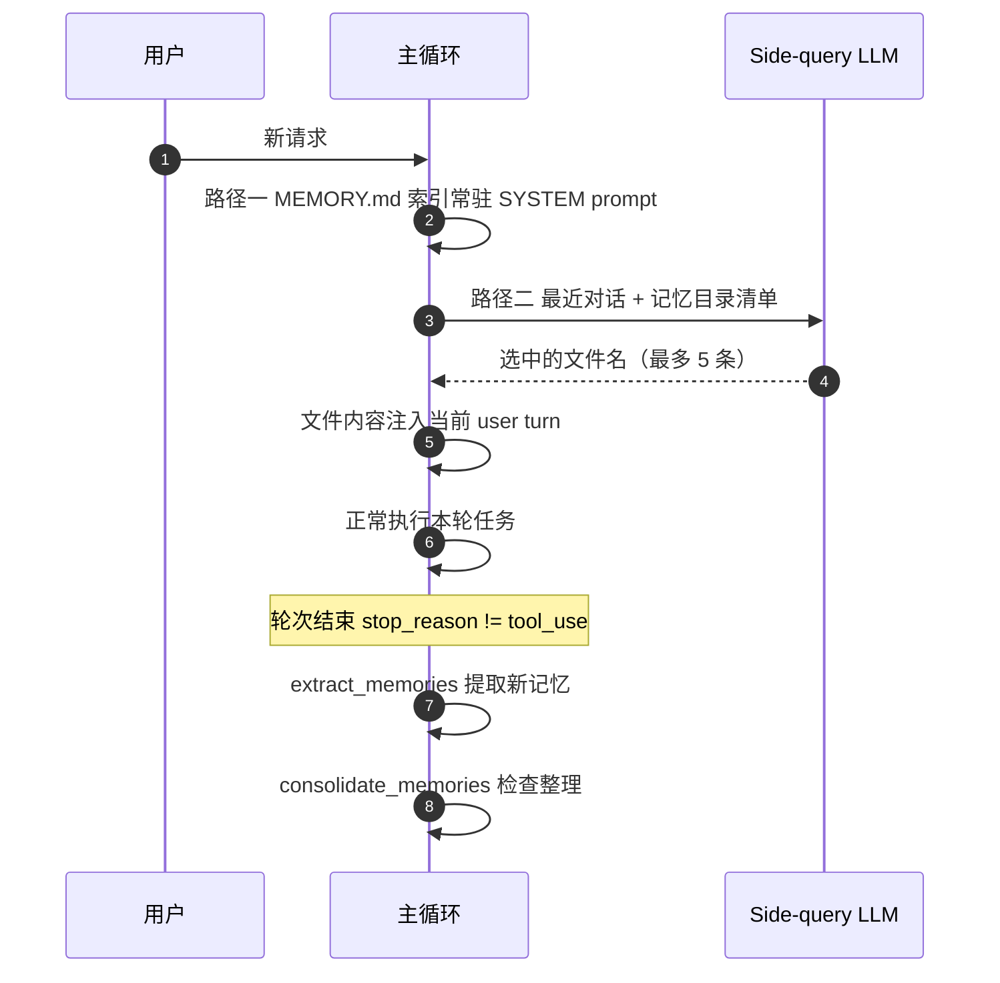

## 核心一句话

> Some facts should survive summarization and future sessions.
> （有些事实应该在摘要和未来会话中存活下来。）

## 问题

上下文压缩会把当前目标、剩余工作、用户约束写进摘要，但细节会丢失："用 tab
缩进不要用空格"可能被简化成"用户有代码风格偏好"。而且新开一个会话，连摘要
也没了。

LLM 没有持久状态，所有信息都在上下文窗口里。上下文满了要压缩，压缩就有损。
**需要一层不参与压缩、跨会话保留的存储。**

## 存储设计：记忆图书馆

`.memory/` 目录下每个记忆一个 `.md` 文件，带 YAML frontmatter；`MEMORY.md`
是一行一个链接的索引：

```markdown
---
name: user-preference-tabs
description: User prefers tabs for indentation
type: user
---

User prefers using tabs, not spaces, for indentation.
**Why:** Consistency with existing codebase conventions.
**How to apply:** Always use tabs when writing or editing files.
```

```markdown
<!-- MEMORY.md 索引 -->
- [user-preference-tabs](user-preference-tabs.md) — User prefers tabs for indentation
```

四类记忆，各有用途：

| 类型 | 回答什么 | 示例 |
|---|---|---|
| user | 你是谁 | "用 tab 不用空格" |
| feedback | 怎么做事 | "别 mock 数据库" |
| project | 正在发生什么 | "auth 重写是合规驱动" |
| reference | 东西在哪找 | "pipeline bug 在 Linear INGEST" |

## 读写链路



**两条加载路径**是关键设计：

- **路径一（索引常驻 SYSTEM）**：`MEMORY.md` 清单注入 system prompt——可被
  prompt cache 缓存，不随对话变化
- **路径二（内容按需注入）**：每次用户请求开始时，把最近对话和记忆目录
  （name + description）发给 LLM 做一次轻量 side-query，选出相关文件名，
  再读文件内容临时注入到当前 user turn（不破坏 cache）。最多 5 条，控制开销

## 核心源码：写入、选择、提取、整理

**写入**——写入新记忆时自动重建索引：

```python
def write_memory_file(name, mem_type, description, body):
    slug = name.lower().replace(" ", "-")
    filepath = MEMORY_DIR / f"{slug}.md"
    filepath.write_text(
        f"---\nname: {name}\ndescription: {description}"
        f"\ntype: {mem_type}\n---\n\n{body}\n"
    )
    _rebuild_index()
```

**选择**——每次用户请求开始时做一次轻量 side-query，选出相关记忆：

```python
def select_relevant_memories(messages, max_items=5):
    files = list_memory_files()
    if not files:
        return []

    # Build catalog: "0: user-preference-tabs — User prefers tabs..."
    catalog = "\n".join(f"{i}: {f['name']} — {f['description']}"
                        for i, f in enumerate(files))

    response = client.messages.create(
        model=MODEL,
        messages=[{"role": "user",
                  "content": "Select relevant memory indices. "
                             "Return JSON array.\n\n"
                             f"Recent conversation:\n{recent}\n\n"
                             f"Memory catalog:\n{catalog}"}],
        max_tokens=200)
    text = extract_text(response.content).strip()
    indices = json.loads(re.search(r'\[.*?\]', text).group())
    return [files[i]["filename"] for i in indices
            if 0 <= i < len(files)]
```

side-query 失败（API 错误、JSON 解析失败）时降级到关键词匹配 name +
description。

**提取**——轮次结束时运行（条件：模型停止且没有 tool_use，说明对话告一段落）：

```python
def extract_memories(messages):
    dialogue = format_recent_messages(messages[-10:])
    existing = "\n".join(f"- {m['name']}: {m['description']}"
                        for m in list_memory_files())

    prompt = (
        "Extract user preferences, constraints, or project facts.\n"
        "Return JSON array: [{name, type, description, body}].\n"
        "If nothing new or already covered, return [].\n\n"
        f"Existing memories:\n{existing}\n\n"
        f"Dialogue:\n{dialogue[:4000]}"
    )
    # ... parse response, write files ...
```

提取 prompt 的关键约束："If nothing new or already covered, return
[]"——先列已有记忆再决定，天然防重复。

**整理**——低频合并去重：

```python
CONSOLIDATE_THRESHOLD = 10

def consolidate_memories():
    files = list_memory_files()
    if len(files) < CONSOLIDATE_THRESHOLD:
        return   # 太少，不值得整理
    # Send all memories to LLM, get back deduplicated list
    # Replace all files with consolidated results
```

**主循环集成**——两条线：每轮开始注入，每轮结束提取：

```python
# 轮次开始（用户请求处理前）：
relevant = select_relevant_memories(messages)
# → 文件内容临时注入当前 user turn

# 轮次结束（agent_loop 内）：
if response.stop_reason != "tool_use":
    extract_memories(pre_compress)   # 从压缩前快照提取新记忆
    consolidate_memories()           # 检查是否需要整理
    return
```

## 走查案例：一条记忆的完整生命周期

**Session A（学习）**：

1. 用户："Please keep LCC pages concrete for beginners."（显式要求记住）
2. 轮次结束 → `extract_memories` 扫描最近 10 条消息
3. 对照已有记忆（无重复）→ 写入 `.memory/lcc-concrete-pages.md`
4. `MEMORY.md` 索引自动重建，多了一行

**六周后，Session B（回忆）**：

1. 用户回来写文档，请求开始
2. side-query 拿着"写文档"上下文扫记忆目录 → 选中 `lcc-concrete-pages`
3. 文件内容注入当前 user turn
4. Agent 的输出自然保持 concrete for beginners 的风格

期间 Session B 可能发生多次上下文压缩——**细节在文件里，不在摘要里**，
压缩丢不掉它。

## 试一下

```bash
cd learn-claude-code
python s09_memory/code.py
```

分多轮输入，观察记忆的累积和加载：

| 轮次 | Prompt | 预期行为 |
|---|---|---|
| 1 | `I prefer using tabs for indentation, not spaces. Remember that.` | 轮末提取，生成记忆文件 |
| 2 | `Create a Python file called test.py` | 观察 Agent 是否用了 tab |
| 3 | `What did I tell you about my preferences?` | 观察 Agent 是否记得 |
| 4 | `I also prefer single quotes over double quotes for strings.` | 第二条记忆累积 |

观察重点：每轮结束后是否出现 `[Memory: extracted N new memories]`？
`.memory/` 目录下是否生成了 `.md` 文件？`MEMORY.md` 索引是否更新？新一轮
对话时 Agent 是否自动加载了之前的记忆？

## 记忆选择：LLM 选，不是 embedding

CC 用 **Sonnet 本身来选记忆**（`findRelevantMemories.ts`），不是向量相似度：

1. 扫描 `.memory/` 下所有 `.md` 文件（排除 MEMORY.md），最多 200 个，按
   mtime 降序
2. 把 `name` + `description` 列成清单
3. 发给 Sonnet side-query："根据名称和描述选出真正有用的记忆（最多 5 个）。
   **不确定就不要选**"
4. Sonnet 返回选中的文件名
5. 选中文件读取完整内容（每文件 ≤ 200 行 / 4096 字节）注入。单 session
   总预算 60KB

教学版在 side-query 失败（API 错误、JSON 解析失败）时降级到关键词匹配
name + description。

## 提取时机与 Dream 整理

**提取**：CC 通过 stop hook fire-and-forget 触发，由 forked agent 执行——
受限权限、`skipTranscript: true`、`maxTurns: 5`。还有重叠保护：主 Agent 已经
写入记忆文件就跳过提取。

**整理（CC 称为 Dream）**不是"数量够了就合并"，而是**四层门控**：

| 门控 | 条件 |
|---|---|
| 时间 | 距上次合并 ≥ 24 小时 |
| 扫描节流 | 避免频繁扫描文件系统 |
| 会话 | 自上次合并以来修改了 ≥ 5 个会话 transcript |
| 锁 | 没有其他进程正在合并（`.consolidate-lock` 文件，崩溃 1 小时后自动过期） |

## User Memory vs Session Memory

|  | User Memory | Session Memory |
|---|---|---|
| 持久性 | 跨会话 | 单会话 |
| 存储 | `memory/` 下多个 .md 文件 | `session-memory/<id>/memory.md` |
| 加载到 | system prompt | compact 摘要 |
| 用途 | 跨会话的知识积累 | 跨 compact 的上下文连续性 |

两者配合：Memory 管长期知识，session memory 管当前会话的压缩续接。

## 要点备忘

- **索引常驻、内容按需**——与技能加载（[技能按需加载](/ai/intermediate/agent/05-skill-loading/)）
  是同一个模式在不同数据上的应用
- 用 LLM 选记忆而非 embedding：记忆量小（≤ 200 个文件）时，名称 + 描述的
  语义判断比向量检索更准
- 提取放在轮次结束（stop 时机），不阻塞主流程
- 记忆适合保存"以后还会用到什么"；正在做什么用任务系统（[任务规划](/ai/intermediate/agent/01-todo-planning/)）

## 延伸阅读

- [Learn Claude Code s09: Memory](https://learn.shareai.run/zh/s09/)（含 memdir 源码路径表与 Dream 四层门控）
- [深入理解 AI Agent · 第 3 章 用户记忆和知识库](https://bojieli.github.io/ai-agent-book/book/chapter3/)
