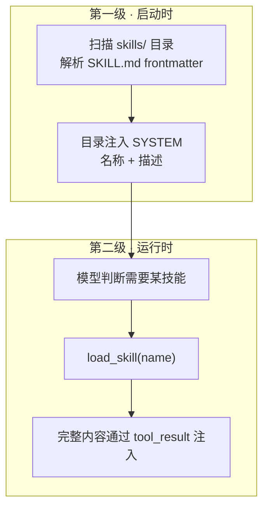

## 核心一句话

> Inject specialized knowledge only when the task actually needs it.
> （只在任务真正需要时注入专业知识。）

## 问题

你的项目有一套 React 组件规范、一份 SQL 风格指南、一份 API 设计文档。你希望
Agent 自动遵守这些规范。最直接的想法——全塞进 system prompt：

```python
SYSTEM = (
    f"You are a coding agent. "
    + open("docs/react-style.md").read()    # 2000 行
    + open("docs/sql-style.md").read()     # 1500 行
    + open("docs/api-design.md").read()    # 3000 行
)
```

6500 行 system prompt。Agent 每次调用 LLM 都带着这些文档——不管是在改 CSS
颜色还是修 SQL 查询。**99% 的内容和当前任务无关，白白消耗 token。**

## 两级设计

| 层 | 位置 | 时机 | 代价 |
|---|---|---|---|
| 1. 目录 | system prompt | 启动时注入（harness 扫描 `skills/`） | 约 100 tokens/skill，每轮都带 |
| 2. 内容 | tool_result | Agent 调用 `load_skill` 时 | 约 2000 tokens/skill，按需 |



模型每轮都能看到"我有哪些技能可用"（不花额外 API 调用）；决定加载时才花
2000 token 级的完整内容。

## 工作原理

**skills/ 目录**，每个技能一个子目录，包含 `SKILL.md`：

```
skills/
  agent-builder/SKILL.md
  code-review/SKILL.md
  mcp-builder/SKILL.md
  pdf/SKILL.md
```

**启动扫描**：解析每个 SKILL.md 的 YAML frontmatter（`name`、`description`），
存入注册表：

```python
SKILL_REGISTRY: dict[str, dict] = {}

def _scan_skills():
    for d in sorted(SKILLS_DIR.iterdir()):
        manifest = d / "SKILL.md"
        if manifest.exists():
            raw = manifest.read_text()
            meta, body = _parse_frontmatter(raw)
            SKILL_REGISTRY[meta.get("name", d.name)] = {
                "name": meta.get("name", d.name),
                "description": meta.get("description", "..."),
                "content": raw,
            }

_scan_skills()  # 启动时跑一次
```

**运行时加载**：通过注册表查找，不走文件路径，**没有路径遍历风险**：

```python
def load_skill(name: str) -> str:
    skill = SKILL_REGISTRY.get(name)
    if not skill:
        return f"Skill not found: {name}"
    return skill["content"]
```

**目录注入 SYSTEM**——`build_system()` 启动时组装：

```python
def list_skills() -> str:
    return "\n".join(f"- **{s['name']}**: {s['description']}"
                     for s in SKILL_REGISTRY.values())

def build_system() -> str:
    catalog = list_skills()
    return (
        f"You are a coding agent at {WORKDIR}. "
        f"Skills available:\n{catalog}\n"
        "Use load_skill to get full details when needed."
    )

SYSTEM = build_system()
```

**一个完整的 SKILL.md 示例**（code-review 技能）：

```markdown
---
name: code-review
description: Review code for bugs, style issues, and security problems
---

## Code Review Checklist

1. Read the diff first: `git diff HEAD~1`
2. Check for:
   - Null/undefined handling
   - Resource leaks (unclosed files, connections)
   - Error handling coverage
3. Run linter before reporting: `ruff check .`
4. Report findings by severity: critical / warning / info
```

frontmatter 的 name + description 进目录（约 100 tokens）；正文 2000 tokens 级
的清单只在模型调用 `load_skill("code-review")` 时进入对话。

**关键区别**：技能内容不是 system prompt 的一部分，它作为一次工具结果进入
当前 messages。后续调用会随历史一起携带，直到上下文压缩、截断或会话结束。
这和上下文压缩自然衔接：**按需加载解决"不该提前带的不要带"，compact 解决
"该丢的怎么丢"**。

## 案例：token 经济学算账

4 个技能、每个完整内容约 2000 tokens、一次 50 轮的会话（全程只做过一次
code review）：

| 方案 | 计算 | 总消耗 |
|---|---|---|
| 全塞 system prompt | 50 轮 × (4 × 2000) | 400K tokens |
| 两级加载 | 50 轮 × (4 × 100) + 1 × 2000 | **22K tokens（约 5.5%）** |

差距来自两个乘法：目录比内容便宜 20 倍；"每轮都带" 变成 "用到才带"。
技能数量越多、会话越长，两级加载的收益越大。

## 教学版 vs Claude Code

**技能来源不是一个目录，是多个**：user skills（`~/.claude/skills/`）、project
skills（`.claude/skills/`）、`--add-dir` skills、legacy commands、bundled
skills、plugin skills、MCP 远程技能、conditional skills（带 `paths` frontmatter，
按文件路径激活）。

**SKILL.md frontmatter 常见字段**：

| 字段 | 用途 |
|---|---|
| `name` / `description` | 显示名称和描述 |
| `when_to_use` | 指导模型何时调用 |
| `allowed-tools` | 技能可用工具的自动允许列表 |
| `context` | `inline`（默认）或 `fork`（作为子 Agent 运行） |
| `model` | 模型覆盖（haiku/sonnet/opus/inherit） |
| `paths` | 条件激活的 glob 模式 |

**两级加载的精确实现**：

1. Catalog：扫描目录注册为 Command 对象（只有元数据），技能列表格式化为附件，
   预算为上下文窗口的约 1%（上限 8000 字符）
2. Load：模型调 `Skill` 工具 → 展开完整 SKILL.md 内容 → tool_result 展示的
   只是 `"Launching skill: {name}"`，真正的技能内容通过 `newMessages` 注入对话

## 试一下

```bash
cd learn-claude-code
python s07_skill_loading/code.py
```

| Prompt | 预期行为 |
|---|---|
| `What skills are available?` | 直接从 SYSTEM 里的目录回答，不调工具 |
| `Load the code-review skill and follow its instructions` | 出现 `load_skill` 调用 |
| `I need to do a code review -- load the relevant skill first` | 模型自主判断该加载哪个技能 |

观察重点：Agent 是否直接从 SYSTEM 里的目录知道有哪些技能？需要完整规范时
是否出现 `[HOOK] load_skill`？加载后回答是否使用了对应 skill 的说明？

## 要点备忘

- 两级加载是 token 经济学：**目录便宜常驻，内容昂贵按需**
- 加载基于注册表查找而非文件路径——安全边界由数据结构保证
- 技能 = 前置知识的"惰性求值"，与上下文压缩是一对互补机制
- `context: fork` 让技能在子 Agent 里运行，加载的内容完全不进主线程上下文

## 延伸阅读

- [Learn Claude Code s07: Skill Loading](https://learn.shareai.run/zh/s07/)（含 CC 技能来源与 frontmatter 完整分析）
- [深入理解 AI Agent · 第 2 章 上下文工程](https://bojieli.github.io/ai-agent-book/book/chapter2/)（Agent Skills 一节）
