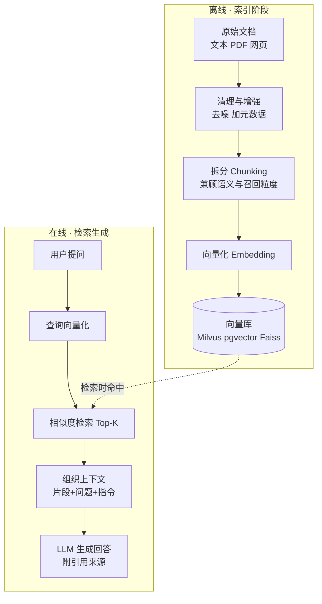

## 什么是 RAG

**RAG（Retrieval-Augmented Generation，检索增强生成）** = 信息检索 + 大模型生成。
系统先从知识库（文档集合、数据库、企业内部系统）检索出与问题相关的片段，
再把片段和原始问题一起喂给 LLM，让模型**基于检索内容回答**，而不是只靠训练时
记住的知识。

做企业知识库问答时，很多人的第一反应是"把文档全塞给大模型"。文档少时能跑；
涨到几十万字后：每次请求撞 Token 上限、更新不及时、权限与溯源无法治理。
RAG 在回答前先检索，让答案落在可核对的证据上。

## 为什么需要 RAG

| 痛点 | RAG 的做法 |
|---|---|
| 知识时效性 | 预训练知识停在截止时间点；RAG 动态检索外部知识源，最新内容直接送给 LLM |
| 私有数据访问 | 企业文档不能随便给公开 LLM；RAG 按需提取相关片段，不暴露全部数据 |
| 幻觉问题 | 提供明确参考文本，让模型基于证据回答——能**降低**幻觉概率，但不能彻底消除 |

## 两阶段工作链路

RAG 工程链路分离线索引和在线检索生成两个阶段：

**索引阶段要点**：

- **Chunking 是质量关键**：太大引入噪声，太小丢失上下文；拆分策略直接影响召回
- 元数据（时间戳、分类标签）为检索提供过滤维度
- 索引通常离线定时跑（如每周重建）；用户上传文档的场景可在线集成

**在线阶段要点**：查询先向量化（与文档向量在同一空间比较），检索 Top-K 片段，
组织成 Prompt（片段 + 原始问题 + 系统指令 + 引用要求）交给 LLM。

## Embedding 与相似度

Embedding 把文本映射到高维稠密向量空间，让**语义接近的文本距离更近**。
"如何申请退款？""退款流程是什么？""订单怎么取消并退钱？"字面不同但语义相近，
好的 Embedding 模型会把它们映射到相近位置。

| 度量方式 | 含义 | 特点 |
|---|---|---|
| 余弦相似度 | 两个向量方向是否一致 | 对向量长度不敏感，RAG 最常用 |
| 内积（点积） | 对应维度乘积之和 | 向量已 L2 归一化时与余弦排序等价 |
| 欧氏距离（L2） | 空间中的绝对距离 | 对幅度敏感，适合按 L2 训练的模型 |

选型参考：闭源 API（OpenAI `text-embedding-3` 系列、Cohere）开箱即用；开源模型
（BGE、GTE、E5 系列）适合内网部署与成本控制。别只看 MTEB 榜单，用自己的业务
问题实测召回率、相关性和延迟。

## RAG vs 传统搜索 vs 微调 vs 长上下文

| 维度 | RAG | 微调 |
|---|---|---|
| 知识更新 | 更新知识库/索引即可 | 重新准备数据并训练 |
| 幻觉控制 | 可引用原文，便于溯源 | 引用来源不天然可见 |
| 成本结构 | 检索 + 输入 Token + 向量库 | 数据标注 + 训练 GPU + 评测 |
| 适合场景 | 知识密集问答、企业知识库、实时信息 | 风格适配、格式控制、固定任务行为 |

一句话区分：**RAG 解决"模型不知道"（新知识/私有知识），微调解决"模型不按你的
方式做事"（风格/格式/行为）**。知识频繁变动、需要引用来源 → RAG；输出风格不稳
→ 微调；既要懂领域表达又要查实时知识 → 两者结合（成本高，先把 RAG 做稳更务实）。

与另外两种方案的关系：

- **传统搜索**：用户目标是"找到材料"时搜索更直接（链路短、成本低、结果可控）；
  目标是"读完材料给结论"才需要 RAG。很多企业两套入口并存：简单查找走搜索，
  复杂问答走 RAG
- **长上下文**：适合单篇长文档深度分析，但不能替代 RAG——百万级文档库不可能
  全塞进去；无关片段一多，"Lost in the Middle"问题反而让答案不稳；权限过滤和
  引用溯源也不具备

## 演进阶段

| 阶段 | 典型链路 | 特点 |
|---|---|---|
| Naive RAG | 切块 → Embedding → Top-K 检索 → 生成 | 最基础，适合 Demo |
| Advanced RAG | Query 改写 / HyDE → 混合检索 → Rerank → 上下文压缩 → 生成 | 解决召回不准、噪声、排序不稳 |
| Modular RAG | 检索器/重排器/压缩器/路由器/生成器可插拔组合 | 按场景动态路由，适合生产系统 |

## 要点备忘

- 检索质量决定上限：检索错了、引用错了，答案照样翻车；生产级要配引用校验、
  拒答机制和评测闭环
- 权限过滤必须在应用层做：RAG 天然有检索入口，便于把 ACL 和召回放同一条链路
- 检索效果不稳定时，问题通常出在查询改写、召回策略、排序或上下文质量
- 面试收尾模板：知识变动频繁、需要引用来源 → RAG；输出风格不稳定 → 微调；
  两者可结合但成本翻倍

## 延伸阅读

- [JavaGuide · RAG 基础概念](https://javaguide.cn/ai/rag/rag-basis.html)（含文档处理、向量库、优化系列姊妹篇）
- [深入理解 AI Agent · 第 3 章 用户记忆和知识库](https://bojieli.github.io/ai-agent-book/book/chapter3/)
