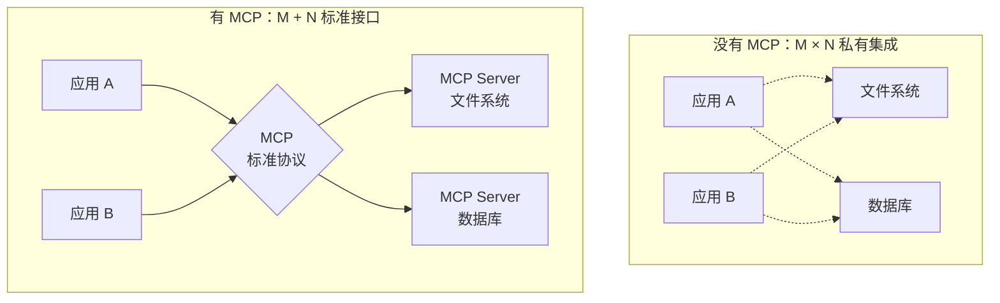
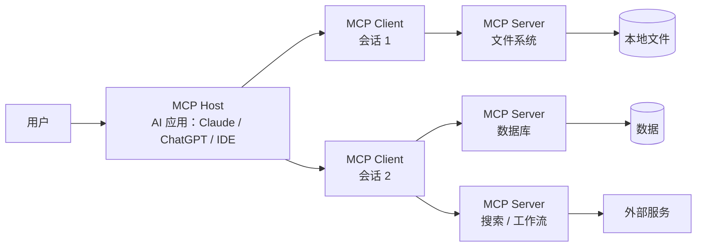

## MCP 是什么

**MCP（Model Context Protocol）** 是连接 AI 应用与外部系统的开放标准。使用 MCP，
Claude、ChatGPT 这样的 AI 应用可以连接：

- **数据源**：本地文件、数据库

- **工具**：搜索引擎、计算器

- **工作流**：专门的 prompt 与流程

官方的比喻是 **"AI 应用的 USB-C 接口"**——就像 USB-C 为电子设备提供了标准化的
连接方式，MCP 为 AI 应用提供了连接外部系统的标准化方式。

## 为什么需要标准协议

没有标准协议时，M 个 AI 应用 × N 个外部系统 = **M×N 种私有集成**，每个都要
单独开发维护。MCP 把集成变成 **M+N**：应用实现一次客户端，服务实现一次服务端，
任意组合即可互通。



对三类角色的价值：

| 角色          | 收益                            |
| ----------- | ----------------------------- |
| 开发者         | 构建或集成 AI 应用时，开发时间与复杂度大幅降低     |
| AI 应用/Agent | 接入一个由数据源、工具和应用组成的生态，能力与体验增强   |
| 终端用户        | 得到能访问自己的数据、并代表用户执行操作的更强 AI 应用 |

## 架构：Host、Client、Server



- **Host**：运行 AI 应用的一端（如 Claude Desktop、VS Code），发起连接

- **Client**：Host 内部与某个 Server 保持的会话，一个 Host 可同时挂多个

- **Server**：暴露数据、工具或 prompt 的程序；同一个 Server 可被多个 Host 复用

这与 Agent Loop 的关系（Learn Claude Code s19）：**外部服务通过一个标准的
"发现 + 调用"协议变成 Agent 的工具**——工具不再需要硬编码进 TOOLS 数组，
而是运行时从 MCP Server 动态发现。

## 生态支持

MCP 是跨客户端的开放协议，一次构建、处处集成：

- AI 助手：Claude、ChatGPT

- 开发工具：VS Code（Copilot Chat）、Cursor、MCPJam 等

- Server 广场：[MCP 广场 · 魔搭社区](https://www.modelscope.cn/mcp)等市场
  聚合了大量现成 Server（搜索、数据库、地图……），接入前先逛广场，别急着
  自己造

## 三个核心协议能力：发现 / 调用 / 读资源

MCP 端点只有三类，全部走 **JSON-RPC 2.0** 消息：

| 能力 | 方法（mcp 前缀） | 作用 |
|---|---|---|
| 工具发现 | `tools/list` | 客户端启动时列出 Server 有哪些工具、各自的 JSON Schema |
| 工具调用 | `tools/call` | 客户端带参数调用某个工具，拿到结构化结果 |
| 资源 | `resources/list` / `resources/read` | 暴露只读数据（文档、配置），供模型作为上下文读 |

这正好对应 Agent Loop 里的工具机制：**Server 响应 `tools/list`，客户端把它
转成自己的 TOOL_HANDLERS 表**——工具不再硬编码进源码，而是运行时发现注册。

## 最小 Server 实现（Python + FastMCP）

`tools/list` 的产物是关键：**每个工具配一个 JSON Schema**，模型据此才知道
该传什么参数：

```python
from mcp.server.fastmcp import FastMCP

mcp = FastMCP("repo-search")

# 装饰器把函数变成暴露给模型的一个工具，docstring 即该工具的说明
@mcp.tool()
def grep_code(pattern: str, path: str = ".") -> str:
    """在指定目录里按正则搜索代码，返回匹配的文件与行号。"""
    import subprocess
    return subprocess.run(
        ["grep", "-rn", pattern, path], capture_output=True, text=True
    ).stdout

if __name__ == "__main__":
    mcp.run()   # 默认 stdio 传输：客户端用 stdin/stdout 与它通信
```

启动后它响应 `tools/list`，返回约等价于这样的 Schema——**模型就是靠这个
知道 `grep_code` 要 `pattern`、可选 `path`**：

```json
{
  "tools": [{
    "name": "grep_code",
    "description": "在指定目录里按正则搜索代码，返回匹配的文件与行号。",
    "inputSchema": {
      "type": "object",
      "properties": {
        "pattern": { "type": "string" },
        "path":    { "type": "string", "default": "." }
      },
      "required": ["pattern"]
    }
  }]
}
```

## 用官方客户端直连验证

不需要 AI 应用，用官方 `mcp` CLI 就能验证协议正确：

```bash
# 连上这套 stdio server，列出工具
mcp run repo-search-server.py

# 直接调用一次，确认返回结构
mcp connect repo-search-server.py    # 交互式按工具调用
```

也可以用 curl 直接发 JSON-RPC（服务需走 HTTP/SSE 传输），核对是否返回合法
的 `tools/list` 响应：

```bash
curl -X POST http://localhost:8080/mcp \
  -H "content-type: application/json" \
  -d '{"jsonrpc":"2.0","id":1,"method":"tools/list","params":{}}'
```

## 协议层最小交互：连一次看看

从 stdin 喂一个标准 `initialize` + `tools/list`，就能看到 Server 的原始应答，
完全不需要图形界面：

```
# 发送（换行分隔的 JSON 行）
{"jsonrpc":"2.0","id":0,"method":"initialize","params":{"protocolVersion":"2024-11-05","capabilities":{},"clientInfo":{"name":"test","version":"0"}}}
{"jsonrpc":"2.0","method":"notifications/initialized"}
{"jsonrpc":"2.0","id":1,"method":"tools/list","params":{}}

# 收到的应答尾段
{"jsonrpc":"2.0","id":1,"result":{"tools":[{"name":"grep_code","description":"...","inputSchema":{...}}]}}
```

> 设计要点：MCP 的 value（协议、Concepts、Levels、Elements）目前仍是**草案
> 中的可选分层理念**，业界落地最实的就是 `tools` 一类能力；真正对外暴露数据
> 的 `resources` 在多数 Server 里反而不常用。协议细节以官方文档为准。

## 把发现的工具接回 Agent（衔接 TOOL_HANDLERS）

学到 Agent 工具机制后，接回的方式是：**把 `tools/list` 返回的动态工具注册进
运行时工具表**。伪代码示意：

```python
# 启动时：接口 MCP Server，把它的工具并入本地工具表
def connect_mcp_server(name, server_spec):
    tools = mcp_client.list_tools(server_spec)     # 对应 tools/list
    for t in tools:
        TOOL_HANDLERS[prefix(name, t.name)] = lambda args, t=t: mcp_client.call(t.name, args)
    return tools
```

模型基于 Schema 构造参数 → `TOOL_HANDLERS` 转成 `tools/call` 发给 Server →
结果作为 tool_result 回传模型，走 Agent Loop 的正常路径。**工具边界被协议
抽象掉了**——本地函数还是远程 Server，对模型无差别。

## 典型应用场景

| 场景     | 示例                                  |
| ------ | ----------------------------------- |
| 个性化助理  | Agent 访问你的 Google 日历和 Notion        |
| 设计到代码  | Claude Code 基于 Figma 设计稿生成整个 Web 应用 |
| 企业数据分析 | 聊天机器人连接组织内多个数据库，用对话做分析              |
| 物理世界   | AI 在 Blender 里建 3D 设计并发送到 3D 打印     |

## 要点备忘

- MCP 是**开放标准**，规范与 SDK 见 [modelcontextprotocol.io](https://modelcontextprotocol.io/)；
  协议细节永远以官方文档为准

- 记住 USB-C 比喻：标准化连接解决的是 M×N 集成爆炸问题

- 工具视角：MCP 让工具从"硬编码注册"进化为"运行时发现"

- 工具的三类分类（感知 / 执行 / 协作）与主动工具发现见《深入理解 AI Agent》第 4 章

## 延伸阅读

- [MCP 官方文档](https://modelcontextprotocol.io/)（概念、架构与快速开始）

- [MCP 广场 · 魔搭社区](https://www.modelscope.cn/mcp)（现成 Server 市场）

- [Learn Claude Code s19: MCP Tools](https://learn.shareai.run/zh/s19/)

- [深入理解 AI Agent · 第 4 章 工具](https://bojieli.github.io/ai-agent-book/book/chapter4/)

