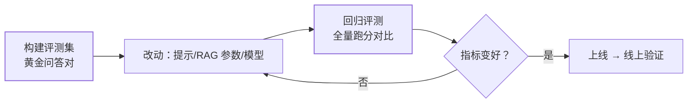

"你的 RAG 效果怎么样？"——回答"感觉挺准的"在面试里等于没答。模型层的
基准评测（MMLU 那类）再高，也**不保证你的应用好用**：检索没召回、工具
选错、提示被长上下文稀释，都会让好模型做出烂应用。本篇讲应用层怎么评估。

## 模型评测 ≠ 应用评估

评测与对齐篇讲的是**模型层**：用公开基准给模型本身打分。应用层的问题
完全不同——你的系统 = 模型 + 提示 + 检索 + 工具 + 编排，**任何一环的
改动都可能让全局变好或变坏**。所以应用评估的核心是：给自己的系统
构建**专属评测集**，让每次改动跑一遍，用数字代替感觉。

## 评什么：按应用形态选指标

| 应用形态 | 核心指标 | 说明 |
| --- | --- | --- |
| RAG | 检索命中率（recall@k）、忠实度 | 召回不到 = 后面全白搭；忠实度 = 回答是否有出处支撑 |
| Agent | 任务完成率、工具调用正确率 | 端到端给任务，看最终是否达成、过程是否走对 |
| 结构化输出 | 格式合法率、字段准确率 | JSON 是否可解析、字段对不对 |
| 通用底线 | 时延、成本（token）、拒绝率 | 体验与账单，常被忽略但必看 |

## 怎么评：三种手段

- **黄金评测集**：几十到几百条"输入 + 标准答案/评分要点"，覆盖典型场景
  与边界（长文档、歧义、恶意输入）。**这是应用评估的固定资产**。
- **LLM-as-judge**：用强模型按评分要点给输出打分——人工评不起，模型评
  可规模化。但有偏差：**位置偏差**（偏好先出现的答案）、**自我偏好**
  （偏好自家模型的输出）、对长答案虚高——**混入一批人工标注校准**后才可信。
- **线上验证**：A/B 实验 + 用户反馈（点踩率、追问率）——离线评测集再好，
  也是对真实分布的近似，最终以线上为准。

## 评估驱动开发（Eval-Driven Development）

把评测集当**测试用例集**用：改提示词不靠"感觉这版更好"，靠回归分数。
这也是团队协作的基础——评测集让"提示词工程"变得可评审、可回滚
（与代码评审同一套纪律）。

## 高频追问速答

- **LLM-as-judge 可靠吗？** 有系统性偏差但可校准：固定评分要点、交换位置
  双评、抽样人工比对一致率；一致率达标后才能大规模用。
- **RAG 检索质量怎么量化？** 离线用标注问答对算 recall@k / MRR；线上看
  引用点击率与"未找到答案"占比。先量化检索，再谈生成——召回不到，
  生成端怎么调都白费（对照落地选型篇）。
- **评测集从哪来？** 真实用户 query 抽样 + 人工补边界用例；冷启动可以
  让模型生成初稿再人工筛选——**质量靠人工把关，数量靠生成**。

## 小结

- 模型基准分 ≠ 应用体验：应用评估用自己的评测集 + 自己的指标。
- 指标按形态选：RAG 看召回与忠实度，Agent 看任务完成率与工具正确率，
  底线看时延与成本。
- LLM-as-judge 可规模化但需人工校准；评估驱动开发让每次改动有数字
  可依，是 AI 应用的"测试纪律"。
