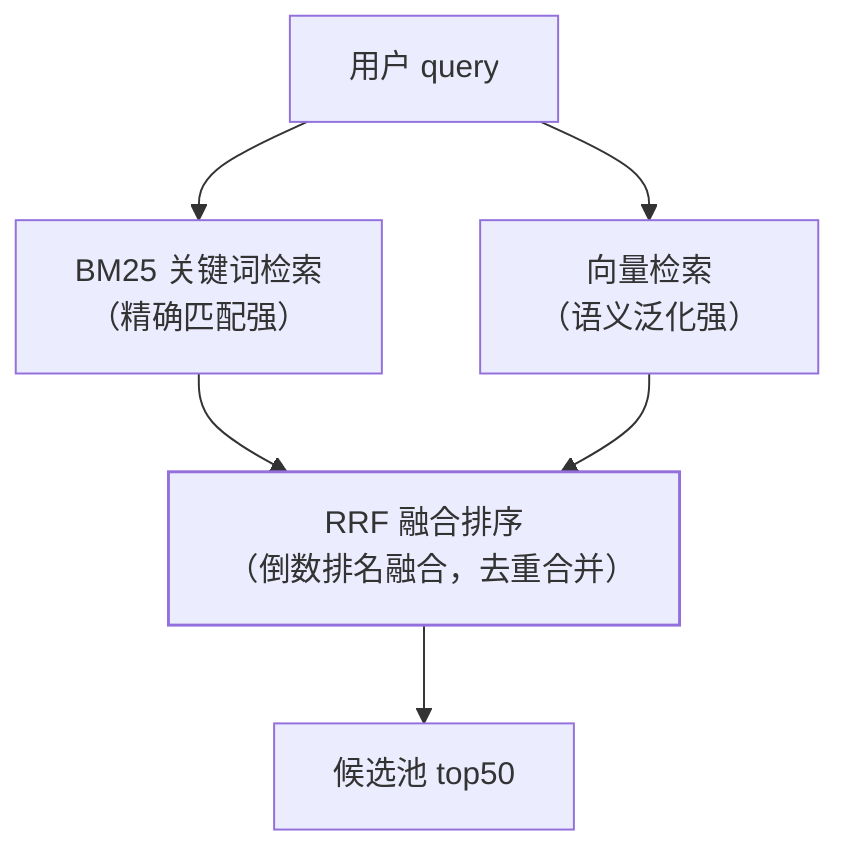

RAG 篇讲了两阶段链路（检索→生成），但纯向量检索有一个**结构性盲区**：
"型号 XR-500 的保修政策"这类**精确关键词**查询，语义向量反而搜不准。
生产级 RAG 的标配是**混合检索 + 重排**——本篇把检索质量从"能用"提到
"可靠"。

## 纯向量检索的盲区

向量检索擅长**语义相似**（"怎么退货"能召回"售后流程"），但败在：

- **精确 token**：型号、错误码、SKU、人名——embedding 把它们"稀释"进
  语义，`XR-500` 和 `XR-501` 的向量几乎一样近；
- **否定与数字**："不支持 7 天退货"和"支持 7 天退货"语义向量高度相似
  ——恰恰是最不能混的。

**关键词检索（BM25）恰好互补**：精确匹配强、语义泛化弱。两者结合=
混合检索。

## 混合检索：双路召回 + RRF 融合

- **RRF（倒数排名融合）**：按"1/(k+排名)"给每路结果打融合分——不关心
  两路分数量纲差异，只看排名，简单稳定；
- 一句话：**关键词管"必须包含"，向量管"大概相关"，融合取并集优势**。

## 重排：召回广撒网，精排挑答案

召回阶段的模型（BM25/双塔向量）都是**独立编码 query 和文档**——快但粗。
重排（rerank）用 **cross-encoder**：把 query 和文档**拼在一起**进模型
精算相关性——慢但准。

- 流水线：双路召回 top50 → rerank 精排 → **top5 进上下文**；
- 成本权衡：cross-encoder 每对都要跑一次模型，只适合小候选池——
  这就是"召回宽、精排窄"两阶段存在的原因（性能与质量的经典分工）；
- 面试句式："检索质量的上限由召回决定，最终效果由重排决定。"

## 查询改写与分块：两个常被忽略的杠杆

- **查询改写**：用户 query 口语化、多轮对话有指代（"它多少钱"——它是谁？）
  ——检索前先改写为独立完整 query（LLM 改写或规则补全），检索质量
  立竿见影；
- **分块（chunking）**：固定 512 字切分会把一句话拦腰截断——按语义
  边界（段落/标题）切，块间留 overlap；块太大噪声多、太小上下文残缺，
  **chunk 大小本身是 RAG 的超参数**（用应用评估篇的评测集调）。

## 高频追问速答

- **混合检索权重怎么调？** 别手调线性权重，用 RRF（免调参）；要精调就
  上重排——把"融合"做成"精排"的前置步骤。
- **rerank 为什么不用向量相似度直接算？** 双塔（向量）是各编各的，
  cross-encoder 让 query 和文档**逐 token 交互**，能理解否定、条件等
  细粒度语义——精度高一个档次，代价是算力。
- **怎么知道检索坏了还是生成坏了？** 评测先行：召回的文档里**有没有
  答案**（recall@k）——检索没召回，生成端怎么调都白费（应用评估篇）。

## 小结

- 纯向量败在精确匹配 → 混合检索（BM25+向量+RRF）补盲区。
- 召回宽撒网、重排精挑（cross-encoder），两阶段是性能与质量的分工。
- 查询改写与分块策略是零成本的检索质量杠杆；一切调优用评测集回归验证。
