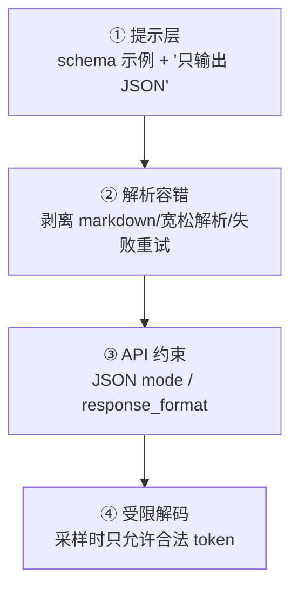

Agent 调工具、信息抽取、风控规则输出——LLM 应用的一半故障来自
**"输出不是合法 JSON"**：多了一句解释、字段名大小写飘了、嵌套括号
断了。本篇给出从弱到强的**四层防线**，以及每层到底保证什么。

## 为什么"说清楚就行"不够

LLM 是逐 token 采样的（推理参数篇）：**任何一步都可能选到语法上跑偏的
token**——提示词能提高概率，但保证不了。所以防线必须多层，越往后越强。

## 四层防线（从弱到强）

1. **提示层**：把 JSON Schema 写进提示 + 一个完整示例 + 明确"不要任何
   解释文字"——成本低但保证不了（漏一句"好的，以下是"就完蛋）；
2. **解析容错**：剥掉 \`\`\`json 围栏、宽松 JSON 解析、失败带错误信息
   重试一次——把"偶发失败"变成"重试后几乎必成"；
3. **API JSON mode**：主流 API 的 `response_format: json_object`——
   **保证语法合法，不保证字段语义**（缺字段/值类型错仍会发生）；
4. **受限解码（constrained decoding）**：按 schema 构建**语法自动机**，
   采样时用 logit mask 只允许合法 token（vLLM 的 guided_json、outlines、
   GBNF 语法）——**100% 语法合法**，最强防线。

## JSON mode 的保证边界（高频追问点）

- ✅ 保证：输出是**可解析的 JSON**；
- ❌ 不保证：字段齐全、枚举值合法、数值范围正确——**语法合法 ≠ 语义
  正确**。字段级强保证必须上受限解码（guided_json 直接吃 JSON Schema），
  或解析后做 schema 校验 + 重试。

## schema 的工程问题：版本兼容

抽取/工具调用的 schema 会演进（加字段/改枚举）：

- **向前兼容**：解析端对未知字段忽略、缺字段给默认值——别让新增字段
  打崩旧消费方；
- **评测回归**：schema 改动跑应用评估篇的评测集，确认抽取准确率没掉
  ——schema 是接口契约，改它要走和 API 变更一样的纪律。

## 高频追问速答

- **受限解码有什么代价？** 自动机约束可能与语义"打架"：强制合法时模型
  可能陷入重复循环生成垃圾但合法的 JSON——schema 设计别过深嵌套；
  且约束有额外计算开销。
- **为什么不用正则从自由文本里抽？** 正则是"事后补救"，约束解码是
  "事前保证"——优先级完全不同；正则适合做解析容错层的辅助。
- **多模态/工具调用里字段语义怎么校验？** 解析后跑 JSON Schema 校验
  （ajv/jsonschema），不合格带错误信息重试——语法由解码层保证，
  语义由校验+重试保证。

## 小结

- 四层防线：提示 → 解析容错 → API JSON mode → 受限解码，强度递增、
  成本递增——生产组合是"解析容错打底 + 关键路径上受限解码"。
- JSON mode 只保证语法不保证语义；字段级强保证靠 schema 约束解码
  或校验重试。
- schema 是接口契约：版本兼容 + 评测回归，改它要像改 API 一样谨慎。
