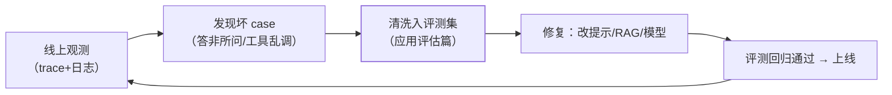

Agent 的输出是**非确定性**的：同样的输入每次跑的路径都可能不同——
传统"看状态码和日志"的监控不够用，要看**行为、成本与质量**。护栏篇
的审计、评估篇的指标，落到运行时就是本篇的可观测性体系。

## 三支柱映射到 Agent

| 支柱 | Agent 形态 | 回答的问题 |
| --- | --- | --- |
| 日志 | 每步全量留痕：提示、响应、工具调用+参数+结果 | 它到底做了什么？（护栏审计的底座） |
| 指标 | token/步数/工具成功率/任务完成率/成本 | 它跑得健康吗？贵不贵？ |
| 追踪 | 一次任务的完整调用链（多 LLM 调用、多工具、子 Agent 嵌套） | 慢/错在哪一步？ |

- **trace 穿透**：一次 Agent 任务 = 一次 trace，其中每次 LLM 调用、
  每次工具调用、每个子 Agent 都是 span（可观测性三支柱篇的 trace
  概念直接复用）——跨多模型多工具的链路只有 trace 能拼出来；
- span 属性要带：模型名、token 数、工具名、耗时、错误——成本归因
  （按用户/按功能）靠这些属性聚合。

## 关键监控点：Agent 的"生命体征"

| 信号 | 危险含义 |
| --- | --- |
| **单任务 token 突增** | 循环失控（反复调同一工具）——护栏篇硬上限的告警面 |
| 工具调用失败率上升 | 工具本身坏了 / 模型选错工具 |
| 任务完成率下滑 | 模型/提示/检索某环退化——先定位再改 |
| 步数分布变化 | 提示词被改坏（绕路了）或任务分布变了 |
| 成本按维度归因 | 某用户/某功能烧钱——网关计量数据的下游 |

## 与评估的闭环：坏 case 回流

线上发现 → 评测集沉淀 → 修复 → 回归 → 上线——**可观测与评估是同一
质量闭环的两端**：观测发现问题，评估验证修复。

## 高频追问速答

- **怎么发现"Agent 在胡说"？** 胡说不一定报错——靠三招：评测集定期
  回归（离线）、抽样人工复核（比例化）、用户负反馈监控（线上）。
- **全量留痕成本高吗？** 提示+响应全存很贵——分级：全量存元数据与
  token 数，正文抽样或短期保留；关键业务（支付类）全量。
- **用什么工具？** LangSmith/Langfuse 类 LLM 可观测平台，或自建
  （OpenTelemetry 语义约定已支持 LLM span）——自建与采购按团队定。

## 小结

- Agent 可观测 = 三支柱的行为化映射：全量留痕（日志）、行为指标
  （token/步数/成功率）、trace 穿透多模型调用链。
- 生命体征四信号：token 突增、工具失败率、完成率、步数分布——
  每个都对应一类故障。
- 可观测与评估是质量闭环的两端：观测发现坏 case，评估验证修复。
