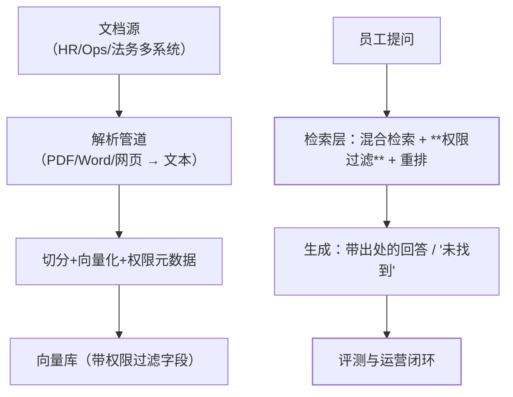

"员工问'报销政策'，系统要给出准确答案和出处"——企业知识库是 RAG 的
第一落地场景，也是**把 RAG 技术（基础篇+进阶篇）装进真实约束**的整合
题：文档格式乱、权限要隔离、答案错比没有更糟、文档还会天天更新。

## 需求的第一原则：错误答案比没有答案更糟

员工拿着错误的政策答案去报销，损失是真金白银——所以知识库系统的
红线是**答案必须可溯源**（引用原文出处），**检索不到就明说"未找到"**，
绝不编造（对照护栏篇的幻觉治理与接地要求）。

## 端到端架构：文档管道到问答服务

## 四个落地要点

1. **文档管道是脏活也是关键**：多格式解析质量参差（PDF 表格最难）、
   **增量更新**（文档改了向量库要同步——按文档 hash 增量重切，全量
   重建是灾难）；文档删除/过期要同步删向量（答已作废政策是事故）；
2. **权限在检索层强制过滤**：HR 薪酬文档不能因为"语义相似"就泄漏给
   普通员工——**权限元数据进检索过滤条件**（检索不到就答不了），
   而不是检索出来再靠生成层"自觉"不答（旁路必漏）；
3. **评测先行**：上线前构建**黄金问答集**（每领域几十条标准问答，
   应用评估篇）——检索 recall@k、答案忠实度、出处准确性三个指标
   达标才上线；文档更新/参数调整跑回归；
4. **运营闭环**：用户点踩/未找到率监控 → 坏 case 分析（检索不到补
   文档/切分不对调策略/生成幻觉加约束）→ 修复回归——Agent 可观测
   性篇的闭环在知识库的具体化。

## 高频追问速答

- **答案错了责任在检索还是生成？** 先查检索：黄金问答里该召回的没
  召回 → 修检索；召回了但答错 → 修生成（提示约束/换模型/加出处
  强制引用）——**定位先行，别上来就换模型**（RAG 进阶篇）。
- **文档天天更新，向量库怎么同步？** 按文档 hash 增量：变了的重新
  切分向量化，删了的删向量——文档多时走异步管道（Excel 任务中心
  的异步模式同构）。
- **不同部门要不同的知识库视图？** 权限元数据（部门/密级）在检索层
  过滤实现——同一份向量库多租户视图，不必建多库（数据权限篇的
  行级过滤思想移植到向量检索）。

## 小结

- 红线：答案可溯源、检索不到明说——错误答案比没有更糟。
- 四要点：脏活管道（增量同步）、**检索层强制权限过滤**、评测先行
  （黄金问答集三指标）、运营闭环（点踩→分析→回归）。
- 答错先查检索再查生成——定位先行，体系化排障。
