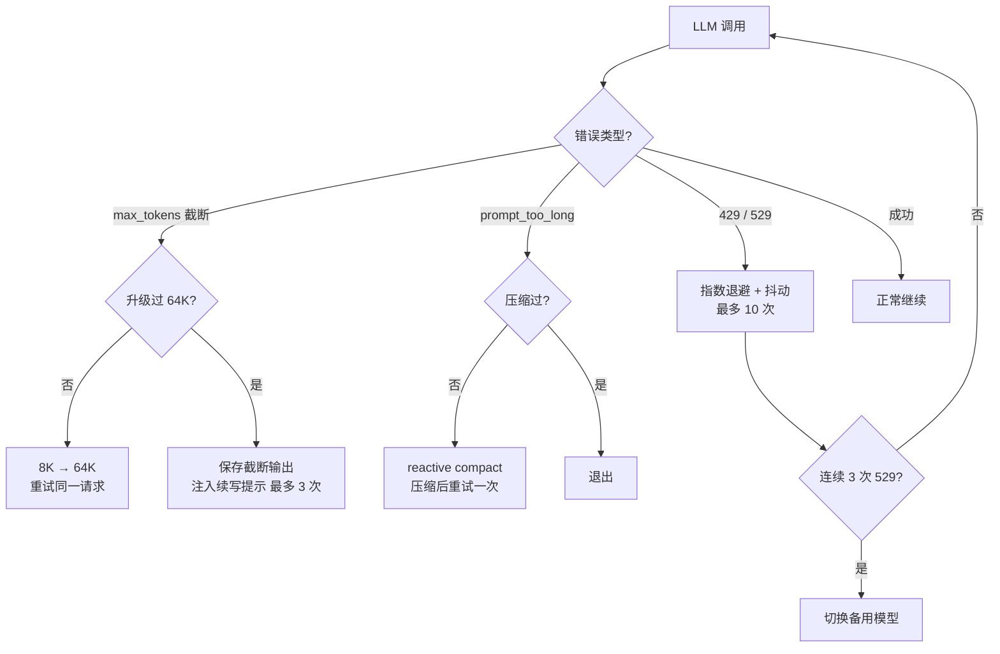

## 核心一句话

> Do not blindly retry; classify the failure, run the smallest recovery,
> and track whether that recovery was already used.
> （不要盲目重试；分类失败，跑最小的恢复，并追踪该恢复是否已用过。）

## 问题

Agent 跑着跑着报错了：

```
Error: 529 overloaded
```

Agent 崩溃了。它没有重试，没有换模型，没有减少上下文——直接崩溃。
生产环境中 API 错误是常态，一个不处理错误的 Agent 就像一碰就熄火的车。

三种最常见的故障模式：

| 模式 | 触发 | 恢复动作 |
|---|---|---|
| 输出截断 | `max_tokens` | 升级 8K→64K / 续写提示 |
| 上下文超限 | `prompt_too_long` | reactive compact → 重试 |
| 临时故障 | 429 / 529 | 指数退避 + 抖动，连续 529 可切换备用模型 |



## 三条恢复路径

### 路径 1：输出被截断

模型话说一半 `max_tokens` 用完了。第一次发生时，直接把 `max_tokens` 从 8K 升级
到 64K（8 倍空间），重试同一请求——**此时不追加截断输出到 messages，保持原始
请求不变**。64K 还不够才保存截断输出并注入续写提示，最多 3 次：

```python
if response.stop_reason == "max_tokens":
    if not state.has_escalated:
        max_tokens = ESCALATED_MAX_TOKENS     # 8K → 64K
        state.has_escalated = True
        continue          # messages 不变，同一请求更多 token
    messages.append({"role": "assistant", "content": response.content})
    messages.append({"role": "user", "content":
        "Output token limit hit. Resume directly — "
        "no apology, no recap. Pick up mid-thought."})
    continue
```

升级只有一次，续写最多 3 次——超过就退出，继续续写也不会有实质产出。

### 路径 2：上下文超限

压缩管线全跑过了还是超。触发 reactive compact（比 auto compact 更激进），
压缩后重试一次。**压缩过一次还超限就只能退出**——再压缩也不会变小：

```python
except PromptTooLongError:
    if not state.has_attempted_reactive_compact:
        messages[:] = reactive_compact(messages)
        state.has_attempted_reactive_compact = True
        continue
    return
```

### 路径 3：临时故障

网络抖动、429 限流、529 过载——不是 bug，是分布式系统的常态。统一走
指数退避 + 抖动，加随机抖动让并发请求不在同一时刻重试：

```python
def retry_delay(attempt, retry_after=None):
    if retry_after:
        return retry_after           # 服务器给了 Retry-After 就优先用
    base = min(500 * (2 ** attempt), 32000) / 1000
    return base + random.uniform(0, base * 0.25)


def with_retry(fn, state, max_retries=10):
    for attempt in range(max_retries):
        try:
            return fn()
        except (RateLimitError, OverloadedError):
            delay = retry_delay(attempt)
            time.sleep(delay)
            if is_overloaded:
                state.consecutive_529 += 1
                if state.consecutive_529 >= 3 and FALLBACK_MODEL:
                    state.current_model = FALLBACK_MODEL
                    raise ModelSwitched()
    raise MaxRetriesExceeded()
```

连续 3 次 529 过载 → 切换到备用模型（若配置了 `FALLBACK_MODEL_ID`）。

退避节奏表——基础延迟翻倍、抖动 0~25%、32 秒封顶：

| 尝试 | 基础延迟 | 抖动范围 |
|---|---|---|
| 1 | 500ms | 0-125ms |
| 2 | 1000ms | 0-250ms |
| 3 | 2000ms | 0-500ms |
| 4 | 4000ms | 0-1000ms |
| 7+ | 32000ms（封顶） | 0-8000ms |

## 恢复状态与完整循环

所有"已用过"的追踪收在一个 RecoveryState 里：

```python
@dataclass
class RecoveryState:
    has_escalated: bool = False              # 8K→64K 是否已用
    recovery_count: int = 0                  # 续写次数（上限 3）
    has_attempted_reactive_compact: bool = False
    consecutive_529: int = 0                 # 连续过载计数
    current_model: str = PRIMARY_MODEL        # 可切到 FALLBACK_MODEL
```

完整循环——外层 try/except 捕获 API 异常，`with_retry` 处理瞬态错误，
`stop_reason` 检查处理截断，三种机制各管各的：

```python
def agent_loop(messages, context):
    system = get_system_prompt(context)
    state = RecoveryState()
    max_tokens = 8000

    while True:
        try:
            response = with_retry(
                lambda: client.messages.create(
                    model=state.current_model, system=system,
                    messages=messages, tools=TOOLS,
                    max_tokens=max_tokens),
                state)
        except Exception as e:
            if is_prompt_too_long_error(e):
                if not state.has_attempted_reactive_compact:
                    messages[:] = reactive_compact(messages)
                    state.has_attempted_reactive_compact = True
                    continue
                return
            log_error(e)
            return

        # max_tokens 检查在追加 messages 之前
        if response.stop_reason == "max_tokens":
            if not state.has_escalated:
                max_tokens = 64000
                state.has_escalated = True
                continue   # 重试同一请求，messages 不变
            messages.append({"role": "assistant", "content": response.content})
            messages.append({"role": "user", "content": CONTINUATION_PROMPT})
            continue

        messages.append({"role": "assistant", "content": response.content})
        if response.stop_reason != "tool_use":
            return
        # ... 工具执行 ...
```

## 对比案例：同一句报错的三种结局

半夜线上高峰，Agent 连续收到三次 `Error: 529 overloaded`：

| 版本 | 结局 |
|---|---|
| s01（裸循环） | 第一次 529 直接崩溃，任务丢失 |
| 只会盲重试的版本 | 恰好 0.5s 后重试成功——但换成 `max_tokens` 截断，重试 100 次还是截断（没分类，白烧钱） |
| s11 版本 | 分类 → 529 走退避（0.5s → 1s → 2s）；连续 3 次自动切备用模型，任务完成 |

分类的价值就在第二行：**盲目重试对确定性失败（截断、超限）无效**，必须先
判断"这个错重试有没有用"。

## 教学版 vs Claude Code

**十几种 reason/transition**，每轮 LLM 调用后都会判断（教学版只展开 5 种）：

| reason/transition | CC 行为 |
|---|---|
| `max_output_tokens_escalate` / `recovery` | 8K→64K 升级 / 续写（最多 3 次） |
| `reactive_compact_retry` / `prompt_too_long` | reactive compact → 重试 |
| `model_error` | 重试 |
| `aborted_streaming` / `aborted_tools` | 流式中止 / 工具中止恢复 |
| `stop_hook_blocking` | 注入 blocking error → 模型自纠 |
| `token_budget_continuation` | token 用量 < 90% 时继续 |
| `collapse_drain_retry` / `blocking_limit` / `max_turns` | 各有专门处理 |

**退避的精确公式**（`withRetry.ts`）：`min(500 × 2^(attempt-1), 32000) +
random(0~25%)`，第 1 次约 0.5s，第 7 次封顶 32s。

**四个细节**：

- **续写提示原文**："Output token limit hit. Resume directly — no apology,
  no recap of what you were doing. Pick up mid-thought if that is where the
  cut happened. Break remaining work into smaller pieces."
- **流式错误暂扣**：流式路径中可恢复的错误（413、max_tokens、media error）
  在 streaming 期间被暂扣不展示——SDK 消费者看不到，只有恢复逻辑能看到
- **529 → 切换模型**：连续 3 次后自动切换（如 Opus → Sonnet），清除所有
  pending 消息，提示 "Switched to {model} due to high demand"
- **Diminishing Returns 检测**：连续 3 次 continuation 且 token 增量 < 500
  时，判断"继续也没有实质性产出"，停止续写

## 试一下

```bash
cd learn-claude-code
python s11_error_recovery/code.py
```

| 做法 | 观察点 |
|---|---|
| 让 Agent 生成一段很长的代码 | 截断后是否自动续写（`[max_tokens] escalating` 日志） |
| 连续读取大量文件撑大上下文 | reactive compact 是否触发 |
| 遇到 429/529 | 指数退避的日志输出 |

## 要点备忘

- 恢复的顺序哲学：**先试便宜的（加大 token）、再试贵的（压缩、换模型）**，
  且每种手段都有次数上限和"已用过"追踪，防止无限循环
- 截断恢复先升级不续写——续写会把截断输出固化进 messages，升级只是同一请求
  重试，更干净
- 抖动（jitter）不是可有可无的装饰——没有它，并发重试会形成同步风暴
- `hasAttemptedReactiveCompact` 这类"已用过"标志就是 Agent Loop State 字段表的
  一部分（见 [Agent Loop 核心循环](/ai/basic/agent/agent-loop/)）

## 延伸阅读

- [Learn Claude Code s11: Error Recovery](https://learn.shareai.run/zh/s11/)（含 13+ reason code 与退避公式源码核查）
