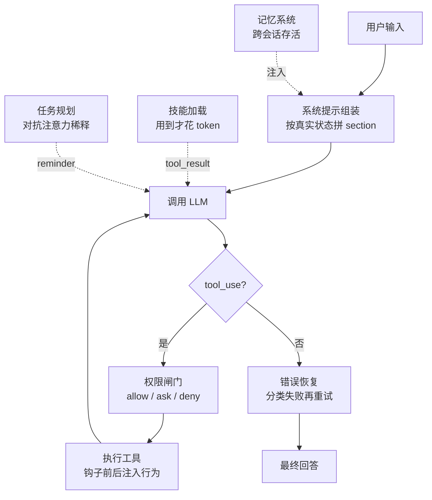

import CategoryNotesIsland from '../../../../../components/learn/CategoryNotesIsland.astro';

基础循环跑起来之后，决定 Agent 上限的是五件事：

- **怎么想**——任务规划（先列清单再动手）与系统提示组装（prompt 是拼出来的）
- **看什么**——上下文工程与记忆系统（压缩有损，要有不丢的一层）
- **懂什么**——RAG 检索增强与技能按需加载（知识注入的两条路线）
- **稳不稳**——错误恢复（错误是重试的起点，不是终点）
- **连什么**——MCP 协议（像 USB-C 一样接上外部世界）

点击右侧圆点可标记学习状态（未学 → 学习中 → 已掌握）。

<CategoryNotesIsland categoryId="ai/intermediate/agent" />

## 七个机制在循环中的位置

本方向笔记的素材出处与完整学习路径见[学习资源导航](/guide/resources/)。
