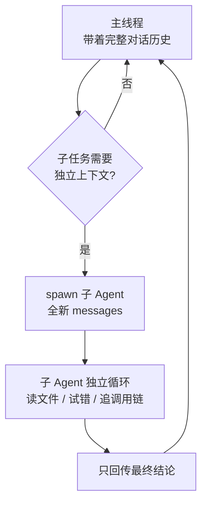

## 核心一句话

> Subagents give each subtask a clean message history while preserving the
> main thread.（子智能体给每个子任务一段干净的消息历史，同时保留主线程。）

## 问题

Agent 在修一个 bug。它读了 30 个文件来追踪调用链，中间聊了 60 轮。messages
列表涨到 120 条，其中大部分是"追踪调用链"的中间过程，和"修 bug"这个最终
目标无关。

这些中间过程占着上下文位置，让 Agent 越来越"健忘"——它记不住最初的问题
是什么了。

换个角度：你修 bug 的时候，会"开一个新终端"来追踪调用链。追踪完了，终端
关掉，结果写进笔记，回到原来的终端继续修 bug。Agent 也需要这个能力：开一个
独立的子进程，给它一个独立的消息列表，让它专心做一件事。

## 解决方案

保留[任务规划](/ai/intermediate/agent/todo-planning/)的最小 hook 结构和
`todo_write` 工具，新增 `task` 工具。调用它时，spawn 一个子 Agent，拥有
全新的 `messages[]`，跑自己的循环，结束后**只把摘要文本**回传给主 Agent。
对话上下文被丢弃，但文件系统的副作用（写文件、改文件、跑命令）保留在
工作目录中。



子 Agent 的工具受限：有 bash/read/write/edit/glob，但**没有 task**，不能
递归 spawn 新的子 Agent。子 Agent 的工具调用仍经过权限 hook——上下文隔离
不代表权限隔离。

## 工作原理

**spawn\_subagent**——给子 Agent 一个全新的 messages 列表，跑自己的循环，
只回传结论：

```python
def spawn_subagent(description: str) -> str:
    # 子 Agent 的工具：基础工具，但没有 task（禁止递归）
    sub_tools = [
        {"name": "bash", ...}, {"name": "read_file", ...},
        {"name": "write_file", ...}, {"name": "edit_file", ...},
        {"name": "glob", ...},
    ]
    messages = [{"role": "user", "content": description}]  # 全新 messages[]

    for _ in range(30):  # safety limit
        response = client.messages.create(
            model=MODEL, system=SUB_SYSTEM,
            messages=messages, tools=sub_tools, max_tokens=8000,
        )
        messages.append({"role": "assistant", "content": response.content})
        if response.stop_reason != "tool_use":
            break
        results = []
        for block in response.content:
            if block.type == "tool_use":
                blocked = trigger_hooks("PreToolUse", block)
                if blocked:
                    results.append({... "content": str(blocked)})
                    continue
                handler = SUB_HANDLERS.get(block.name)
                output = handler(**block.input) if handler else f"Unknown"
                trigger_hooks("PostToolUse", block, output)
                results.append({... "content": output})
        messages.append({"role": "user", "content": results})

    # 只返回最后的文本结论，中间过程全部丢弃
    return extract_text(messages[-1]["content"])
```

主 Agent 调用时，跟调其他工具一样——dispatch 机制不变：

```python
TOOLS = [
    # ... bash / read_file / write_file / edit_file / glob / todo_write ...
    # s06: 新增 task 工具
    {"name": "task",
     "description": "Launch a subagent to handle a complex subtask. "
                    "Returns only the final conclusion.",
     "input_schema": {"type": "object",
                      "properties": {"description": {"type": "string"}},
                      "required": ["description"]}},
]
TOOL_HANDLERS["task"] = spawn_subagent
```

四个关键设计决策：

| 决策      | 选择                           | 原因                           |
| ------- | ---------------------------- | ---------------------------- |
| 上下文隔离   | 全新 `messages[]`              | 子 Agent 的中间过程不污染主 Agent 的上下文 |
| 只回传结论   | `extract_text(last_message)` | 不是回传整个 messages 列表           |
| 禁止递归    | 子 Agent 无 task 工具            | 防止子 Agent 再 spawn 新的子 Agent  |
| 安全策略不跳过 | 子 Agent 也走 PreToolUse hook   | 上下文隔离不代表权限隔离                 |

子 Agent 有独立的 `SUB_SYSTEM` 提示，明确要求"直接完成任务，不要再委派"。

## 相对 s05 的变更

| 组件    | 之前 (s05)                                      | 之后 (s06)                                         |
| ----- | --------------------------------------------- | ------------------------------------------------ |
| 工具数量  | 6（bash, read, write, edit, glob, todo\_write） | 7（+task）                                         |
| 新函数   | —                                             | spawn\_subagent（独立 messages + 30 轮安全限制）          |
| 上下文隔离 | 全部在主对话中                                       | 子 Agent 用全新的 messages                            |
| 循环    | 不变                                            | dispatch 不变，子 Agent 有独立 SUB\_SYSTEM 和 hook 保护的循环 |

## 试一下

```bash
cd learn-claude-code
python s06_subagent/code.py
```

| Prompt                                                                                                                          | 预期行为                      |
| ------------------------------------------------------------------------------------------------------------------------------- | ------------------------- |
| `Use a subtask to find what testing framework this project uses`                                                                | 子 Agent 去读文件，主 Agent 只收结论 |
| `Delegate: read all .py files in agents/ and summarize what each one does`                                                      | 中间过程丢弃，只回摘要               |
| `Use a task to create s06_subagent/example/string_tools.py with a slugify(text) function, then verify it from the parent agent` | 文件副作用保留，主线程可验证            |

观察重点：是否出现 `[Subagent spawned]` / `[Subagent done]`？子 Agent 的工具
调用是否以 `[sub] ...` 输出？主 Agent 最后是否只继续处理子 Agent 返回的摘要？

## 深入 CC 源码

以下基于 CC 源码 `AgentTool.tsx`、`runAgent.ts`、`forkSubagent.ts`、
`forkedAgent.ts` 的完整分析。

### 不是一种模式，是三种

教学版只讲了"全新的 messages\[]"。CC 实际有三种执行模式：

| 模式              | 触发条件                  | 上下文                               |
| --------------- | --------------------- | --------------------------------- |
| Normal Subagent | 指定了 `subagent_type`   | 全新 messages，只有 prompt             |
| Fork Subagent   | 未指定 type，fork gate 开启 | cache-friendly 前缀，共享 prompt cache |
| General-purpose | 未指定 type，fork gate 关闭 | 同 Normal                          |

### Fork 模式：为了共享 Prompt Cache

Fork 模式不创建全新上下文，而是通过 `buildForkedMessages()` 构造 cache-friendly
的消息前缀，保留父 assistant message 并生成 placeholder tool results。目的不是
隔离，而是让 Anthropic API 的 **prompt cache 命中**：父子 Agent 的 system
prompt、tools、messages 前缀、model、thinking config 五个组件字节级一致，
API 端不需要重算。

### Context Isolation 的精确粒度

`createSubagentContext()` 创建子 Agent 的 `ToolUseContext`：

| 字段              | 行为                                |
| --------------- | --------------------------------- |
| abortController | 新的 child controller，父 abort 向下传播  |
| setAppState     | 默认 no-op；sync agent 通过共享函数共用      |
| readFileState   | **从父克隆**（避免重复读相同文件）               |
| queryTracking   | 新 chainId，depth = parentDepth + 1 |

子 Agent 不是完全隔离的：文件读取状态是共享的。

### 递归防护与权限冒泡

教学版用"子 Agent 不给 task 工具"表达递归保护；真实实现更精细——`Agent`
工具默认在所有 agent 的禁用集合里，fork child 有专门的递归保护检查，teammate
场景下有特殊放行。

Fork Agent 的 `permissionMode: 'bubble'` 意味着子 Agent 的权限弹窗**冒泡到
父终端**，用户在主终端里审批子 Agent 的操作。

CC 还支持异步路径：`run_in_background: true` 时异步启动，立即返回
`{ status: 'async_launched' }`，子 Agent 完成后通过通知机制告知父 Agent
（留给 [后台任务](/ai/advanced/agent/background-tasks/) 一章展开）。

## 要点备忘

- 多 Agent 的第一动机是**上下文管理**：探索性工作的中间细节不污染主线程，
  主线程的上下文预算留给真正重要的信息

- 子 Agent 返回**摘要而非过程**，主线程视野不被稀释

- 禁止递归 spawn——子 Agent 没有 task 工具，防止失控展开

- 上下文隔离 ≠ 权限隔离：子 Agent 的工具调用同样过 PreToolUse hook

## 延伸阅读

- [Learn Claude Code s06: Subagent](https://learn.shareai.run/zh/s06/)（含 Fork 模式与 prompt cache 源码核查）

- 临时工（Subagent）与常驻队友的差异见 [Agent 团队](/ai/advanced/agent/agent-teams/)

