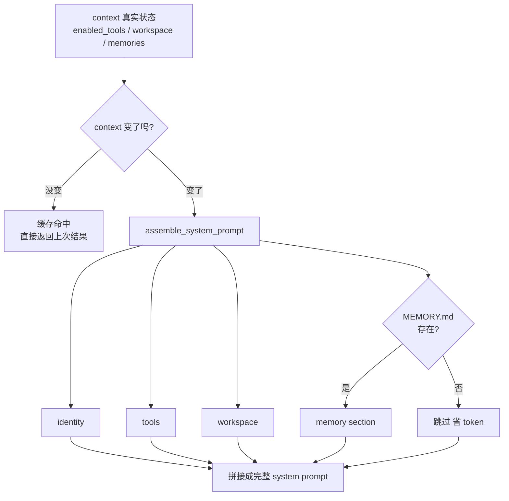

## 核心一句话

> The system prompt is a generated product of policy, tools, skills, and context.
> （系统提示是策略、工具、技能和上下文的生成产物。）

## 问题

从 s01 到 s09，system prompt 都是一行硬编码。但 Agent 已经有记忆、有压缩、
有技能加载，prompt 该提的能力越来越多：

```python
SYSTEM = (
    f"You are a coding agent at {WORKDIR}. "
    "Use tools to solve tasks. Act, don't explain. "
    "Before starting any multi-step task, use todo_write. "
    "Skills are available via list_skills and load_skill. "
    "Relevant memories are injected below when available. "
    # ... 加一个能力就多一段
)
```

三个问题：

1. **换项目要重写整个 prompt**——不知道哪些该改、哪些该留
2. **修改一处可能影响全局**——加一段工具描述可能跟前面的指令冲突
3. **每次请求都带全部内容**——即使当前对话用不到某些段落也浪费 token

## 四个 Section，两种加载策略

| Section | 加载策略 | 内容 | 判断依据 |
|---|---|---|---|
| identity | 始终 | 你是谁、怎么做事 | 始终存在 |
| tools | 始终 | 可用工具列表 | `enabled_tools` |
| workspace | 始终 | 工作目录 | 始终存在 |
| memory | 按需 | 相关记忆内容 | `.memory/MEMORY.md` 是否存在 |



关键设计：**section 是否加载取决于真实状态**（工具是否注册、文件是否存在），
不是消息里的关键词。

## 工作原理

**分段定义**——每个 section 独立维护，修改 `tools` 不影响 `identity`：

```python
PROMPT_SECTIONS = {
    "identity": "You are a coding agent. Act, don't explain.",
    "tools": "Available tools: bash, read_file, write_file.",
    "workspace": f"Working directory: {WORKDIR}",
    "memory": "Relevant memories are injected below when available.",
}
```

**按需拼接**：

```python
def assemble_system_prompt(context: dict) -> str:
    sections = [
        PROMPT_SECTIONS["identity"],
        PROMPT_SECTIONS["tools"],
        PROMPT_SECTIONS["workspace"],
    ]
    memories = context.get("memories", "")
    if memories:
        sections.append(f"Relevant memories:\n{memories}")
    return "\n\n".join(sections)
```

**缓存避免重复拼接**——上下文没变时（同一轮对话的多次 LLM 调用），命中缓存
直接返回：

```python
def get_system_prompt(context: dict) -> str:
    key = json.dumps(context, sort_keys=True, ensure_ascii=False, default=str)
    if key == _last_context_key and _last_prompt:
        return _last_prompt
    _last_context_key = key
    _last_prompt = assemble_system_prompt(context)
    return _last_prompt
```

用 `json.dumps` 而不是 `hash()`：Python 内置 `hash()` 有进程随机化，不适合做
稳定 cache key，而且遇到 list/dict 会报 `unhashable type`。

**context 从哪来**——`update_context` 反映当前运行态的真实状态：

```python
def update_context(context: dict, messages: list) -> dict:
    memories = ""
    if MEMORY_INDEX.exists():
        content = MEMORY_INDEX.read_text().strip()
        if content:
            memories = content
    return {
        "enabled_tools": list(TOOL_HANDLERS.keys()),
        "workspace": str(WORKDIR),
        "memories": memories,
    }
```

`enabled_tools` 列出实际注册的工具，`memories` 检查 `.memory/MEMORY.md`
是否存在。section 加载基于这些真实状态，不在消息里搜关键词。

**合起来跑**——每轮循环开头拿一次 system prompt，context 变了就重新组装，
没变就返回缓存：

```python
def agent_loop(messages: list, context: dict):
    system = get_system_prompt(context)
    while True:
        response = client.messages.create(
            model=MODEL, system=system, messages=messages,
            tools=TOOLS, max_tokens=8000)
        # ... 工具执行 ...
        context = update_context(context, messages)
        system = get_system_prompt(context)
```

**为什么不全加载**？system prompt 每轮计费——token 有成本；信息越少 LLM 越专注
（无关指令是噪音）。

## 走查案例：同一台机器上的两个项目

| | 项目 A（开源库） | 项目 B（公司项目） |
|---|---|---|
| `.memory/MEMORY.md` | 不存在 | 存在（8 条记忆索引） |
| 注册的工具 | 3 个 | 5 个 |

组装结果：

```text
项目 A 的 system prompt：
  [identity]  You are a coding agent. Act, don't explain.
  [tools]     Available tools: bash, read_file, write_file.
  [workspace] Working directory: /home/me/oss-lib

项目 B 的 system prompt：
  [identity]  You are a coding agent. Act, don't explain.
  [tools]     Available tools: bash, read_file, write_file, edit_file, glob.
  [workspace] Working directory: /home/me/company-app
  [memory]    Relevant memories:
              - [user-preference-tabs] — ...
```

切换项目 = context 变化 = 缓存自动失效、重新组装。硬编码时代这两个 prompt
要手写两份 SYSTEM 字符串；现在差异由状态驱动，identity 一处维护。

## 教学版 vs Claude Code

**Section 数量不固定**，受 feature flag、output style、用户类型、token 预算影响，
大致分两类：

- **静态 section**（始终加载）：identity、system、doing_tasks、actions、
  using_tools、tone_style、output_efficiency 等
- **动态 section**（按状态加载）：session_guidance、memory、env_info_simple、
  language、output_style、mcp_instructions、token_budget 等

`mcp_instructions` 是唯一的易失性 section——MCP server 可以在轮次间连接和断开。

**三层缓存**（教学版只有"避免重复拼接"这一层）：

| 层 | 机制 |
|---|---|
| 1 | lodash memoize：会话中缓存 getSystemContext / getUserContext |
| 2 | section 注册缓存：`STATE.systemPromptSectionCache`，`/clear` 或 `/compact` 时清除 |
| 3 | API 级缓存：按 `SYSTEM_PROMPT_DYNAMIC_BOUNDARY` 分隔静态/动态部分，静态部分命中 global cache |

**getUserContext vs getSystemContext**：

|  | getSystemContext | getUserContext |
|---|---|---|
| 内容 | gitStatus、cacheBreaker | CLAUDE.md 内容、currentDate |
| 注入方式 | 追加到 system prompt 数组 | 前置为 `<system-reminder>` 用户消息 |

**模式如何改变 prompt**：CLAUDE_CODE_SIMPLE 模式整个 prompt 只有 2 行；标准
交互模式下 system prompt 核心约 **20-30KB** 文本。

**组装函数签名**——CC 的入口：

```typescript
getSystemPrompt(tools, model, additionalWorkingDirs?,
                mcpClients?): Promise<string[]>
```

返回 `string[]`（每个元素是一个 section），由 `SYSTEM_PROMPT_DYNAMIC_BOUNDARY`
分隔静态和动态部分。

## 试一下

```bash
cd learn-claude-code
python s10_system_prompt/code.py
```

| Prompt | 预期行为 |
|---|---|
| `Read the file README.md` | 观察始终加载的三个 section |
| `Create a file called .memory/MEMORY.md with content "- [test](test.md) — test memory"` | 写入记忆索引 |
| `Read the file code.py` | 观察 memory section 是否出现 |

观察重点：输出中 `[assembled] sections: ...` 标签显示哪些 section 被加载；
连续对话时是否出现 `[cache hit]`；创建 `.memory/MEMORY.md` 后下一轮 memory
section 是否自动加载。

## 要点备忘

- system prompt 是**运行时根据当前状态组装的配置**，不是写死的字符串
- 加载依据是真实状态（文件是否存在、工具是否注册），不是关键词猜测
- 缓存 key 用确定性序列化（`json.dumps` + `sort_keys`），不用进程随机化的 `hash()`
- 这里的缓存只是"避免重复拼接字符串"，与 API 层的 prompt cache 是两回事——后者
  要靠静态/动态边界（`SYSTEM_PROMPT_DYNAMIC_BOUNDARY`）保住
- 记忆索引、技能目录注入的都是"组装的原料"（见[记忆系统](/ai/intermediate/agent/memory/)、
  [技能按需加载](/ai/intermediate/agent/skill-loading/)）

## 延伸阅读

- [Learn Claude Code s10: System Prompt](https://learn.shareai.run/zh/s10/)（含 CC prompt section 与三层缓存源码分析）
