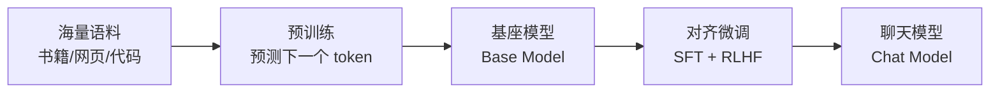

## LLM 本质：超大语料训练出的下一个词预测器

大语言模型（Large Language Model）本质是一个在**天量文本**上训练出来的模型，
任务朴素到极致：**给定上文，预测下一个 token**。当数据量、参数规模大到
一定程度，这个"下一个词预测"任务竟逼出了推理、代码、翻译等复杂能力——
这叫**涌现能力（Emergent Ability）**。

## 从基座模型到聊天模型

直接拿预训练完的基座模型（Base Model）跟你对话，它会"接话"而不是"回答"——
因为训练目标是续写文本，不是遵从指令。所以需要再训练：

| 阶段 | 名称 | 做什么 | 目的 |
|---|---|---|---|
| 1 | 预训练（Pretrain） | 海量文本预测下一个 token | 学会语言与世界知识 |
| 2 | SFT 监督微调 | 用（指令, 标准答案）对训练 | 学会"按指令回答" |
| 3 | RLHF 人类反馈强化 | 按人类偏好打分优化 | 让回答有用、无害、真诚 |

**SFT 教模型"听懂人话"，RLHF 教模型"说人爱听的话"**。经过这两步，基座模型才
变成我们每天用的 ChatGPT / Claude 这类助手。

## 两个关键概念

### Token（词元）：模型的"字"不是你的字

模型读写文本的最小单位，**不是"字符"也不是"词"，而是子词片段（subword）**。
文字进模型前先过**分词器（tokenizer）**：按词表把文本切成 token，每个
token 映射为固定整数 id——模型从头到尾处理的只是 id 序列，"字符"在入口
处就消失了。

为什么是子词而不是字符或词？三种切法各有一本账：

| 切法 | 问题 |
|---|---|
| 按字符 | 序列过长（自注意力 O(n²) 扛不住）；单字符几乎无语义——"unbelievable" 的 "u" 学不到东西 |
| 按词 | 词表要百万级（屈折变化、专有名词、新词），嵌入矩阵爆炸；没见过的词（OOV）无法表示 |
| 子词（BPE） | 折中：**高频词整块记，低频词拆着记**——"tokenization" → [token][ization] |

主流分词器（BPE 及其变体）的原理：从字符/字节起步，统计语料中反复合并
**最高频的相邻对**，直到词表达到目标规模（几万~十几万条目）。由此推出
几条实战结论：

- **英文平均约 4 个字符 = 1 token**：常见单词和词根整体在词表里成块
  （the → 1 token，-ing/-ation 这类后缀也成块）；
- **中文常见字 1 字 ≈ 1 token，罕用字/emoji 更贵**：不在词表里的走
  **字节回退（byte fallback）**，一个字拆成 2~3 个 token——同样一段
  内容中文比英文吃 token，计费和上下文窗口占用都更高；
- 著名的"数不清 strawberry 里有几个 r"：模型看到的是一两个 token 而
  不是 10 个字母——**字符级信息在 token 层被压缩掉了**。要模型做字符级
  任务（数字母、数笔画），得先让它逐字符拼写展开再数；
- token 边界还解释了为什么模型会"拼错"罕见词、为什么某些数字串
  （如长卡号）会被切得支离破碎。

**上下文窗口（Context Window）指模型一次能看多少个 token**，这是 LLM 的
核心资源边界——所有 Agent 的上下文工程、压缩、记忆机制，本质都是在跟
这个窗口作斗争；计费维度（输入/输出单价、缓存折扣）见 Token 计费篇。

### 上下文学习（In-Context Learning）

LLM 不用改权重，仅靠提示词里的示例/指令就能完成新任务——这个能力是 Small
模型没有的。它也是**提示工程**（下一层）存在的物理基础。

## 参数规模与缩放定律

- **缩放定律（Scaling Law）**：模型损失随参数量、数据量、算力的幂律下降，
  基本可预测——这也是大厂敢砸钱训更大模型的原因。
- **涌现能力**：某些能力（如多步推理、CoT）在小模型上不存在，跨过某规模门槛
  后突然出现，无法从小模型线性外推。

## 小结

- LLM = 超大语料训练的"下一个 token 预测器"，能力从预测任务中涌现。
- 基座模型 → SFT → RLHF，两步对齐才变成实用助手。
- token 与上下文窗口是理解一切 Agent 机制的总纲。

## 延伸阅读

- [深入理解 AI Agent · 大模型基础](https://bojieli.github.io/ai-agent-book/)
- [Stanford CS224N 自然语言处理](https://web.stanford.edu/class/cs224n/)