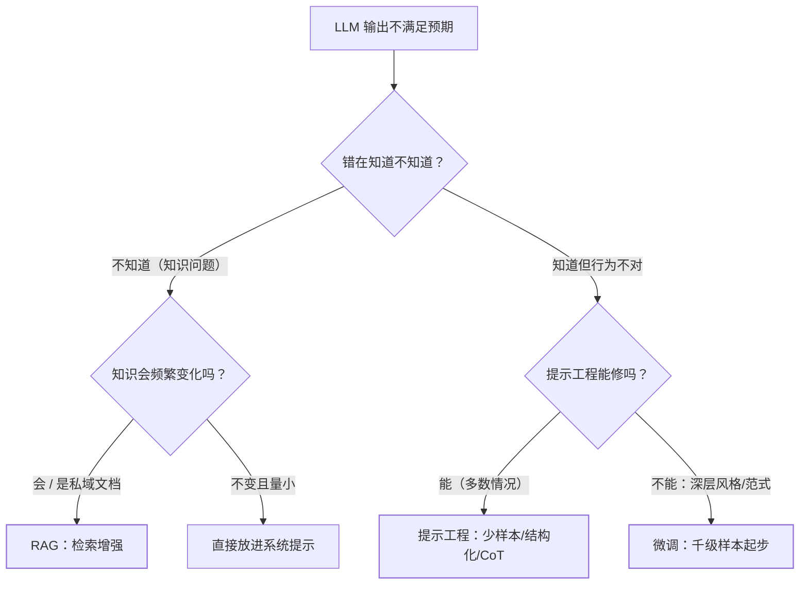

"要用 LLM 做业务，是写提示词、上 RAG，还是微调一个模型？"——AI 应用落地的
第一道选型题，也是面试考察"是否真的做过"的分水岭。三者的关系不是三选一，
而是**各解决一类问题、常常叠加使用**。

## 三条路线各自解决什么

| | 解决的核心问题 | 一句话记忆 |
| --- | --- | --- |
| 提示工程 | **行为与格式**：让模型按预期方式回答 | 教人怎么干活 |
| RAG | **知识时效与私域**：模型训练截止后/没见过的知识 | 给人发资料 |
| 微调 | **稳定的领域风格与任务范式**：通用模型不够"专" | 送人去培训班 |

判断的关键问题是："我的诉求是**行为**、**知识**还是**能力**？"

- 行为不对（格式乱、语气差、不按步骤）→ 提示工程，成本最低，当天见效；
- 知识缺失（私域文档、新闻时效、实时数据）→ RAG，知识可随时增删，
  **不要**用微调硬灌知识；
- 风格/任务范式深度绑定（法律文书措辞、特定代码风格、垂直领域术语）
  → 微调，用几百到几千条高质量样本。

## 一棵决策树

先问"知识还是行为"，再问"提示能不能修"——**绝大多数需求止步于提示工程 +
RAG 的组合**，微调是最后才考虑的重武器。

## 成本对比：为什么先便宜后昂贵

| 维度 | 提示工程 | RAG | 微调 |
| --- | --- | --- | --- |
| 起步成本 | 小时级，一个 markdown | 天级，需检索链路 | 周级，需数据管线 |
| 数据需求 | 几个示例 | 文档切片 + 向量化 | 数百~数千标注样本 |
| 迭代周期 | 分钟级改提示 | 增删文档即时生效 | 重训/LoRA 一轮起 |
| 也在变化的知识 | ✗ | ✓（核心优势） | ✗（训练后固化） |
| 幻觉抑制 | 弱 | 强（有出处可引） | 不确定（可能更自信地错） |

微调最容易踩的坑：**想用微调注入新知识**——模型能"记住"训练数据里的知识，
但检索不稳、容易一本正经地幻觉；知识问题永远优先 RAG。微调的正道是
**稳定的行为范式**（输出结构、语气、领域推理套路）。

## 生产现实：三层叠加

真实系统几乎都是组合拳（对照本站 Agent 方向的上下文工程与 RAG 篇）：

- **底座**：通用大模型（基座能力不用自己养）；
- **微调（可选）**：对高频、格式严格的核心任务做领域适配；
- **RAG**：挂知识库，时效与私域知识随时更新；
- **提示工程**：每次请求的系统提示 + 少样本 + 结构化输出约束。

面试标准句式："先用提示工程把原型跑通，验证需求后补 RAG 解决知识问题，
只有当提示怎么调都稳不住领域风格时才考虑微调——**成本曲线决定了迭代顺序**。"

## 高频追问速答

- **RAG 失败的常见模式？** 切片切坏语义、检索召回不准（改 embedding/重排）、
  拼进上下文后模型忽略资料——排查顺序：先看检索结果有没有答案，再看模型
  为什么没用（见 RAG 篇的链路）。
- **temperature 调多少？** 抽取/分类/结构化输出调低（0~0.3），创意生成调高
  （0.7~1.0）；生产默认低温——稳定性优先。
- **Token 成本怎么估？** 输入按上下文长度（系统提示+历史+RAG 片段）计，
  输出按生成长度计；RAG 的隐性成本是把检索片段塞进每次请求的输入 token。

## 小结

- 三路线解决三类问题：提示工程管行为、RAG 管知识、微调管稳定的领域范式。
- 决策树第一问是"知识还是行为"；成本曲线决定迭代顺序：提示 → RAG → 微调。
- 生产常态是三层叠加，微调用在行为范式、别用来灌知识。
