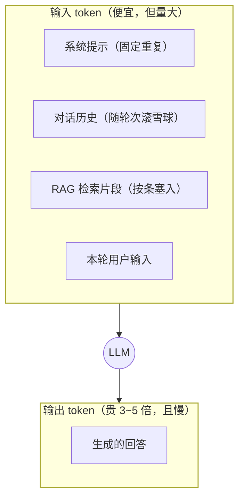

AI 应用上量后，账单增长曲线往往先于功能问题出现。"为什么这个月 token
花了这么多"的答案都在**一次调用的成本结构**里——本篇把账单拆开，
给一套可落地的降本手段。

## 一次调用的账单构成

每次请求的成本 = **输入 token × 输入单价 + 输出 token × 输出单价**：

两个要点：

- **输入单价通常是输出的 1/3~1/5**，但输入量常常是输出的 10~50 倍
  （系统提示+历史+RAG 片段都在输入里）——**总账单大头往往是输入**；
- **输出又贵又慢**：生成是逐 token 的（推理参数篇的解码过程），输出越长
  时延越长、费用越高。

## 为什么"上下文越长越贵也越慢"

Transformer 的自注意力是 O(n²)（每个位置对每个位置打分，见 Transformer
篇）——上下文翻倍，计算量约四倍。这从底层解释了三件事：计费按 token、
长上下文响应慢、以及**窗口用满不等于好事**（"lost in the middle"：中段
信息利用率反而下降）——上下文是稀缺资源，要精打细算（上下文工程篇）。

## 降本四招

1. **裁历史**：对话历史按滑动窗口保留最近 N 轮，更早的压成摘要
   （记忆系统篇的分层记忆就是干这个的）；
2. **精简系统提示**：固定重复的几千 token 系统提示 × 每天百万次调用 =
   巨额固定开销——能压缩的规则表格化，能外置的走工具按需取
   （技能按需加载篇的思路）；
3. **限制输出**：`max_tokens` 硬上限 + 要求"简短回答"的指令——输出
   单价高，这项立竿见影；
4. **模型分级路由**：简单任务（分类、抽取）用小模型，复杂推理才上大模型
   ——单次省的不多，量大了差距是数量级。

## 提示缓存：固定前缀打折

主流 API 的 **prompt caching**：对**完全相同的前缀**（系统提示 + 少样本
部分）命中缓存后按大幅折扣计价、且省去重复预计算。适用条件：

- 前缀**逐字节一致**且在最前面（动态内容放后段）；
- 系统提示/工具定义/少样本示例这类"稳定大块头"最受益；
- 设计提示结构时把**稳定部分放前、易变部分放后**，就能白拿折扣
  ——这是"结构影响成本"的典型例子。

## 高频追问速答

- **怎么估一次调用的 token？** 粗估：中文约 1 字 ≈ 1 token，英文约 4 字符
  ≈ 1 token（分词器不同有偏差）；精确用官方 tokenizer 计数器——做预算
  必须实测。token 与字符/词的区别、中英文比例为何不同，见
  [大模型 LLM 篇 · Token 一节](/ai/intermediate/llm/01-llm/)。
- **流式输出省钱吗？** 不省总 token（一样多），省的是**首字延迟**的体验
  ——流式是体验优化不是成本优化。
- **RAG 一定比长上下文便宜吗？** 短文档场景长上下文直接塞更简单；
  文档量大、反复使用时 RAG 的检索成本远低于每次塞全文——看复用率
  （对照落地选型篇）。

## 小结

- 账单 = 输入 token（量大）+ 输出 token（单价高）；上下文长既是钱的
  问题也是 O(n²) 的速度问题。
- 降本四招：裁历史、精简系统提示、限制输出、模型分级路由；提示缓存
  靠"稳定前缀放前"的结构设计白拿折扣。
- 成本优化与效果优化的每一步都应该用应用评估篇的分数验证——省出问题
  来才是最贵的。
