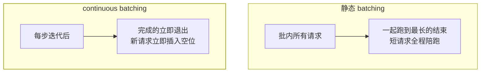

自部署开源模型（Qwen/Llama）上生产，第一课是：**HuggingFace transformers
的直接推理快不起来**——吞吐只有专业推理框架的零头。vLLM 凭
PagedAttention 和 continuous batching 成了事实标准，"为什么快"也随之
成为 AI 应用/推理岗的新晋高频题。

## 裸推理慢在哪：显存浪费与调度空转

LLM 推理的瓶颈是**显存带宽**而非计算，两大浪费源：

- **KV Cache 碎片**：每条请求要为 KV Cache 预留连续显存（按"最大长度"
  预留），实际长度参差——实测 60%~80% 的 KV Cache 显存被浪费在
  预留未用与外部碎片上（Transformer 篇的 KV Cache 概念在此落地）；
- **静态 batching 空转**：攒一批请求一起跑，**最长的那个没生成完，
  全批次都得陪着**——短请求早早算完却在干等（GPU 空转）。

## PagedAttention：把操作系统分页搬到 KV Cache

vLLM 的核心创新：KV Cache **不再按最大长度连续预留**，而是像 OS 虚拟
内存一样切成固定大小的**块（block，如 16 token/块）**，按需分配、
逻辑连续物理离散（块表映射）：

- 显存浪费从 60%~80% 降到 **4% 以下**；
- 同样的显存能塞下多得多的并发请求——**吞吐数倍提升的根源**；
- 顺带实现 Copy-on-Write：并行采样（一次生成多个候选）共享前缀 KV，
  省显存（与 fork 的 CoW 同一思想，见 Redis 持久化篇）。

## continuous batching：迭代级调度

静态 batching 按批为单位，continuous batching **按迭代（每生成一个
token）为单位调度**：

- GPU 每一步都满负荷干"有意义的活"——吞吐再提升一个台阶；
- 搭配**前缀缓存**（相同系统提示的 KV 复用，Token 成本篇提示缓存的
  服务端版）——多轮对话/固定系统提示场景收益巨大。

## 吞吐与时延：一对永恒权衡

- **批越大吞吐越高**（GPU 利用率满），但单请求时延随之上升（排队+分摊）；
- 生产 SLA 通常约束**首 token 延迟（TTFT）与 token 间延迟（TPOT）**，
  在延迟上限内把 batch 推到最大——推理参数篇的参数调优管"单请求效果"，
  本篇管"全体请求效率"，两层配合。

## 高频追问速答

- **PagedAttention 解决什么？** KV Cache 的内部碎片（按最大长度预留）
  与外部碎片（连续分配失败）——分页管理把浪费从 60-80% 压到 4% 以下。
- **为什么不用 HF pipeline 直接上生产？** 无 continuous batching、
  KV Cache 管理原始、无并发调度——吞吐差数倍到数十倍，"能跑"和
  "能服务"是两回事。
- **推理框架还有什么选型？** TensorRT-LLM（NVIDIA 深度优化）、SGLang
  （结构化生成/ RadixAttention 前缀树缓存）、llama.cpp（端侧 CPU/量化）
  ——核心思想趋同：管好 KV Cache + 迭代级调度。

## 小结

- 裸推理两大浪费：KV Cache 碎片、静态批处理的陪跑。
- PagedAttention = KV Cache 的分页管理（浪费→4%），continuous
  batching = 迭代级调度（GPU 永不空转），前缀缓存 = 复用公共前缀。
- 吞吐与时延用 SLA（TTFT/TPOT）定边界——推理服务层与参数调优层各管一段。
