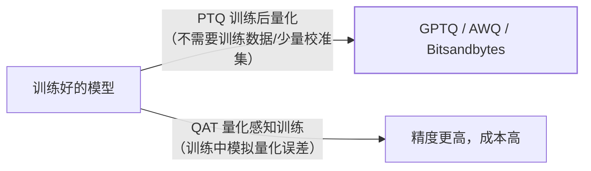

7B 模型 FP16 要 14GB 显存，量化到 INT4 只要约 4GB——**量化是"让大模型
跑进小显存"的第一杠杆**，也是本地部署、降本推理绕不开的话题（vLLM 篇
与 QLoRA 都建立在它之上）。

## 为什么敢量化：权重对噪声鲁棒

神经网络权重的数值分布集中、冗余度高——把 16 位浮点压到 8 位甚至 4 位
整数，**绝大部分权重的微小舍入不会改变模型的输出方向**。这不是无损压缩
（精度一定有损），而是"有损到实用"的工程权衡：换 2~4 倍显存与带宽。

## 显存账：同一模型的四档位

| 精度 | 字节/参数 | 7B 模型权重 | 场景 |
| --- | --- | --- | --- |
| FP32 | 4 | 28GB | 训练（现在多被 BF16 取代） |
| FP16/BF16 | 2 | 14GB | 标准推理/微调基线 |
| INT8 | 1 | 7GB | 精度敏感的降本 |
| INT4 | 0.5 | 3.5~4GB | 端侧/消费级显卡 |

外加 KV Cache（随上下文长度与并发增长，vLLM 篇）——**权重量化了，
KV Cache 也要量化才能更进一步**。

## 两条路线：PTQ 与 QAT

- **PTQ**（训练后量化）是工程主流：GPTQ（逐层量化误差补偿）、AWQ
  （保护"重要权重"）、bitsandbytes（NF4，QLoRA 用的就是它）——
  几行代码、无需训练；
- **QAT**（量化感知训练）在训练中模拟量化误差，精度更高但要重训——
  大模型时代成本过高，应用团队基本只用 PTQ。

## 代价：哪些任务敏感

量化的精度损失**不均匀**：

- 不敏感：日常对话、摘要、翻译（语言模型对权重噪声容错高）；
- 敏感：**数学计算、代码生成、长链推理**——每一位精度的损失都可能
  改变推理链的走向；
- 结论：**量化后必须用评测集回归**（应用评估篇），观察任务指标掉多少，
  而不是只看"能跑"。

## 高频追问速答

- **GGUF 是什么？** llama.cpp 生态的量化模型格式（多种量化档位 + 端侧
  CPU/Metal 推理）——与 vLLM（服务端 GPU）是不同生态的载体。
- **AWQ 和 GPTQ 选哪个？** AWQ 按"激活值重要性"保护关键权重，推理
  速度通常更好；GPTQ 老牌稳定——都试，评测说话。
- **量化能省 Token 成本吗？** 自部署场景省的是**显存与 GPU 数量**
  （同卡装更大模型/更高并发）；API 调用场景与你无关（厂商侧的事）。

## 小结

- 量化 = 用可控的精度损失换 2~4 倍显存与带宽：FP16→INT8/INT4 的
  显存账是选型第一算术。
- 工程主流是 PTQ（GPTQ/AWQ/bnb），QAT 成本高基本不用；KV Cache
  量化是第二级杠杆。
- 量化后必须评测回归——数学/代码类任务对精度最敏感，别只看"能跑"。
