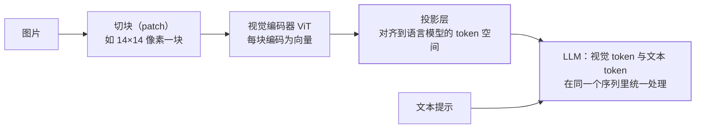

真实世界的输入不止文本：用户发来一张报错截图、一张发票、一张架构图
问"哪里有问题"。多模态 LLM（GPT-4V/Qwen-VL 类）的答案出乎意料地统一：
**把图片切成小块，编码成一串特殊 token，塞进语言模型**——视觉问题的
本质还是 token 处理。

## 核心机制：图片 → 一串视觉 token

- **视觉编码器（ViT）**：图片切成固定大小的小块，每块编码为一个向量
  ——一块 ≈ 一个"视觉 token"；
- **投影层**：把视觉向量**对齐到语言模型的 token 空间**——这一层决定
  了"图片信息能否被语言模型读懂"，多模态训练主要就在训它；
- 之后语言模型对"视觉 token + 文本 token"一视同仁——注意力机制
  （Transformer 篇）天然支持混合序列。

## 图片的代价：视觉 token 比文字贵

- 一张 1024×1024 的图可以切出**上千个视觉 token**（高分辨率还有切块
  放大策略，更多）——一张图动辄相当于几千字的输入；
- **计费按视觉 token 算**：多模态调用的成本敏感点从"历史多长"变成
  "图多大/多少张"（Token 成本篇的输入账本扩展项）；分辨率越高细节
  越清楚（OCR 小字），但 token 成本随之上升——分辨率是成本旋钮。

## 典型应用与边界

- **截图排查**：报错截图直接问"哪行出错了"——运维/开发效率利器；
- **票据/表单**：发票提取、工单识别——传统 OCR 提取文本 + LLM 理解
  语义的组合；
- **图表问答**：给架构图/流程图问问题——视觉 token 让模型"看到"布局；
- **视觉 Agent**：屏幕操作类 Agent 靠视觉理解界面（对照 Agent 篇的
  工具调用——"看"也是一种输入工具）。

边界：**精确文字提取仍首选传统 OCR**（视觉 LLM 会"脑补"模糊小字）、
**高清大图细节**（地图小字、合同条款）要用高分辨率模式权衡成本——
多模态 LLM 强在"理解图在说什么"，不是像素级抄写。

## 高频追问速答

- **图片 token 怎么算？** 与分辨率和切块策略相关（patch 数 × 每块
  token），高分辨率模式还会切块放大——API 文档会给表格，成本敏感
  场景按文档估算。
- **为什么不让 LLM 直接像素级读图？** LLM 处理的是对齐后的语义向量，
  不是原始像素——像素级抄写是 OCR 的强项（专用模型更准更便宜）。
- **多模态训练难在哪？** 难在**对齐**：让视觉向量落到语言模型"听得懂"
  的空间——通常冻结视觉编码器与语言模型，主要训练中间的投影层。

## 小结

- 多模态的本质：图片切块编码 → 投影对齐 → 变成一串视觉 token 与文本
  统一处理——"看图"问题被归约成了 token 问题。
- 成本敏感点从文本长度变成图片大小与数量；分辨率是"细节 vs 成本"
  的旋钮。
- 强在理解、弱在抄写——精确文字提取仍用 OCR，理解型问题交给多模态
  LLM。
