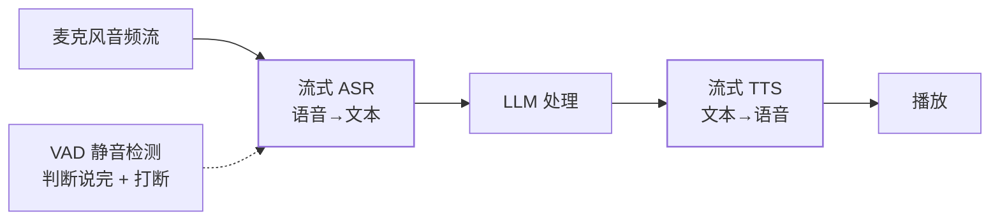

语音 Agent（电话客服、语音助手）是 AI 落地的热点形态，架构却常被低估：
**ASR（语音转文本）→ LLM → TTS（文本转语音）三段流水线**，每段都有
延迟，叠加起来决定"像不像真人对话"。

## 全链路：三段流水线的延迟账

- **延迟是体验的生死线**：真人对话的"自然响应"约 300~500ms——三段
  流水线每段都要压缩（流式处理：ASR 边听边出字、LLM 流式输出、TTS
  边收文本边合成，而不是各段串行等全量）；
- **VAD（语音活动检测）**：判断用户"说完了"（触发 LLM）以及**用户
  正在打断**（立即停 TTS）——打断体验（barge-in）是自然对话的标志。

## ASR 的关键问题

- **词错率（WER）**是核心指标——专有名词、人名、数字是重灾区；
- **热词（hotword）机制**：把业务词表喂给 ASR 提升专有名词识别
  （对照搜索联想篇的热词——都是"领域知识注入通用能力"）；
- **流式 vs 离线**：流式 ASR 边录边转（延迟低、精度略降），离线全量
  转写精度最高——实时交互必须流式。

## TTS 的关键问题

- **自然度 vs 延迟**：神经 TTS（VITS/CosyVoice 类）自然度高但首包
  延迟要压——流式合成（边生成音频边播放）是标配；
- **音色与情绪**：固定音色 / 音色克隆（合规风险：声音授权）/ 情绪
  匹配——客服场景通常固定音色求稳。

## 端到端语音模型：趋势

传统三段流水线的缺点：**误差级联**（ASR 错→LLM 错上加错）+ 信息损失
（语气、停顿丢失）。新一代**端到端语音模型**（GPT-4o realtime 类）
直接语音进语音出，保留语气、天然低延迟——但可控性（热词、审查、成本）
仍是三段流水线的优势。**过渡期两条路线并存**：对话质量敏感用端到端，
可控性与成本敏感用三段。

## 高频追问速答

- **为什么不直接语音到语音？** 见上——三段可控可调试，端到端自然但
  黑盒；按业务对"拟人度 vs 可控性"的要求选。
- **怎么压首响延迟？** 流式全链（不等 ASR 全句）、LLM 输出按句切分
  送 TTS（不等全文）、TTS 首包优化——每段省 200ms，叠加到 500ms 内。
- **电话线路（8kHz 采样）对识别的影响？** 电话音质窄带，WER 明显
  高于 App 音频——电信级场景要专门的电话语音模型与降噪。

## 小结

- 语音交互 = 流式 ASR + LLM + 流式 TTS，延迟账决定体验；VAD 管
  "说完没"与"打断"。
- ASR 靠热词救专有名词，TTS 靠流式压首包；打断（barge-in）是自然
  对话的标志能力。
- 三段流水线（可控）与端到端（拟人）并存——按"拟人度 vs 可控性"
  的业务要求选。
