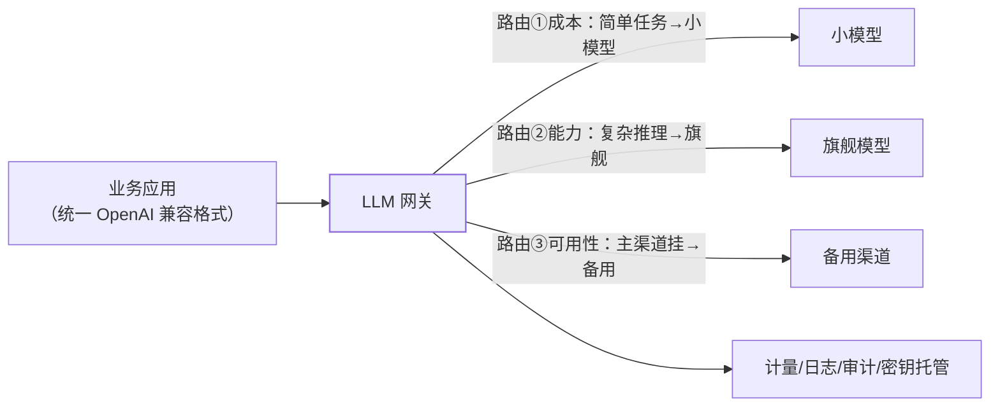

应用上了三个模型（对话用大模型、抽取用小模型、嵌入用第三方）之后，
问题开始成串出现：**SDK 各写一套、token 花费没人管、某家限流全线瘫痪、
密钥散落在代码里**。LLM 网关（LiteLLM/OneAPI 类）就是这一层的标准答案
——企业 AI 应用的"基础设施层"。

## 直接调 API 的五个问题

1. **接口碎片**：各家 SDK/参数/返回格式不同，换模型 = 改代码；
2. **成本黑盒**：谁在用、用了多少、哪个应用烧钱——没有统一计量；
3. **限流失控**：单渠道限流打满全线不可用，没有降级与转移；
4. **审计缺失**：发了什么给模型、模型回了什么——合规与排障都抓瞎
   （护栏篇的审计要求落不了地）；
5. **密钥散落**：API key 进代码库/配置文件——泄露事故预备役。

## 网关五职责

1. **统一接口**：OpenAI 兼容格式成事实标准——应用只面向一种协议；
2. **模型路由**：按任务成本路由（分类/抽取走小模型）、按能力路由
   （复杂推理走旗舰）、按可用性路由（failover 切备用）；
3. **配额与限流**：按团队/应用维度配额与限流（分布式限流篇的策略
   复用），超配额降级到小模型而非直接报错；
4. **可观测与审计**：token 计量（Token 成本篇的账本落地）、全量
   请求日志、敏感内容审计（护栏篇的审计闭环）；
5. **密钥托管**：渠道密钥只存网关，应用拿网关发的内部 key——泄露
   面收敛到一个可控点。

## 提示缓存与网关的层次关系

提示缓存（Token 成本篇）在**模型服务层**（前缀命中打折），网关在
**应用与模型之间**（路由与管控）——两层不冲突但要配合：网关做请求
聚合与日志时不要破坏"稳定前缀"（注入动态内容到前部会打爆缓存命中率）。

## 高频追问速答

- **网关自己挂了怎么办？** 网关是新的单点——应用侧配置"网关失败降级
  直连渠道"的兜底链路 + 网关多活部署；降级期间损失统一管控能力，
  换可用性。
- **流式请求过网关会怎样？** 网关需透传 SSE 流（不能缓冲全量再转发，
  否则打字机效果全灭）——LLM 网关与普通 API 网关的核心实现差异。
- **路由策略怎么定？** 成本路由看"任务难度分级"（分类/抽取用小模型
  ——效果用应用评估篇验证），能力路由看评测分数，别拍脑袋。

## 小结

- 直接调 API 的五个问题（碎片/黑盒/限流/审计/密钥）由网关五职责
  收口：统一接口、路由、配额、可观测、密钥托管。
- 路由三策略（成本/能力/可用性）是 AI 应用的"多活与降级"体系。
- LLM 网关 = AI 应用的 API 网关：**模型可以被替换，管控层必须稳定**。
