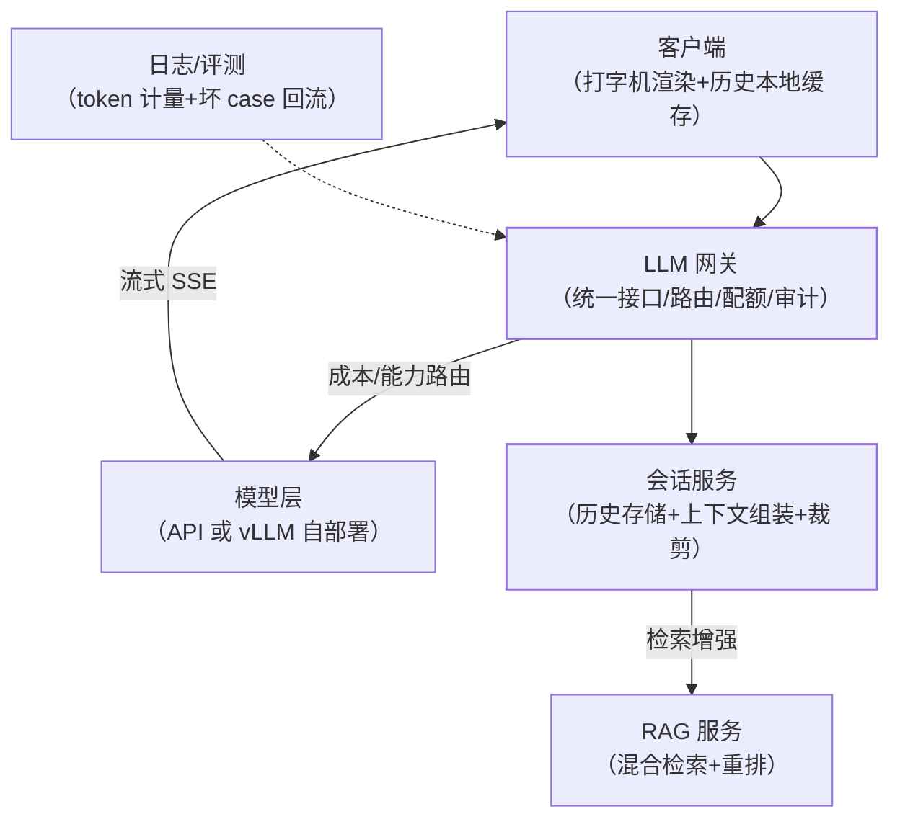

"设计一个类 ChatGPT 的应用"是 AI 面试的大题。答案不是单一技术点，
而是**把选型、上下文、流式、成本、网关、部署这些零件装配成一条端到端
链路**——本站 LLM 分类的十篇是零件说明书，本篇是总装图。

## 端到端架构总装

每个零件对应一篇：网关（LLM 网关篇）、模型选型（落地选型篇）、自部署
（vLLM/量化篇）、会话与上下文（记忆系统/上下文工程篇）、检索增强
（RAG 篇与进阶篇）、流式（语音篇的 SSE 链路同源）、成本（Token 成本
篇）、质量（应用评估篇）。

## 关键链路一：对话请求的一生

1. 客户端发起请求（带会话 ID + 本轮输入），经**网关鉴权与配额检查**；
2. **会话服务**取历史 → 按上下文窗口裁剪（滑动窗口+摘要）→ 若开 RAG
   先走检索改写与混合检索 → 组装最终提示；
3. 经网关路由到模型（成本路由：简单任务小模型）；
4. **流式返回**：SSE 逐 token 推给客户端打字机渲染；
5. 全程写日志与 token 计量 → 异步落分析库。

每一环都有前篇的深挖——总装的意义是看清**环与环的交接面**。

## 关键链路二：可靠性与成本的两层防线

- **可靠性**：网关 failover（主模型挂切备用）+ 客户端重试幂等 +
  状态无关设计（会话可恢复）；
- **成本**：输入侧裁历史与精简系统提示、输出侧 max_tokens、模型分级
  路由、提示缓存命中——全部在网关与会话服务的交汇处实施。

## 关键链路三：质量闭环

线上 trace（Agent 可观测性篇）→ 坏 case 回流评测集 → 修复（改提示/
RAG 参数）→ 评测回归 → 上线。**没有评测闭环的 LLM 应用，迭代全靠感觉**。

## 高频追问速答

- **先自部署还是先用 API？** 起步用 API 验证需求（成本可控、零运维）；
  量大/数据敏感/成本压力出现再自部署（vLLM）——落地选型篇的迭代顺序
  在基础设施层的重放。
- **会话历史存哪？** Redis 存活跃会话（低延迟读），异步落库归档——
  裁剪策略在会话服务统一实施。
- **怎么支撑多模态？** 接入层透传多模态内容（视觉 token 计费）、模型
  层选多模态模型——架构不变，模型层替换（网关抽象的红利）。

## 小结

- 总装图六件套：网关、会话服务、RAG 服务、模型层、流式链路、评测
  闭环——每一件都有本站专篇深挖。
- 两条主线：**可靠性**（failover/幂等/状态无关）与**成本**（裁剪/
  路由/缓存/计量）贯穿所有交接面。
- 这道大题的答法：先画总装图，再挑面试官追问的方向下钻到对应零件篇
  ——体系化 > 单点深挖。
