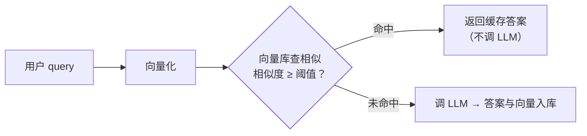

客服系统里 **30%~50% 的问题高度重复**（"怎么退货"换 100 种问法）——
每次都调 LLM 是浪费。**语义缓存**：把"相似的问题"直接映射到缓存的
答案——它是 LLM 应用特有的缓存层（传统缓存要求 key 完全一致，
语义缓存允许"意思一样"）。

## 原理：向量相似度当缓存键

- 命中：**省 LLM 调用（成本）+ 省 2~5 秒（延迟）**——双收益；
- Embedding 篇的向量相似度在这里变成"缓存的模糊匹配键"。

## 与提示缓存的层次区别（易混点）

| | 提示缓存（Prompt Caching） | 语义缓存 |
| --- | --- | --- |
| 层 | 模型服务层（厂商提供） | 应用层（自建） |
| 匹配 | **前缀完全相同** | **语义相似**（可差几个字/换个问法） |
| 收益 | 输入 token 打折 | **整次调用跳过** |
| 风险 | 几乎无 | 误命中（相似≠同答案） |

两者可叠加：语义缓存未命中的请求，其稳定前缀仍可吃提示缓存折扣。

## 难点一：阈值是两难

- **阈值过高**：命中少，缓存白建（"怎么退货"和"退货流程是什么"应命中
  却没命中）；
- **阈值过低**：**误命中**——"退货"和"换货"语义相似但答案完全不同，
  返回错答案比慢更糟；
- 定法：**评测集实测**（应用评估篇）——同义改写集（应命中）与近似
  问题集（不应命中）分别测命中/误命中率，画 ROC 选阈值。

## 难点二：什么时候不能缓存

- **答案含用户数据**（"我的订单"）——个性化内容不能全局缓存；
- **时效性答案**（库存、价格、政策刚改）——需要失效联动（CDC 篇：
  政策文档更新→清相关缓存）；
- 治理：**缓存按"问题意图+关键参数"分键**（去掉个性化部分再算
  embedding），或只缓存公共知识类问题。

## 高频追问速答

- **命中率能到多少？** FAQ 类场景 30%~60%（重复问法多）；开放域对话
  低（每句都不同）——**先分析 query 重复率再决定要不要建**。
- **误命中怎么兜底？** 缓存答案标注"参考历史回答"+用户可反馈不匹配
  → 反馈触发重新生成并修正缓存——缓存要有自愈闭环。
- **向量库选什么？** 复用 RAG 的向量库与 embedding 模型（同一套
  基础设施）——embedding 模型换了缓存要全量重建（embedding 篇）。

## 小结

- 语义缓存 = 向量相似度当模糊缓存键：命中省调用+省延迟。
- 与提示缓存的层次区别：前缀相同（服务端折扣）vs 语义相似（应用层
  跳过）——可叠加。
- 两大陷阱：阈值两难与个性化/时效不可缓存——**先分析重复率，
  评测集定阈值，缓存必须有失效与反馈闭环**。
