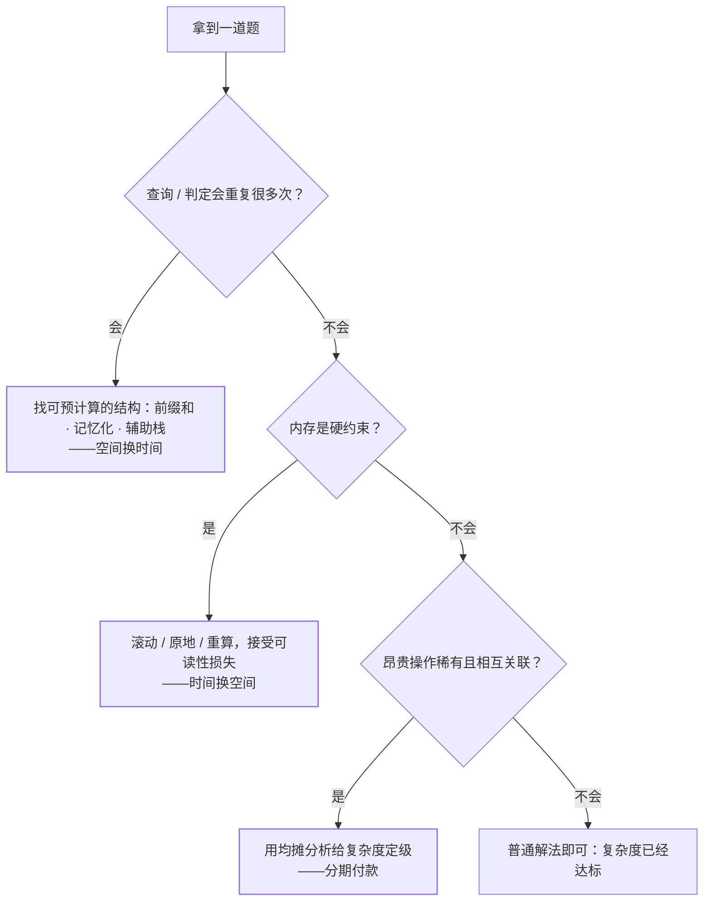

算法题的复杂度里，时间与空间从来不是独立变量，而是一对可以**互相交换**的筹码。
本站 37 个知识点里至少十几个都在做这笔交易，只是散落在各自笔记里。
这一篇把它们拉到同一张桌子上：三种交易模式、各自的适用信号，以及一张「拿到题先问什么」的决策表。

## 一、空间换时间（最常用的方向）

**核心动作：用一次性的额外内存，买断未来的重复计算。**

| 模式 | 做法 | 本站案例 | 交易明细 |
| --- | --- | --- | --- |
| 预处理 | 提前算好「每个位置之前的累计」 | [前缀和](/algorithm/basic/techniques/01-prefix-sum/) | O(n) 空间 ↔ 区间查询 O(n)→O(1) |
| 攒批处理 | 修改只记端点，最后统一还原 | [差分](/algorithm/basic/techniques/02-difference-array/) | O(n) 空间 ↔ 区间修改 O(n)→O(1) |
| 索引 / 缓存 | 哈希表存「见过的」，空间换一遍扫描 | 两数之和哈希法（[双指针](/algorithm/basic/searching/02-two-pointers/)的对照组） | O(n) 空间 ↔ O(n²)→O(n) |
| 记忆化 | 缓存子问题答案，算过的不再算 | [爬楼梯](/algorithm/intermediate/dp/01-climbing-stairs/)的演进第 2 步 | O(n) 缓存 ↔ O(2ⁿ)→O(n) |
| 值即地址 | 用值直接当数组下标，绕开比较 | [计数排序](/algorithm/basic/sorting/08-counting-sort/) | O(k) 空间 ↔ 突破 O(n log n) 比较下界 |
| 辅助结构 | 并排维护一份「额外信息」 | [最小栈](/algorithm/intermediate/stack-queue/02-min-stack/)同步最小值列 | O(n) 空间 ↔ getMin O(n)→O(1) |
| 暂存换优雅 | 合并时整体暂存，写回不必腾挪 | [归并排序](/algorithm/basic/sorting/05-merge-sort/)辅助数组 | O(n) 空间 ↔ 稳定 + 最坏 O(n log n) |

这类交换的**共性信号**：查询/判定会被执行很多次，而「答案」可以提前算或边走边存。
只要满足这两点，多花的那份内存几乎总是划算的——内存是可再生资源，重复计算不可再生。

## 二、时间换空间（内存受限时的反向操作）

**核心动作：放弃一些「顺手」，或当场重算，换取更少的内存占用。**

| 模式 | 做法 | 本站案例 | 交易明细 |
| --- | --- | --- | --- |
| 滚动变量 | dp 只依赖前几项，数组不留 | [爬楼梯](/algorithm/intermediate/dp/01-climbing-stairs/) O(n)→O(1) | 时间不变，纯省空间 |
| 滚动行 | 二维表逐行依赖上一行 | [LCS](/algorithm/intermediate/dp/04-lcs/) O(mn)→O(n) | 代价：无法回溯还原解本身 |
| 原地算法 | 不开辅助数组，就地交换 | [快排](/algorithm/basic/sorting/02-quick-sort/) / [堆排](/algorithm/basic/sorting/06-heap-sort/) | O(1) 空间 ↔ 牺牲稳定性（快排）或缓存友好性（堆排慢于快排） |
| 放弃全序 | 只为答案付扫描成本 | [快速选择](/algorithm/basic/searching/04-quickselect/) | 数组不被排好 ↔ 第 K 小降到 O(n) |
| 状态压缩的信息换法 | 存差值不存原值 | [最小栈](/algorithm/intermediate/stack-queue/02-min-stack/)差值版 | 可读性 ↔ 辅助空间 O(n)→O(1) |

注意第二行的细节：**滚动行牺牲的不是时间而是「可回溯性」**——要打印 LCS 本体就必须保留全表。
「时间换空间」并不总是拿运行时间做筹码，更多时候牺牲的是解的可还原性、代码可读性这类隐性资产。

## 三、均摊：不是一次性交换，而是分期付款

有些结构单次操作最坏很贵，但**把账摊到所有操作上**每次都是常数：

- [双栈实现队列](/algorithm/intermediate/stack-queue/03-queue-via-stacks/)：倒栈那一步 O(n)，但每个元素一生至多被搬两次，n 次操作总代价 O(n)，均摊 O(1)。
- [单调栈](/algorithm/basic/techniques/03-monotonic-stack/)：双层循环的观感，但每个元素至多进栈出栈各一次，总操作数 ≤ 2n。
- （工程视角）`ArrayList` 扩容：一次扩容 O(n) 搬家，均摊后 append 仍是 O(1)——这是 JDK 里每天都在发生的均摊。

**均摊的识别信号**：昂贵的操作只在「稀有事件」时发生，且事件之间有关联（如栈空才倒、容量满才扩）。

## 四、决策表：拿到题先问三句

1. **查询/判定会重复很多次吗？** 会 → 找可预计算的结构（前缀和、记忆化、辅助栈），空间换时间。
2. **内存是硬约束吗？** 是 → 找滚动/原地/重算的写法，接受可读性或可回溯性的损失。
3. **昂贵操作是否稀有且关联？** 是 → 用均摊分析说服面试官它是 O(1)。

边界情况：**边改边查**两头都要快时，前缀和与差分双双失效——那就继续加钱：树状数组/线段树用 O(n) 空间买 O(log n) 的单点修改 + 区间查询，是这笔交易的「高端套餐」（后续计划单独成篇）。

## 一句话总结

**时间与空间不是二选一，而是定价互查**：先问「这个重复计算值得花多少内存买断」，再问「这份内存占用值得多少次重算来省」——两个方向都问过，选型才完整。复杂度表只是报价单，真正的决策还要加上第三个维度：实现与维护的复杂度。
