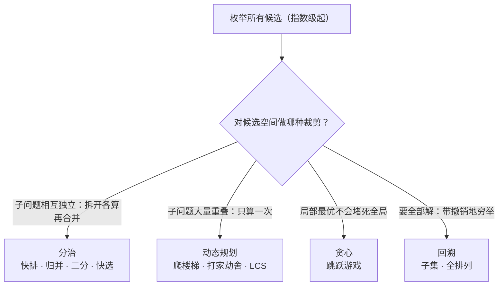

所有算法题的暴力解都是**枚举**——把所有候选答案摆出来挑最好的。四大范式（分治、贪心、DP、回溯）
没有一个是「另一种东西」，它们全是**让穷举变聪明的办法**，区别只在于对候选空间做了哪种裁剪。
这篇把本站散落的范式笔记放进同一张地图，并给出「拿到新题先走哪条路」的决策链。

## 一张地图：四种范式对穷举的裁剪

- **分治**：子问题**相互独立**，拆开各算再合并。答案 = 合并函数的功力（[归并的合并](/algorithm/basic/sorting/05-merge-sort/)、[快排的分区](/algorithm/basic/sorting/02-quick-sort/)）。
- **DP**：子问题**大量重叠**，砍掉重复计算（记忆化是它的递归形态，[爬楼梯](/algorithm/intermediate/dp/01-climbing-stairs/)的演进链就是证明）。
- **贪心**：每层决策有**贪心选择性质**——局部最优不会堵死全局最优，连子问题的解都不用存（[跳跃游戏](/algorithm/advanced/greedy/01-jump-game/)的交换论证）。
- **回溯**：要**所有解**或解的结构复杂，就老老实实穷举，但用「路径 + 撤销」组织（[子集](/algorithm/intermediate/backtracking/01-subsets/)、[全排列](/algorithm/intermediate/backtracking/02-permutations/)）——它是 DP 的题量放大版：DP 只要一个最优值，回溯要把树走全。

**分界问题速答**：只要最优值且子问题重叠 → DP；要列出所有解 → 回溯；子问题独立 → 分治；一步能看出最优且不会后悔 → 贪心。

## 复杂度阶梯（对应本站的演示）

| 阶梯 | 量级 | 本站代表 |
| --- | --- | --- |
| 暴力枚举 | O(2ⁿ) / O(n!) / O(n²) | 子集与全排列的决策树全量、两数之和的数对枚举 |
| 空间换时间的预处理 | O(n) 预处理 + O(1)/O(log) 查询 | [前缀和](/algorithm/basic/techniques/01-prefix-sum/)、[单调栈](/algorithm/basic/techniques/03-monotonic-stack/) |
| 分治 | O(n log n) | 三大排序（[归并](/algorithm/basic/sorting/05-merge-sort/) / [快排](/algorithm/basic/sorting/02-quick-sort/) / [堆排](/algorithm/basic/sorting/06-heap-sort/)） |
| 线性扫描的巧思 | O(n) | [Kadane](/algorithm/intermediate/dp/03-max-subarray/)、[双指针](/algorithm/basic/searching/02-two-pointers/)、[滑动窗口](/algorithm/basic/searching/03-sliding-window/) |
| 对数 | O(log n) | [二分](/algorithm/basic/searching/01-binary-search/)及其变体、[二分答案](/algorithm/advanced/binary-answer/01-koko-eating-bananas/) |

读法：从上往下就是「用结构和单调性逐步裁剪候选空间」的过程——排序利用有序性、双指针利用方向性、
二分利用单调性、DP 利用无后效性、贪心利用选择性质。**每降一层，都对应一个可说出口的性质**，
面试里说出这个性质（而不只是报复杂度）才是得分点。

## 拿到新题的决策链

1. 先写暴力枚举，确认状态空间形状（线性？树形？图？）。
2. 候选空间能**排序/单调化**吗？→ 双指针 / 二分（含二分答案）。
3. 是「区间和/最值」类重复查询吗？→ 前缀和 / 差分 / 单调栈预处理。
4. 子问题重叠、只要最优值？→ DP（先写记忆化，再改递推，最后考虑滚动压缩，参考[时间与空间的交换](/algorithm/advanced/principles/01-time-space-tradeoff/)）。
5. 要所有解 / 解结构复杂？→ 回溯（路径 + 撤销 + 剪枝）。
6. 每层决策可证「不后悔」？→ 贪心；证明不了退回 DP。

## 一句话总结

**范式不是流派，而是对同一棵穷举树的不同修剪策略**——分治把树拆成独立子树，DP 把重复子树缓存，
贪心直接砍到只剩一条链，回溯老老实实走完全树但用撤销避免重来。看到任何「新」算法，
先问它修剪了这棵树的哪里，题海就变成了同一道题。
