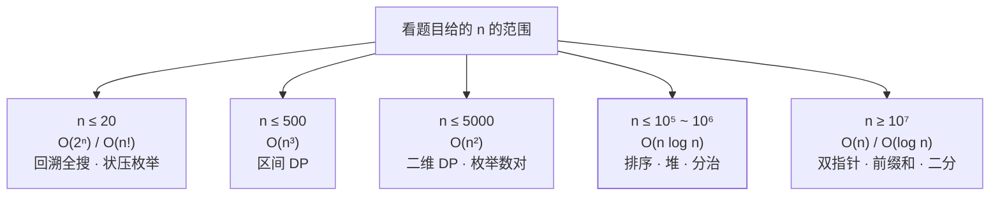
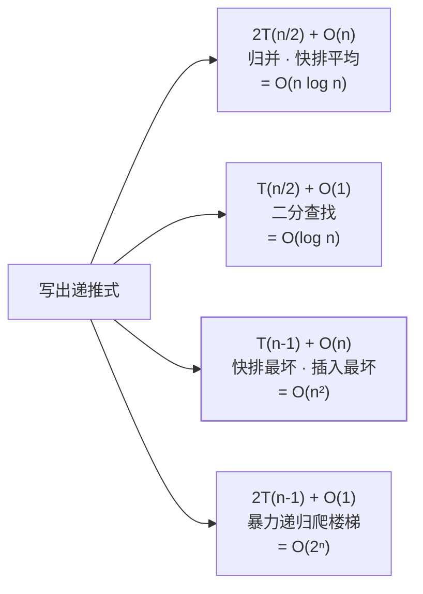

全站的复杂度表给了结论，这篇补「这些数字怎么算出来」。核心只有一句话：
**大 O 度量的是「操作次数随输入规模 n 的增长趋势」，不是运行秒数**——所以系数丢弃、常数项丢弃、只留最高阶。
它的用途是回答一个问题：**n 变大 10 倍 / 100 倍时，我的程序会慢多少？**

## 一、n 翻倍时，各复杂度变几倍（增长直觉）

| 复杂度 | n → 2n 时 | 直观感受（n = 100 万时的操作量级） |
| --- | --- | --- |
| O(1) | ×1 | 哈希查一次 |
| O(log n) | +1 次基本操作 | 20 次比较（二分） |
| O(n) | ×2 | 扫一遍数组 |
| O(n log n) | ×2 略多一点（≈2.2×） | 好的排序 |
| O(n²) | ×4 | 双层循环，百万级已不可行 |
| O(2ⁿ) | 平方倍（2ⁿ → 2²ⁿ） | n = 40 就到天荒地老 |
| O(n!) | 爆炸 | n = 12 是极限 |

**经验法则（白板/竞赛通用）**：1 秒 ≈ 10⁸ 次简单操作。拿到题先看 n 的范围，反推可行复杂度：

| n 的规模 | 可行复杂度 | 对应套路 |
| --- | --- | --- |
| ≤ 20 | O(2ⁿ) / O(n!) | 回溯全搜、状压枚举 |
| ≤ 500 | O(n³) | 区间 DP |
| ≤ 5 000 | O(n²) | 二维 DP、枚举数对 |
| ≤ 10⁵ ~ 10⁶ | O(n log n) | 排序、堆、分治 |
| ≥ 10⁷ | O(n) / O(log n) | 双指针、前缀和、二分、数学 |

面试官给「n ≤ 10⁵ 还要求 O(n²) 以内」这类提示时，就是在用这张表递答案。

## 二、时间复杂度怎么数

只数「基本操作的执行次数」关于 n 的表达式，三种来源：

**1. 循环层数**：单层扫 n 遍 O(n)；两层嵌套 O(n²)；但**内层次数递减**要按级数求和——
冒泡的比较次数 n-1 + n-2 + … + 1 = n(n-1)/2，取最高阶得 O(n²)，系数 1/2 丢弃。

**2. 规模每次砍半 → 出对数**：二分、跳表、堆的上浮下沉，都是「剩余规模 n → n/2 → … → 1」，
砍 log₂n 次见底。反过来**每次只减 1 → 出 n**（链表遍历）。混合形态 `外层减半 × 内层扫全量` = O(n log n)（归并每层合并 O(n) 共 log n 层）。

**3. 递归式展开**：写递归先写出递推式，套三个高频模板就够用：

| 递推式 | 结论 | 本站案例 |
| --- | --- | --- |
| T(n) = 2T(n/2) + O(n) | O(n log n) | 归并、快排平均 |
| T(n) = T(n/2) + O(1) | O(log n) | 二分查找 |
| T(n) = T(n-1) + O(n) | O(n²) | 快排最坏、插入排序最坏 |
| T(n) = 2T(n-1) + O(1) | O(2ⁿ) | 暴力递归爬楼梯 |

（完整版是主定理 Master Theorem，面试记住下表四个形态即可。）

## 三、空间复杂度怎么数

三笔账，**递归栈是最常被漏掉的那笔**：

1. **显式结构**：dp 数组、辅助数组、哈希表——声明了多少就是多少（[LCS](/algorithm/intermediate/dp/04-lcs/) 的 O(mn)）。
2. **递归栈深度 = 递归树的深度**，不是节点数：归并递归 O(log n) 层；链状树 DFS 最坏 O(n)；快排平均 O(log n)、最坏 O(n)。迭代版没有这笔账（[快选](/algorithm/basic/searching/04-quickselect/)迭代 O(1)）。
3. **输出一般不计入**空间复杂度（惯例），但题目若把「收集所有子集」当输出，O(2ⁿ · n) 的输出规模要口头说明——[子集](/algorithm/intermediate/backtracking/01-subsets/)笔记的复杂度就是这么写的。

「原地」的定义：额外空间 O(1) 或 O(log n)（允许递归栈）——所以快排、堆排敢自称原地，归并不敢。

## 四、最好 / 最坏 / 平均，与均摊

- **默认报最坏**：面试说「快排 O(n log n)」指平均，紧跟着要能补一句「最坏 O(n²)，随机基准规避」——只会平均不会最坏是扣分点（[快排](/algorithm/basic/sorting/02-quick-sort/)、[插入](/algorithm/basic/sorting/03-insertion-sort/)、[二分](/algorithm/basic/searching/01-binary-search/)的表里都拆了这三种）。
- **最好情况**只在「自适应」类算法里有意义：插入排序近乎有序 O(n)、冒泡 swapped 提前退出。
- **均摊**：单次最坏 O(n) 但稀有且关联，摊到每个操作是 O(1)——动态数组扩容、[双栈队列](/algorithm/intermediate/stack-queue/03-queue-via-stacks/)、[单调栈](/algorithm/basic/techniques/03-monotonic-stack/)。分析方法：算**总代价**再除以操作数（聚合分析），而不是对单次操作取平均。

## 五、和其他两篇的关系

复杂度分析是度量衡，[时间与空间的交换](/algorithm/advanced/principles/01-time-space-tradeoff/)是交易策略，
[算法思想全景](/algorithm/advanced/principles/02-paradigm-landscape/)是选型地图——
先会用这篇文章的尺子量出各方案的代价，再谈怎么权衡、怎么选范式。

## 一句话总结

**数执行次数、留最高阶、别忘递归栈**；再用「n 的规模反推可行复杂度」反过来约束选型——
量得准，才谈得上换得值。
