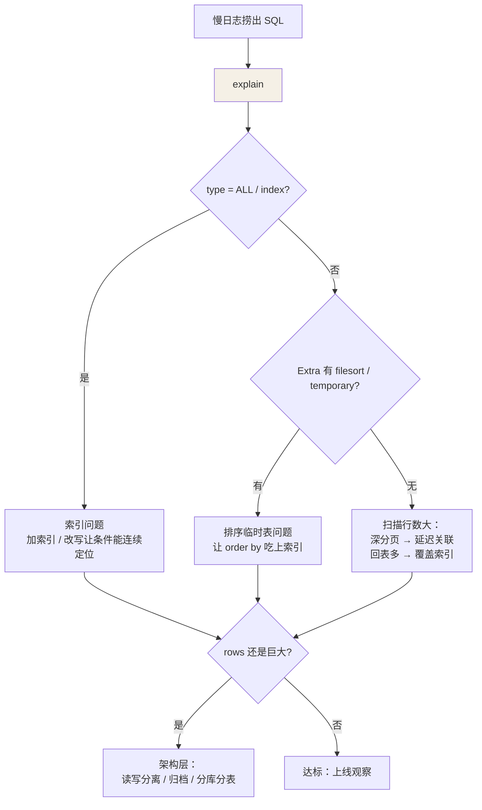

## 第一步：找到慢 SQL

```sql
set global slow_query_log = on;
set global long_query_time = 1;     -- 超过 1s 记录
-- 日志里除了 SQL 还有 lock_time / rows_examined
-- rows_examined 巨大而 rows_sent 很小 = 扫得多回得少，索引有问题
```

## 第二步：读懂 explain

```sql
explain select * from orders where user_id = 42;
```

| 列 | 看什么 |
|---|---|
| type | 访问方式（越靠左越好）：**system > const > eq_ref > ref > range > index > ALL** |
| key / key_len | 实际用的索引 + 用了几列（联合索引用没用满看这里） |
| rows | 预估扫描行数 |
| Extra | **Using index**（覆盖索引，好）；Using index condition（ICP）；Using filesort（额外排序）；Using temporary（临时表，警惕） |

type 的分水岭：**range 以上算健康**（能用索引定位一段）；index 是"扫整棵
索引树"，ALL 是全表扫——出现 ALL 且 rows 巨大，就是优化对象。

## 高频优化手法

### 深分页

```sql
-- ❌ 扫描并丢弃前 100 万行
select * from orders order by id limit 1000000, 10;

-- ✅ 方案一：延迟关联（先用覆盖索引拿到 id，再回表 10 行）
select o.* from orders o
join (select id from orders order by id limit 1000000, 10) t
  on o.id = t.id;

-- ✅ 方案二：游标 / 书签（记录上一页末尾 id，下次从它开始）
select * from orders where id > #{lastId} order by id limit 10;
```

### count 优化

```sql
select count(*) ≈ count(1) > count(主键) > count(普通列)
-- count(普通列) 要判 NULL 逐行取值；count(*) 与 count(1) 是引擎层直接数行
-- InnoDB 没有总数缓存（MVCC 下每个事务看到的行数都不同）
-- 超大表要近似值：show table status / explain 估算；要精确：计数表或中间件
```

### join

- **小表驱动大表**：驱动表的全集 + 被驱动表的索引 = 效率上限（BNL 除外）。
- 被驱动表的关联列**必须有索引**，否则走 BNL（Block Nested-Loop）暴力。
- 大表 join 前先过滤：子查询收敛数据量再 join，往往比先 join 再 where 快。

### 其他清单

- 前缀索引：`index(email(12))` 省空间，但**不能用于覆盖索引与排序**。
- 索引选择性：`(去重数 / 总行数)` 越接近 1 越值得单独建索引；性别这种
  低选择性列只配做联合索引的一部分。
- 批量写入：`insert ... values (), (), ()` 比循环单条快一个量级。
- 建议口径：单表 2000 万行（B+ 树三层见索引篇）、字段够小够用、not null
  default 减少字节与 NULL 语义歧义。

## 一条慢 SQL 的完整排查思路



## 小结

- 路径：慢日志 → explain → 看 type / key / rows / Extra 对症下药。
- 深分页用延迟关联或游标；count(*) 与 count(1) 同级最优。
- 优化到头仍是全量扫描的业务，才轮到读写分离和分库分表出手。
